[[START OF PAGE 1]]

[[START OF PAGE 1]]

EGO™

COMMERCIAL

CUL US
LISTED

OPERATOR'S MANUAL
56-VOLT LITHIUM-ION
COMMERCIAL 17.5"
STRING TRIMMER

Français p. 51

Español p. 107

MODEL NUMBER
STX4500/STX4500-FC

AWARNING: To reduce the risk of injury, the user must read and understand the Operator's Manual before using this product. Save these instructions for future reference.

[[END OF PAGE 1]]

[[START OF PAGE 2]]

[[END OF PAGE 1]]

[[START OF PAGE 2]]

EGO

TABLE OF CONTENTS

<table><tr><th>FCC Statement..</th><th>4</th></tr><tr><td>Safety Symbols</td><td>5</td></tr><tr><td>Safety Instructions.</td><td>6-14</td></tr><tr><td>Introduction..</td><td>15</td></tr><tr><td>Specifications</td><td>16</td></tr><tr><td>Description</td><td>17-19</td></tr><tr><td>Assembly.</td><td>20-25</td></tr><tr><td>Operation..</td><td>26-40</td></tr><tr><td>Maintenance</td><td>41-44</td></tr><tr><td>Troubleshooting..</td><td>45-47</td></tr><tr><td>Warranty</td><td>48-49</td></tr></table>

2

56-VOLT LITHIUM-ION COMMERCIAL 17.5" STRING TRIMMER-STX4500/STX4500-FC

[[END OF PAGE 2]]

[[START OF PAGE 3]]

[[END OF PAGE 2]]

[[START OF PAGE 3]]

EGO

READ ALL INSTRUCTIONS!

READ & UNDERSTAND
INSTRUCTION MANUAL

A WARNING: Some dust created by power sanding, sawing, grinding, drilling and other construction activities contains chemicals known to the State of California to cause cancer, birth defects or other reproductive harm. Some examples of these chemicals are:

	■Lead from lead-based paints.

		- Crystalline silica from bricks, cement, and other masonry products.

	■ Arsenic and chromium from chemically-treated lumber.

- Your risk from these exposures varies, depending upon how often you do this type of work. To reduce your exposure to these chemicals:

	■ Work in a well-ventilated area.

	■ Work with approved safety equipment, such as dust masks that are specially designed to filter out microscopic particles.

	■ Avoid prolonged contact with dust from power sanding, sawing, grinding, drilling, and other construction activities. Wear protective clothing and wash exposed areas with soap and water. Allowing dust to get into your mouth or eyes or to lie on the skin may promote absorption of harmful chemicals.

56-VOLT LITHIUM-ION COMMERCIAL 17.5" STRING TRIMMER-STX4500/STX4500-FC

3

[[END OF PAGE 3]]

[[START OF PAGE 4]]

[[END OF PAGE 3]]

[[START OF PAGE 4]]

EGO

FCC STATEMENT

	1. This device complies with Part 15 of the FCC Rules. Operation is subject to the following two conditions

		1) This device may not cause harmful interference.

		2) This device must accept any interference received, including interference that may cause undesired operation.

2. Changes or modifications not expressly approved by the party responsible for compliance could void the user's authority to operate the equipment.

NOTICE: This equipment has been tested and found to comply with the limits for a Class B digital device, pursuant to Part 15 of the FCC Rules. These limits are designed to provide reasonable protection against harmful interference in a residential installation. This equipment generates, uses, and can radiate radio frequency energy and, if not installed and used in accordance with the instructions, may cause harmful interference to radio communications. However, there is no guarantee that interference will not occur in a particular installation. If this equipment does cause harmful interference to radio or television reception, which can be determined by turning the equipment off and on, the user is encouraged to try to correct the interference by one or more of the following measures: Reorient or relocate the receiving antenna. Increase the separation between the equipment and receiver. Connect the equipment into an outlet on a circuit different from that to which the receiver is connected. Consult the dealer or an experienced radio/TV technician for help.

4

56-VOLT LITHIUM-ION COMMERCIAL 17.5" STRING TRIMMER-STX4500/STX4500-FC

[[END OF PAGE 4]]

[[START OF PAGE 5]]

[[END OF PAGE 4]]

[[START OF PAGE 5]]

EGO

SAFETY SYMBOLS

The purpose of safety symbols is to attract your attention to possible dangers. The safety symbols and the explanations with them deserve your careful attention and understanding. The symbol warnings do not, by themselves, eliminate any danger. The instructions and warnings they give are no substitutes for proper accident prevention measures.

A WARNING: Be sure to read and understand all safety instructions in this Operator's Manual, including all safety alert symbols such as "DANGER," "WARNING," and "CAUTION" before using this machine. Failure to follow all instructions listed below may result in electric shock, fire, and/or serious personal injury.

SYMBOL MEANING

A SAFETY ALERT SYMBOL: Indicates DANGER, WARNING, or CAUTION. May be used in conjunction with other symbols or pictographs.

A WARNING! The operation of any machines can result in foreign objects being thrown into your eyes, which can result in severe eye damage. Before beginning machine operation, always wear safety goggles or safety glasses with side shields and a full face shield when needed. We recommend a Wide Vision Safety Mask for use over eyeglasses or standard safety glasses with side shields. Always use eye protection which is marked to comply with ANSI Z87.1.

56-VOLT LITHIUM-ION COMMERCIAL 17.5" STRING TRIMMER-STX4500/STX4500-FC

5

[[END OF PAGE 5]]

[[START OF PAGE 6]]

[[END OF PAGE 5]]

[[START OF PAGE 6]]

EGO

SAFETY INSTRUCTIONS

This page depicts and describes safety symbols that may appear on this product. Read, understand, and follow all instructions on the machine before attempting to assemble and operate it.

<table><tr><th>A</th><th>Safety Alert</th><th>Indicates a potential personal injury hazard.</th></tr><tr><td></td><td>Read &amp;
Understand
Operator's
Manual</td><td>To reduce the risk of injury, user must read and
understand the operator's manual before using
this product. Failure to do so can result in serious
injury to the operator and/or bystander.</td></tr><tr><td></td><td>Wear Eye
Protection</td><td>Always wear safety goggles or safety glasses
with side shields that comply with ANSI Z87.1
when operating this product</td></tr><tr><td></td><td>Wear Ear
Protection</td><td>Always wear sound barriers (ear plugs or ear
mufflers) to protect your hearing.</td></tr><tr><td></td><td>Wear Head
Protection</td><td>Wear an approved safety hard hat to protect your
head.</td></tr><tr><td></td><td>Wear Protective
Gloves</td><td>Protect your hands with gloves when handling
blade or blade guard. Heavy-duty, nonslip gloves
improve your grip and protect your hands.</td></tr><tr><td></td><td>Wear Safety
Footwear</td><td>Wear non-slip safety footwear when using this
equipment.</td></tr><tr><td>A</td><td>Beware of thrown
objects</td><td>Alerts user to beware of thrown objects.</td></tr></table>

6

56-VOLT LITHIUM-ION COMMERCIAL 17.5" STRING TRIMMER-STX4500/STX4500-FC

[[END OF PAGE 6]]

[[START OF PAGE 7]]

[[END OF PAGE 6]]

[[START OF PAGE 7]]

EGO

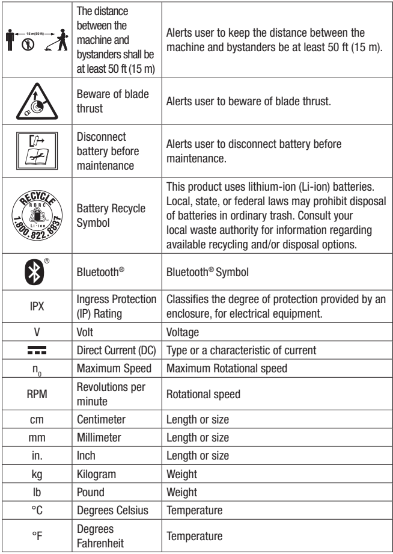

<table><tr><th>155</th><th>The distance
between the
machine and
bystanders shall be
at least 50 ft (15 m)</th><th>Alerts user to keep the distance between the
machine and bystanders be at least 50 ft (15 m).</th></tr><tr><td>A</td><td>Beware of blade
thrust</td><td>Alerts user to beware of blade thrust.</td></tr><tr><td>+]</td><td>Disconnect
battery before
maintenance</td><td>Alerts user to disconnect battery before
maintenance.</td></tr><tr><td>RECYCLE
1.800 822 E88</td><td>Battery Recycle
Symbol</td><td>This product uses lithium-ion (Li-ion) batteries.
Local, state, or federal laws may prohibit disposal
of batteries in ordinary trash. Consult your
local waste authority for information regarding
available recycling and/or disposal options.</td></tr><tr><td>B</td><td>Bluetooth®</td><td>Bluetooth® Symbol</td></tr><tr><td>IPX</td><td>Ingress Protection
(IP) Rating</td><td>Classifies the degree of protection provided by an
enclosure, for electrical equipment</td></tr><tr><td>V</td><td>Volt</td><td>Voltage</td></tr><tr><td></td><td>Direct Current (DC)</td><td>Type or a characteristic of current</td></tr><tr><td>no</td><td>Maximum Speed</td><td>Maximum Rotational speed</td></tr><tr><td>RPM</td><td>Revolutions per
minute</td><td>Rotational speed</td></tr><tr><td>cm</td><td>Centimeter</td><td>Length or size</td></tr><tr><td>mm</td><td>Millimeter</td><td>Length or size</td></tr><tr><td>in.</td><td>Inch</td><td>Length or size</td></tr><tr><td>kg</td><td>Kilogram</td><td>Weight</td></tr><tr><td>lb</td><td>Pound</td><td>Weight</td></tr><tr><td>°C</td><td>Degrees Celsius</td><td>Temperature</td></tr><tr><td>°F</td><td>Degrees
Fahrenheit</td><td>Temperature</td></tr></table>

56-VOLT LITHIUM-ION COMMERCIAL 17.5" STRING TRIMMER-STX4500/STX4500-FC

7

[[END OF PAGE 7]]

[[START OF PAGE 8]]

[[END OF PAGE 7]]

[[START OF PAGE 8]]

EGO

GENERAL BATTERY-OPERATED MACHINE SAFETY WARNINGS

A WARNING! Read all safety warnings, instructions, illustrations and specifications provided with this machine. Failure to follow all instructions listed below may result in electric shock, fire and/or serious injury.

SAVE ALL WARNINGS AND INSTRUCTIONS FOR FUTURE REFERENCE.

The term "machine" in the warnings refers to your mains-operated (corded) machine or battery-operated (cordless) machine.

Work area safety

	■ Keep work area clean and well lit. Cluttered or dark areas invite accidents.

■ Do not operate machines in explosive atmospheres, such as in the presence of flammable liquids, gases or dust. Machines create sparks which may ignite the dust or fumes.

■ Keep children and bystanders away while operating a machine. Distractions can cause you to lose control.

Electrical safety

	■ Machine plugs must match the outlet. Never modify the plug in any way. Do not use any adapter plugs with earthed (grounded) machines. Unmodified plugs and matching outlets will reduce risk of electric shock.

■ Avoid body contact with earthed or grounded surfaces, such as pipes, radiators, ranges and refrigerators. There is an increased risk of electric shock if your body is earthed or grounded.

■ Do not operate the machine in rain or wet conditions. Water entering the machine may increase the risk of electric shock or malfunction that could result in personal injury.

■ Do not abuse the cord. Never use the cord for carrying, pulling or unplugging the machine. Keep cord away from heat, oil, sharp edges or moving parts. Damaged or entangled cords increase the risk of electric shock.

	■ When operating a machine outdoors, use an extension cord suitable for outdoor use. Use of a cord suitable for outdoor use reduces the risk of electric shock.

	■ If operating a machine in a damp location is unavoidable, use a ground fault circuit interrupter (GFCI) protected supply. Use of a GFCI reduces the risk of electric shock.

8

56-VOLT LITHIUM-ION COMMERCIAL 17.5" STRING TRIMMER-STX4500/STX4500-FC

[[END OF PAGE 8]]

[[START OF PAGE 9]]

[[END OF PAGE 8]]

[[START OF PAGE 9]]

EGO

Personal safety

	■ Stay alert, watch what you are doing and use common sense when operating a machine. Do not use a machine while you are tired or under the influence of drugs, alcohol or medication. A moment of inattention while operating machines may result in serious personal injury.

■ Use personal protective equipment. Always wear eye protection. Protective equipment such as a dust mask, non-skid safety shoes, hard hat or hearing protection used for appropriate conditions will reduce personal injuries.

■ Prevent unintentional starting. Ensure the switch is in the off-position before connecting to power source and/or battery pack, picking up or carrying the machine. Carrying machines with your finger on the switch or energizing machines that have the switch on invites accidents.

■ Remove any adjusting key or wrench before turning the machine on. A wrench or a key left attached to a rotating part of the machine may result in personal injury.

■ Do not overreach. Keep proper footing and balance at all times. This enables better control of the machine in unexpected situations.

■ Dress properly. Do not wear loose clothing or jewelry. Keep your hair and clothing away from moving parts. Loose clothes, jewelry or long hair can be caught in moving parts.

■ If devices are provided for the connection of dust extraction and collection facilities, ensure these are connected and properly used. Use of dust collection can reduce dust-related hazards.

■ Do not let familiarity gained from frequent use of machines allow you to become complacent and ignore machine safety principles. A careless action can cause severe injury within a fraction of a second.

Machine use and care

■Do not force the machine. Use the correct machine for your application. The correct machine will do the job better and safer at the rate for which it was designed.

■ Do not use the machine if the switch does not turn it on and off. Any machine that cannot be controlled with the switch is dangerous and must be repaired.

	■ Disconnect the plug from the power source and/or remove the battery pack, if detachable, from the machine before making any adjustments, changing

56-VOLT LITHIUM-ION COMMERCIAL 17.5" STRING TRIMMER-STX4500/STX4500-FC

9

[[END OF PAGE 9]]

[[START OF PAGE 10]]

[[END OF PAGE 9]]

[[START OF PAGE 10]]

EGO

accessories, or storing machines. Such preventive safety measures reduce the risk of starting the machine accidentally.

■ Store idle machines out of the reach of children and do not allow persons unfamiliar with the machine or these instructions to operate the machine. Machines are dangerous in the hands of untrained users.

■ Maintain machines and accessories. Check for misalignment or binding of moving parts, breakage of parts and any other condition that may affect the machine's operation. If damaged, have the machine repaired before use. Many accidents are caused by poorly maintained machines.

■ Keep cutting machines sharp and clean. Properly maintained cutting machines with sharp cutting edges are less likely to bind and are easier to control.

■ Use the machine, accessories and machine bits etc. in accordance with these instructions, taking into account the working conditions and the work to be performed. Use of the machine for operations different from those intended could result in a hazardous situation.

■ Keep handles and grasping surfaces dry, clean and free from oil and grease. Slippery handles and grasping surfaces do not allow for safe handling and control of the machine in unexpected situations.

Battery machine use and care

■ Recharge only with the charger specified by the manufacturer. A charger that is suitable for one type of battery pack may create a risk of fire when used with another battery pack.

▪ Use machines only with specifically designated battery packs. Use of any other battery packs may create a risk of injury and fire.

■ When battery pack is not in use, keep it away from other metal objects, like paper clips, coins, keys, nails, screws or other small metal objects, that can make a connection from one terminal to another. Shorting the battery terminals together may cause burns or a fire.

■ Under abusive conditions, liquid may be ejected from the battery; avoid contact. If contact accidentally occurs, flush with water. If liquid contacts eyes, additionally seek medical help. Liquid ejected from the battery may cause irritation or burns.

■ Do not use a battery pack or machine that is damaged or modified. Damaged or modified batteries may exhibit unpredictable behavior resulting in fire, explosion or risk of injury.

10

56-VOLT LITHIUM-ION COMMERCIAL 17.5" STRING TRIMMER-STX4500/STX4500-FC

[[END OF PAGE 10]]

[[START OF PAGE 11]]

[[END OF PAGE 10]]

[[START OF PAGE 11]]

EGO

■ Do not expose a battery pack or machine to fire or excessive temperature. Exposure to fire or temperature above 265 °F (130 °C) may cause explosion.

■ Follow all charging instructions and do not charge the battery pack or machine outside the temperature range specified in the instructions. Charging improperly or at temperatures outside the specified range may damage the battery and increase the risk of fire.

Service

■ Have your machine serviced by a qualified repair person using only identical replacement parts. This will ensure that the safety of the machine is maintained.

■ Never service damaged battery packs. Service of battery packs should only be performed by the manufacturer or authorized service providers.

String trimmer and brush cutter safety warnings

	■ Do not use the machine in bad weather conditions, especially when there is a risk of lightning. This decreases the risk of being struck by lightning.

■ Thoroughly inspect the area for wildlife where the machine is to be used. Wildlife may be injured by the machine during operation.

■ Thoroughly inspect the area where the machine is to be used and remove all stones, sticks, wires, bones, and other foreign objects. Thrown objects can cause personal injury.

■ Before using the machine, always visually inspect to see that the cutter or blade and the cutter or blade assembly are not damaged. Damaged parts increase the risk of injury.

■ Follow instructions for changing accessories. Improperly tightened blade securing nuts or bolts may either damage the blade or result in it becoming detached.

■ The rated rotational speed of the blade must be at least equal to the maximum rotational speed marked on the machine. Blades running faster than their rated rotational speed can break and fly apart.

■ Wear eye, ear, head and hand protection. Adequate protective equipment will reduce personal injury by flying debris or accidental contact with the cutting line or blade.

56-VOLT LITHIUM-ION COMMERCIAL 17.5" STRING TRIMMER-STX4500/STX4500-FC

11

[[END OF PAGE 11]]

[[START OF PAGE 12]]

[[END OF PAGE 11]]

[[START OF PAGE 12]]

EGO

■ While operating the machine, always wear safety footwear. Do not operate the machine when barefoot or wearing open sandals. This reduces the chance of injury to the feet from contact with a moving cutter, line or blade.

■ While operating the machine, always wear long trousers. Exposed skin increases the likelihood of injury from thrown objects.

■ Keep bystanders away while operating the machine. Thrown debris can result in serious personal injury.

■ Always use two hands when operating the machine. Holding the machine with both hands will avoid loss of control.

■ Hold the machine by the insulated gripping surfaces only, because the cutting line or blade may contact hidden wiring. Cutting line or blades contacting a "live" wire may make exposed metal parts of the machine "live" and could give the operator an electric shock.

■ Always keep proper footing and operate the machine only when standing on the ground. Slippery or unstable surfaces may cause a loss of balance or control of the machine.

■ Do not operate the machine on excessively steep slopes. This reduces the risk of loss of control, slipping and falling which may result in personal injury.

■ When working on slopes, always be sure of your footing, always work across the face of slopes, never up or down and exercise extreme caution when changing direction. This reduces the risk of loss of control, slipping and falling which may result in personal injury.

■ Keep all parts of the body away from the cutter, line or blade when the machine is operating. Before you start the machine, make sure the cutter, line or blade is not contacting anything. A moment of inattention while operating the machine may result in injury to yourself or others.

■ Do not operate the machine above waist height. This helps prevent unintended cutter or blade contact and enables better control of the machine in unexpected situations.

■ When cutting brush or saplings that are under tension, be alert for spring back. When the tension in the wood fibers is released, the brush or sapling may strike the operator and/or throw the machine out of control.

▪ Use extreme caution when cutting brush and saplings. The slender material may catch the blade and be whipped toward you or pull you off balance.

■ Maintain control of the machine and do not touch cutters, lines or blades and other hazardous moving parts while they are still in motion. This reduces the risk of injury from moving parts.

12

56-VOLT LITHIUM-ION COMMERCIAL 17.5" STRING TRIMMER-STX4500/STX4500-FC

[[END OF PAGE 12]]

[[START OF PAGE 13]]

[[END OF PAGE 12]]

[[START OF PAGE 13]]

EGO

■ Carry the machine with the machine switched off and away from your body. Proper handling of the machine will reduce the likelihood of accidental contact with a moving cutter, line or blade.

■ Only use replacement cutters, lines, cutting heads and blades specified by the manufacturer. Incorrect replacement parts may increase the risk of breakage and injury.

■ When clearing jammed material or servicing the machine, make sure the switch is off and the battery pack is removed. Unexpected starting of the machine while clearing jammed material or servicing may result in serious personal injury.

■ When transporting or storing the machine, always fit the cover on metal blades.

■ Proper handling of the machine will reduce the likelihood of accidental contact with the blade.

■ Damage to Trimmer - If you strike a foreign object with the trimmer or it becomes entangled, stop the machine immediately, check for damage and have any damage repaired before further operation is attempted. Do not operate with a broken guard or spool.

■ If the equipment should start to vibrate abnormally, stop the motor and check immediately for the cause. Vibration is generally a warning of trouble. A loose head may vibrate, crack, break or come off the trimmer, which may result in serious or fatal injury. Make sure that the cutting attachment is properly fixed in position. If the head loosens after fixing it in position, replace it immediately. Never use a trimmer with a loose cutting attachment.

■ Use only with the battery packs and chargers listed below:

<table><tr><th>BATTERY PACK</th><th>CHARGER</th></tr><tr><td>BA1400, BA1400-FC, BA2800, BA2800-FC,</td><td>CH2100, CH2100-FC,</td></tr><tr><td>BA4200, BA4200-FC, BA1400T, BA1400T-FC,</td><td>CH3200, CH3200-FC,</td></tr><tr><td>BA2242T, BA2242T-FC, BA2800T, BA2800T-FC,</td><td>CH5500, CH5500-FC,</td></tr><tr><td>BA3360T, BA3360T-FC, BA4200T, BA4200T-FC,</td><td>CH2800D, CH2800D-FC</td></tr><tr><td>BA5600T, BA5600T-FC, BA6720T, BA6720T-FC</td><td>CH7000, CH7000-FC</td></tr></table>

56-VOLT LITHIUM-ION COMMERCIAL 17.5" STRING TRIMMER-STX4500/STX4500-FC

13

[[END OF PAGE 13]]

[[START OF PAGE 14]]

[[END OF PAGE 13]]

[[START OF PAGE 14]]

EGO

Blade thrust causes and related warnings

Blade thrust is a sudden sideways, forward or backward motion of the machine, which may occur when the blade jams or catches on an object such as a sapling or a tree stump. It can be violent enough to cause the machine and/or operator to be propelled in any direction, and possibly lose control of the machine.

Blade thrust and its related hazards can be avoided by taking proper precautions as given below.

	■ Maintain a firm grip with both hands on the machine and position your arms to resist blade thrust. Position your body to the left side of the machine. Blade thrust can increase the risk of injury due to the machine moving unexpectedly. Blade thrust can be controlled by the operator if proper precautions are taken.

■ If the blade binds, or when interrupting a cut for any reason, switch the machine off and hold the machine motionless in the material until the blade comes to a complete stop. While the blade is binding, never attempt to remove the machine from the material or pull the machine backward while the blade is in motion, otherwise blade thrust may occur. Investigate and take corrective actions to eliminate the cause of blade binding.

■ Do not use blunt or damaged blades. Blunt or damaged blades increase the risk of jamming or catching on an object, resulting in blade thrust.

■ Always maintain good visibility of the material being cut. Blade thrust is more likely to occur in areas where it is difficult to see the material being cut.

■ If you are approached by another person while operating the machine, switch the machine off. There is an increased risk of injury to other persons being struck by the moving blade in the event of blade thrust.

SAVE THESE INSTRUCTIONS!

14

56-VOLT LITHIUM-ION COMMERCIAL 17.5" STRING TRIMMER-STX4500/STX4500-FC

[[END OF PAGE 14]]

[[START OF PAGE 15]]

[[END OF PAGE 14]]

[[START OF PAGE 15]]

EGO

INTRODUCTION

Congratulations on your selection of the new EGO COMMERCIAL 56V Lithium-ion string trimmer. It has been designed, engineered and manufactured to give you the best possible dependability and performance.

Should you experience any problem you cannot easily remedy, please contact EGO customer service center 1-855-EGO-5656.

This manual contains important information on the safe assembly, operation and maintenance of your string trimmer. Read it carefully before using the string trimmer. Keep this manual handy so you can refer to it at any time.

SERIAL NUMBER

DATE OF PURCHASE

YOU SHOULD RECORD BOTH SERIAL NUMBER AND DATE OF PURCHASE AND KEEP IN A SAFE PLACE FOR FUTURE REFERENCE

56-VOLT LITHIUM-ION COMMERCIAL 17.5" STRING TRIMMER-STX4500/STX4500-FC

15

[[END OF PAGE 15]]

[[START OF PAGE 16]]

[[END OF PAGE 15]]

[[START OF PAGE 16]]

EGO

SPECIFICATIONS

<table><tr><th>Voltage</th><th>56 V</th></tr><tr><td>no</td><td>Low: 3500/min
Medium: 4500/min
High: 5700/min</td></tr><tr><td>Cutting Mechanism</td><td>Bump Head</td></tr><tr><td>Cutting Line</td><td>Kitted with 0.095"(2.4 mm) line,
compatible with up to 0.105 in (2.7 mm)
line</td></tr><tr><td>Cutting Swath</td><td>17.5 in. (45 cm)</td></tr><tr><td>Ingress Protection Rating</td><td>IPX5* (Protected against water jets)</td></tr><tr><td>Recommended Operating Temperature</td><td>32-104°F (0-40°C)</td></tr><tr><td>Recommended Storage Temperature</td><td>-4-158°F (-20-70°C)</td></tr><tr><td>Weight (without battery pack)</td><td>9.04 lbs (4.1 kg)</td></tr></table>

*NOTE: IPX5 rating is based on the machine and battery being used together as a system.

Recommended Accessories

<table><tr><th>PART NAME</th><th>MODEL NUMBER</th></tr><tr><td>Trimmer Head</td><td>AH3810</td></tr><tr><td>0.095" (2.4 mm) Cutting Line</td><td>AL2420P, AL2420PD, AL2450S</td></tr></table>

16

56-VOLT LITHIUM-ION COMMERCIAL 17.5" STRING TRIMMER-STX4500/STX4500-FC

[[END OF PAGE 16]]

[[START OF PAGE 17]]

[[END OF PAGE 16]]

[[START OF PAGE 17]]

EGO

DESCRIPTION

KNOW YOUR STRING TRIMMER (Fig. 1)

The safe use of this product requires an understanding of the information on the machine and in this operator's manual, as well as knowledge of the project you are attempting. Before using this product, familiarize yourself with all operating features and safety rules.

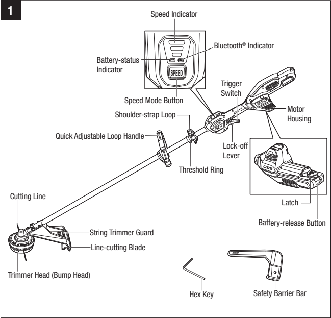

1 Speed Indicator

Bluetooth® Indicator

Battery-status
Indicator SPEED
Trigger
Switch
Speed Mode Button
-Motor
Shoulder-strap Loop Housing

Quick Adjustable Loop Handle-
Lock-off
Lever

Threshold Ring

Cutting Line
Latch

Battery-release Button
-String Trimmer Guard

-Line-cutting Blade

Trimmer Head (Bump Head)

Hex Key Safety Barrier Bar

56-VOLT LITHIUM-ION COMMERCIAL 17.5" STRING TRIMMER-STX4500/STX4500-FC

17

[[END OF PAGE 17]]

[[START OF PAGE 18]]

[[END OF PAGE 17]]

[[START OF PAGE 18]]

EGO

QUICK ADJUSTABLE LOOP HANDLE

For easy control of the machine during cutting.

THRESHOLD RING

Limits the loop handle mounting position.

SAFETY BARRIER BAR

Device attached to the brush cutter, designed to maintain a minimum distance between the operator and the cutting accessory when the machine is being operated.

STRING TRIMMER GUARD

Reduces the risk of injury from foreign objects flung backwards toward the operator and from contact with the cutting line.

TRIMMER HEAD (BUMP HEAD)

Stores the cutting line and releases the cutting line when the head is lightly tapped on the ground during operation.

LINE-CUTTING BLADE

Steel blade on the string trimmer guard that maintains the cutting line at the proper length.

CUTTING LINE

Cutting line for trimming.

TRIGGER SWITCH / LOCK-OFF LEVER

Turns the machine ON and OFF; the lock-off lever must be moved forward before pressing the trigger switch.

SPEED MODE BUTTON

Switches between high, medium, and low speed mode for different tasks at hand.

18

56-VOLT LITHIUM-ION COMMERCIAL 17.5" STRING TRIMMER-STX4500/STX4500-FC

[[END OF PAGE 18]]

[[START OF PAGE 19]]

[[END OF PAGE 18]]

[[START OF PAGE 19]]

EGO

BATTERY-STATUS INDICATOR

Indicates the charge level of the battery pack and the working status of the battery.

BLUETOOTH® INDICATOR

To set up Bluetooth® connection and indicate the connection status.

The Bluetooth® word mark and logos are registered trademarks owned by Bluetooth SIG, inc. and any use of such marks by EGO is under license.

56-VOLT LITHIUM-ION COMMERCIAL 17.5" STRING TRIMMER-STX4500/STX4500-FC

19

[[END OF PAGE 19]]

[[START OF PAGE 20]]

[[END OF PAGE 19]]

[[START OF PAGE 20]]

EGO

ASSEMBLY

- A WARNING: If any part is damaged or missing, do not operate this product until the part is replaced. Use of this product with damaged or missing parts could result in serious personal injury.

	- A WARNING: Do not attempt to modify this product or create accessories not recommended for use with this product. Any such alteration or modification is misuse and could result in a hazardous condition leading to possibly serious personal injury.

- A WARNING: Always wear heavy gloves when performing any maintenance on the blade. Be careful of the blade and protect your hands from being injured by the blade.

	- A WARNING: To prevent accidental starting that could cause serious personal injury, always remove the battery pack from the machine when assembling parts, making adjustments, cleaning, or when not in use.

UNPACKING

	■This product requires assembly.

■ Carefully remove the product and any accessories from the box. Make sure that all items listed in the packing list are included.

■ Inspect the machine carefully to make sure that no breakage or damage occurred during shipping.

■ Do not discard the packing material until you have carefully inspected and satisfactorily operated the machine.

		- If any parts are damaged or missing, please return the product to the place of purchase.

PACKING LIST

<table><tr><th>PART NAME</th><th>QUANTITY</th></tr><tr><td>String Trimmer</td><td>1</td></tr><tr><td>String Trimmer Guard</td><td>1</td></tr><tr><td>Quick Adjustable Loop Handle</td><td>1</td></tr><tr><td>Safety Barrier Bar (only for use with brush cutter head)</td><td>1</td></tr><tr><td>Hex Key (4 mm)</td><td>1</td></tr><tr><td>Operator's Manual</td><td>1</td></tr></table>

20

56-VOLT LITHIUM-ION COMMERCIAL 17.5" STRING TRIMMER-STX4500/STX4500-FC

[[END OF PAGE 20]]

[[START OF PAGE 21]]

[[END OF PAGE 20]]

[[START OF PAGE 21]]

EGO

MOUNTING AND ADJUSTING THE LOOP HANDLE

- A WARNING: Always remove the battery pack from the product when you are assembling parts, making adjustments, cleaning, or when the product is not in use.

		1. Stop the motor and remove the battery pack, if installed.

	2. Loosen the wing nut and remove the quick-release lever, clamping block, and wing nut from the loop handle (Fig. 2a).

- A WARNING: When the machine is used with brush cutter head (part of the EGO kit ABB1203-1, sold separately), the safety barrier bar must be installed onto the loop handle.

		3. Push the loop handle onto the shaft between the threshold ring and the warning label, make sure that the loop handle is positioned upwards and points toward the top of the rear handle (Fig. 2b).

		4. Insert the clamping block into the handle slot (Fig. 2c).

		5. Align the recessed part in the barrier bar with the protruded part on the loop handle, press the barrier bar onto the loop handle (Fig. 2d).

		6. Mount the quick-release lever and tighten the wing nut (Fig. 2e).

	7. Pull the quick-release lever up to move/rotate the loop handle to a comfortable operating position (Fig. 2).

		8. Fold the quick-release lever to secure the loop handle in place (Fig. 2g).

A WARNING: Never use the machine without the loop handle securely attached.

56-VOLT LITHIUM-ION COMMERCIAL 17.5" STRING TRIMMER-STX4500/STX4500-FC

21

[[END OF PAGE 21]]

[[START OF PAGE 22]]

[[END OF PAGE 21]]

[[START OF PAGE 22]]

EGO

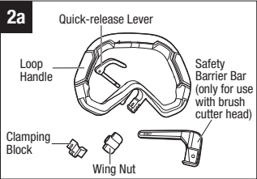

2a Quick-release Lever

Loop Safety
Handle Barrier Bar
(only for use
with brush
cutter head)

Clamping
Block
Wing Nut

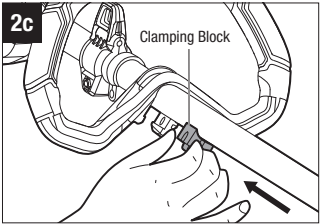

2c
Clamping Block

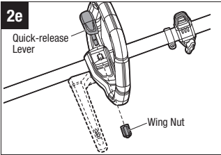

2e

Quick-release
Lever

-Wing Nut

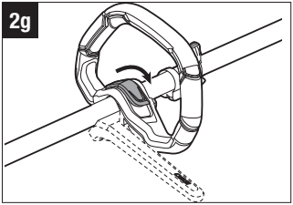

2g

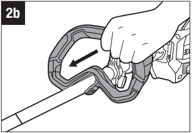

2b

2d

Recessed

Part

Protruded Part

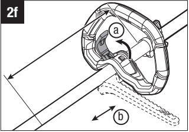

2f

(b)

22

56-VOLT LITHIUM-ION COMMERCIAL 17.5" STRING TRIMMER-STX4500/STX4500-FC

[[END OF PAGE 22]]

[[START OF PAGE 23]]

[[END OF PAGE 22]]

[[START OF PAGE 23]]

EGO

MOUNTING THE STRING
TRIMMER GUARD

- A WARNING: To reduce the risk of injury to people, do not operate without guard in place.

- A WARNING: Always wear gloves when mounting or replacing the guard. Be careful of the line-cutting blade on the guard and protect your hands from being injured by the blade.

	1. Loosen the two bolts in the guard with the supplied hex key, then remove the bolts and spring washers from the guard (Fig. 3a).

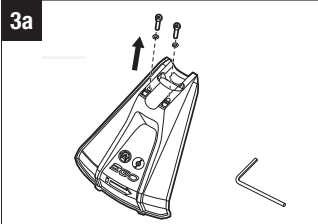

3a

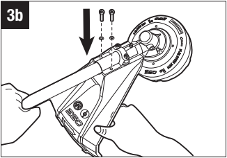

3b

2. Lift the trimmer head and face it downward. Align the two mounting holes in the guard with the two assembly holes in the base of the shaft. Make sure that the internal surface of the guard faces towards the trimmer head (Fig. 3b).

3. Secure the guard to the shaft using the two bolts and washers (Fig. 3b).

4. Use the supplied hex key to tighten the bolts.

NOTICE: There are two kinds of guards compatible with this machine. Only the guard with icon can be used with the string trimmer head and must not be used with the brush cutter head. Be careful to choose the correct guard when using the machine.

NOTICE: The brush cutter guard is not included (part of the EGO kit ABB1203-1, sold separately).

56-VOLT LITHIUM-ION COMMERCIAL 17.5" STRING TRIMMER-STX4500/STX4500-FC

23

[[END OF PAGE 23]]

[[START OF PAGE 24]]

[[END OF PAGE 23]]

[[START OF PAGE 24]]

EGO

ATTACHING/DETACHING
BATTERY

NOTE: Fully charge battery pack before
first use.

To Attach

Align the battery ribs with the mounting slots in the machine's battery port and slide the battery pack until it snaps into position (Fig. 4).

To Detach

A WARNING: Always be aware of the location of your feet, children, or pets when pressing the battery-release button. Serious injury could result if the battery pack falls. NEVER remove the battery pack at a high location.

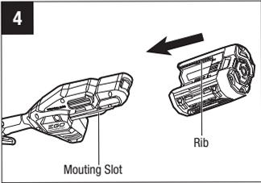

Rib

Mouting Slot

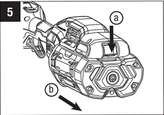

5
(a

■ Depress the battery-released button and the battery pack will disengage from the latch (Fig. 5).

■ Grasp the battery pack and remove it from the machine.

24

56-VOLT LITHIUM-ION COMMERCIAL 17.5" STRING TRIMMER-STX4500/STX4500-FC

[[END OF PAGE 24]]

[[START OF PAGE 25]]

[[END OF PAGE 24]]

[[START OF PAGE 25]]

EGO

MOUNTING THE SHOULDER STRAP AP1500 (SOLD SEPARATELY)

Depress the carabiner to open it and hook the carabiner onto the shoulder strap loop (Fig. 6a).

For safe and better operation, put on the shoulder strap across the shoulder as shown in Fig. 6b. Adjust the shoulder strap length to a comfortable operating position. Hold the machine with both hands: one hand on the rear handle and the other hand on the loop handle. The trimmer head should be parallel to the ground so that it easily contacts the material to be cut without the operator having to bend over.

There are two ways to release the strap. Take it off from your shoulder directly (Fig. 6c) or press the carabiner of the strap and disconnect it out from the shoulder-strap loop (Fig. 6d).

When an emergency occurs, take the strap off from your shoulder immediately, no matter what way the strap is on.

You should not use the single-shoulder strap and double-shoulder strap simultaneously.

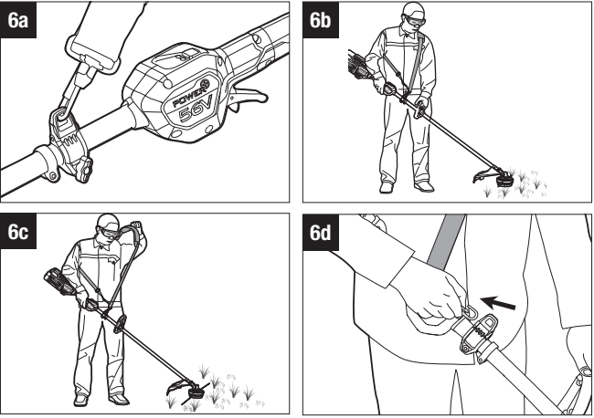

6a 6b

POWER
56V

NE

6c 6d

56-VOLT LITHIUM-ION COMMERCIAL 17.5" STRING TRIMMER-STX4500/STX4500-FC

25

[[END OF PAGE 25]]

[[START OF PAGE 26]]

[[END OF PAGE 25]]

[[START OF PAGE 26]]

EGO

OPERATION

	- A WARNING: Do not allow familiarity with this product to make you careless. Remember that a careless fraction of a second is sufficient to inflict serious injury.

- A WARNING: Always wear eye protection that is marked to comply with ANSI Z87.1. Failure to do so could result in objects being thrown into your eyes and other possible serious injuries.

- A WARNING: Do not use any attachments or accessories not recommended by the manufacturer of this product. The use of attachments or accessories not recommended can result in serious personal injury.

- A WARNING: To prevent serious personal injury, disconnect the battery pack from the machine before servicing, cleaning, changing attachments or removing material from the unit.

APPLICATIONS

You may use this product for the purposes listed below:

■ With Trimmer Head (original configuration): Trimming grass and weeds from around porches, fences and decks.

■ With 3-tooth metal blade (sold separately): Cutting grass, weeds, wild growth and scrub, thinning young stands with a maximum stem diameter of 3/4 in (2 cm).

NOTICE: The machine is to be used only for its prescribed purpose. Any other use is deemed to be a case of misuse.

26

56-VOLT LITHIUM-ION COMMERCIAL 17.5" STRING TRIMMER-STX4500/STX4500-FC

[[END OF PAGE 26]]

[[START OF PAGE 27]]

[[END OF PAGE 26]]

[[START OF PAGE 27]]

EGO

HOLDING THE STRING TRIMMER
(FIG. 7)

A WARNING: Dress properly to reduce the risk of injury when operating this machine. Do not wear loose clothing or jewelry. Wear eye and ear/hearing protectors. Wear heavy, long pants, boots and gloves. Do not wear short pants or sandals or go barefoot.

7

Hold the string trimmer with one hand on the rear handle and your other hand on the loop handle. Keep a firm grip with both hands while operating the machine. The string trimmer should be held at a comfortable position, with the rear handle at about hip height. The trimmer head should be parallel to the ground so that it easily contacts the material to be cut without the operator having to bend over.

USING THE STRING TRIMMER

A WARNING: To avoid serious personal injury, wear goggles or safety glasses at all times when operating this unit. Wear a face mask or dust mask in dusty locations.

Clear the area to be cut before each use. Remove all objects, such as rocks, broken glass, nails, wire, or string that can be thrown or become entangled in the cutting attachment. Clear the area of children, bystanders, and pets. At a minimum, keep all children, bystanders and pets at least 50 feet (15 m) away; there still may be risk to bystanders from thrown objects. Bystanders should be encouraged to wear eye protection. If you are approached, stop the machine immediately.

A WARNING: To prevent serious personal injury, remove the battery pack from the machine before servicing, cleaning, changing attachments or removing material from the unit.

Before each use check for damaged/worn parts

Check the trimmer head, guard, and loop handle and replace any parts that are cracked, warped, bent, or damaged in any away.

The line-cutting blade on the guard can dull over time. It is recommended that you periodically sharpen it with a file or replace it with a new blade.

56-VOLT LITHIUM-ION COMMERCIAL 17.5" STRING TRIMMER-STX4500/STX4500-FC

27

[[END OF PAGE 27]]

[[START OF PAGE 28]]

[[END OF PAGE 27]]

[[START OF PAGE 28]]

EGO

A WARNING: Always wear gloves when mounting or replacing the guard or when sharpening or replacing the line-cutting blade. Note the location of the line-cutting blade on the guard and protect your hand from injury.

Clean the trimmer after each use

- See the Maintenance section for cleaning instructions.

A WARNING: Never use water to clean your trimmer. Avoid using solvents when cleaning plastic parts. Most plastics are susceptible to damage from various types of commercial solvents. Use clean cloth to remove dirt, dust, oil, grease, etc.

Check for blockage of the trimmer head

To prevent blockage, keep the trimmer head clean. Remove grass clippings, leaves, dirt and any other accumulated debris before and after each use.

When blockage happens, stop the string trimmer and remove the battery. Then remove any grass that may have wrapped itself around the motor shaft or trimmer head.

STARTING/STOPPING THE MACHINE

A WARNING: Dress properly to reduce the risk of injury when operating this machine. Do not wear loose clothing or jewelry. Wear eye and ear/hearing protection. Wear heavy duty, long trousers, boots and gloves. Do not wear short trousers, sandals or go barefoot.

To start the machine (Fig. 8)

1. Move the lock-off lever forward and then press the trigger switch to start.

2. The rotational speed of the trimmer head is controlled with the trigger switch. More pressure on the trigger results in higher speed; less pressure on the trigger results in lower speed. Adjust the speed to suit the task at hand.

8

40
POWER
56V

(a) (b
Lock-off Lever
Trigger Switch

NOTICE: The motor starts only when the lock-off lever is moved forward and the trigger switch is depressed at the same time.

28

56-VOLT LITHIUM-ION COMMERCIAL 17.5" STRING TRIMMER-STX4500/STX4500-FC

[[END OF PAGE 28]]

[[START OF PAGE 29]]

[[END OF PAGE 28]]

[[START OF PAGE 29]]

EGO

To stop the machine

Move the machine away from the cutting area and release the trigger switch to stop it.

A WARNING: Always remove the battery pack from the machine during work breaks and after finishing work.

CHANGING SPEED MODE (FIG. 9)

This machine features three speed
modes.

The speed mode will change with every press of the speed mode button.

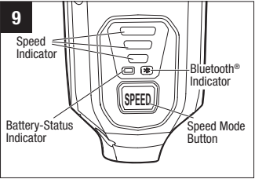

9

Speed
Indicator
-Bluetooth®
Indicator
SPEED

Battery-Status Speed Mode
Button

The speed indicator will display the active Indicator speed mode: one light for low speed, two lights for medium speed, three lights for high speed. The low speed mode provides better control of the machine and longer operating time per charge.

NOTICE: The speed mode can be set before the machine is turned on OR during operation.

When the machine is re-started after a break, the speed mode will return to the previous speed.

56-VOLT LITHIUM-ION COMMERCIAL 17.5" STRING TRIMMER-STX4500/STX4500-FC

29

[[END OF PAGE 29]]

[[START OF PAGE 30]]

[[END OF PAGE 29]]

[[START OF PAGE 30]]

EGO

BATTERY-STATUS INDICATOR AND SPEED INDICATOR (FIG. 9)

The battery-status indicator shows the charge level and the working status of the battery pack, and the speed indicator shows the working status of the machine as shown in the chart below. The battery-status indicator and the speed indicator will illuminate when the machine is started or the speed mode button is pressed.

<table><tr><th colspan="3">Indicator Lights</th><th>Meaning</th></tr><tr><td rowspan="4"></td><td>Solid green</td><td></td><td>Battery charge level of 20% to 100%</td></tr><tr><td>Flashing green</td><td></td><td>Battery charge level of 10% to 20%</td></tr><tr><td>Solid red</td><td></td><td>Battery charge level of less than 10%</td></tr><tr><td>Flashing red</td><td></td><td>The battery pack charge is nearly
depleted and needs to be charged
immediately.</td></tr><tr><td rowspan="2">Battery-status
Indicator</td><td>Solid orange</td><td></td><td>The battery pack is overheated.
Cool the battery pack until the
temperature drops below 152°F
(67°C). See "Battery High-
temperature Protection" below.</td></tr><tr><td>Flashing
red/green
alternately</td><td></td><td>The battery pack electronics error.
Replace the battery pack or contact
EGO customer service center.
See "Battery Electronics Error
Protection".</td></tr><tr><td rowspan="3">Speed
Indicator (the
illustration
shows the high
speed)</td><td>Solid green</td><td></td><td>The machine is working properly.</td></tr><tr><td>Solid orange</td><td></td><td>The machine is overheated. Cool the
machine until the temperature drops
below 176°F (80°C). See "Machine
High-temperature Protection" below.</td></tr><tr><td>Flashing orange</td><td>\\/ //</td><td>The machine is overloaded. See
"Machine Overload Protection" below.</td></tr></table>

30

56-VOLT LITHIUM-ION COMMERCIAL 17.5" STRING TRIMMER-STX4500/STX4500-FC

[[END OF PAGE 30]]

[[START OF PAGE 31]]

[[END OF PAGE 30]]

[[START OF PAGE 31]]

EGO

Battery High-temperature Protection

If the battery temperature exceeds 158°F (70°C) during operation, the temperature- protection circuit will immediately shut off the machine to protect the battery pack from overheating damage. The battery-status indicator will glow solid orange. Release the trigger and wait until the overheated battery cools down and the indicator turns green, then restart the machine.

Battery Electronics Error Protection

When the battery pack electronics error occurs, the battery-status indictor will flash red/green alternately and the machine will shut off in 3 seconds. Replace the battery pack or contact EGO customer service center.

Machine Overload Protection

This machine features a built-in overload circuit protection. When the machine is overloaded, the motor will stop and the speed indicator will flash orange. Remove the battery pack from the machine, then reattach the battery pack and restart the machine. Decrease the load on the machine, avoid too long or oversize cutting line or cutting of the heavy/woody shrubs.

Machine High-temperature Protection

If the machine temperature exceeds 194°F (90°C) during operation, the temperature- protection circuit will immediately shut off the machine to prevent overheating damage. The speed indicator will glow solid orange. Release the trigger and wait until the overheated machine cools down and the speed indicator turns green, then restart the machine.

BLUETOOTH® WIRELESS TECHNOLOGY

Products with built-in Bluetooth® wireless technology can connect to mobile devices. Please visit www.egopowerplus.com/commercial for instructions on how to use the Bluetooth® function.

The Bluetooth® symbol
mobile device.

will light up when the machine is connected to your

56-VOLT LITHIUM-ION COMMERCIAL 17.5" STRING TRIMMER-STX4500/STX4500-FC

31

[[END OF PAGE 31]]

[[START OF PAGE 32]]

[[END OF PAGE 31]]

[[START OF PAGE 32]]

EGO

ADJUSTING THE CUTTING LINE
LENGTH

The trimmer head allows the operator to release more cutting line without stopping the motor. As line becomes frayed or worn, additional line can be released by lightly tapping the trimmer head on the ground while operating the trimmer (Fig. 10a).

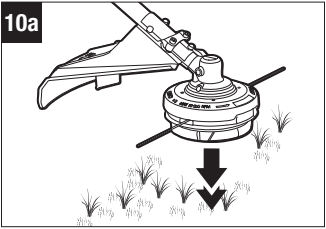

10a

A WARNING: Do not remove or alter the line-cutting blade assembly. Excessive line length will cause the motor to overheat and may result in serious personal injury.

For best results, tap the trimmer head on bare ground or hard soil. If line release is attempted in tall grass, the motor may overheat. Always keep the trimming line fully extended. Line release becomes more difficult as the cutting line becomes shorter. Replace the line when necessary. For instructions, please see section "LINE REPLACEMENT".

32

56-VOLT LITHIUM-ION COMMERCIAL 17.5" STRING TRIMMER-STX4500/STX4500-FC

[[END OF PAGE 32]]

[[START OF PAGE 33]]

[[END OF PAGE 32]]

[[START OF PAGE 33]]

EGO

Tips for best trimming results
(Fig. 10b)

	- The correct angle for the cutting attachment is parallel to the ground.

■Do not force the trimmer. Allow the very tip of the line to do the cutting (especially along walls). Cutting with more than the tip will reduce cutting efficiency and may overload the motor.

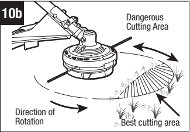

10b Dangerous
Cutting Area

Direction of
Rotation **Best cutting area

■ The cutting height is determined by the distance of the cutting line from the lawn surface.

■ Grass over 8 inches (20 cm) should be cut by working from top to the bottom in small increments to avoid premature line wear or motor drag.

■ Slowly move the trimmer into and out of the area being cut, maintaining the cutting head position at the desired cutting height. This movement can be either a forward-backward motion or a side-to-side motion. Cutting shorter lengths produces best results.

■ Avoid trimming when grass and weeds are wet.

■ Wire and picket fences can cause extra cutting line wear or breakage. Stone and brick walls, curbs, and wood may wear cutting line rapidly.

■ Avoid trees and shrubs. Tree bark, wood moldings, siding, and fence posts can easily be damaged by the cutting line.

56-VOLT LITHIUM-ION COMMERCIAL 17.5" STRING TRIMMER-STX4500/STX4500-FC

33

[[END OF PAGE 33]]

[[START OF PAGE 34]]

[[END OF PAGE 33]]

[[START OF PAGE 34]]

EGO

LINE REPLACEMENT

NOTICE: Always use the recommended nylon cutting line with a diameter that does not exceed 0.105 in (2.7 mm). Using line other than that specified may cause the machine to overheat or become damaged.

A WARNING: Never use metal-reinforced line, wire, or rope, etc. These can break off and become dangerous projectiles.

Trimmer head assembly is shown for reference in Fig. 12a.

	1. Remove the battery pack.

	2. For 0.095" (2.4 mm) line, cut one piece of cutting line 26 ft. (8 m) long. Insert the line into the eyelet (Fig. 11a) and push the line until the end of the line comes out of the opposite eyelet. Pull the line from the other side until equal lengths of the line appear on both sides of the trimmer head.

	3. Press and rotate lower cover assembly in the direction indicated by the arrow to wind the cutting line onto the spool until approximately 6 in. (15.3 cm) of line is showing on each side (Fig. 11b).

4. Push the lower cover assembly down while pulling on the lines to manually advance the line and to check for proper assembly of the trimmer head.

RELOADING THE CUTTING LINE

NOTICE: When the cutting line breaks from the eyelet or the cutting line is not released when the trimmer head is tapped, follow the steps below:

1. Remove the battery pack.

2. Press two release tabs on the trimmer head and remove the lower cover assembly of the trimmer head by pulling it straight out (Fig. 11c & 11d).

3. Remove the cutting line from the spool.

4. Make sure the spring is in its original position in the lower cover assembly.

5. With one hand holding the trimmer, use the other hand to grasp the lower cover assembly and align the slots in the lower cover assembly with the release tabs. Press the lower cover assembly until it snaps into place, at which time you will hear a distinct click sound (Fig. 11e).

6. Follow the instructions in "LINE REPLACEMENT" to reload the cutting line. Make sure that the release tabs on the spool retainer snap into place or the spool assembly will come out during operation, which may result in serious personal injury.

34

56-VOLT LITHIUM-ION COMMERCIAL 17.5" STRING TRIMMER-STX4500/STX4500-FC

[[END OF PAGE 34]]

[[START OF PAGE 35]]

[[END OF PAGE 34]]

[[START OF PAGE 35]]

EGO

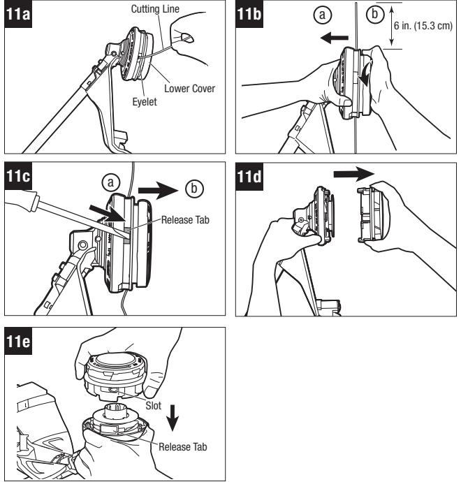

11a Cutting Line 11b O
6 in. (15.3 cm)

Lower Cover
Eyelet

11c 11d

Release Tab

11e

Slot

Release Tab

56-VOLT LITHIUM-ION COMMERCIAL 17.5" STRING TRIMMER-STX4500/STX4500-FC

35

[[END OF PAGE 35]]

[[START OF PAGE 36]]

[[END OF PAGE 35]]

[[START OF PAGE 36]]

EGO

CONVERTING THE MACHINE TO BRUSH CUTTER

This string trimmer can be converted into a brush cutter using the EGO kit ABB1203-1 (Sold Separately). The required steps are:

■ Replacement of the string trimmer head with a metal blade.

■Replacement of the string trimmer guard with the brush cutter guard.

■ Installation of the Safety Barrier Bar (refer to chapter "MOUNTING AND ADJUSTING THE LOOP HANDLE").

REPLACE THE STRING TRIMMER HEAD WITH THE 3-TOOTH BLADE (PART OF THE EGO KIT ABB1203-1, SOLD SEPARATELY)

Familiarize yourself with the trimmer head by referring to Fig. 12a.

Follow the steps below to remove the trimmer head and mount the 3-tooth blade.

12a Slot in the Flange

Drive Shaft Spool
Flange
-Cutting Line
Flange Cover

Upper Cover

Spring

Lower Cover Assembly

Lower Cover Assembly

1. Disconnect the battery pack.

2. Rotate the trimmer head to align the slot in the inner flange with the shaft-locking hole in the gear case and insert the provided hex key into the aligned hole to act as a stabilizer (Fig. 12b).

3. Wear gloves. Rotate the trimmer head CLOCKWISE according to the rotation direction marked on the upper cover (Fig. 12b) until it can be removed from the shaft.

4. The 3-tooth blade is shipped in a sheath. Remove the blade from the sheath according to Fig. 12c. Keep the sheath in a safe place for future use.

36

56-VOLT LITHIUM-ION COMMERCIAL 17.5" STRING TRIMMER-STX4500/STX4500-FC

[[END OF PAGE 36]]

[[START OF PAGE 37]]

[[END OF PAGE 36]]

[[START OF PAGE 37]]

EGO

- A WARNING: To protect against injury, wear gloves prior to any operation with the 3-tooth blade.

	5. Before mounting the blade, make sure that the inner flange and flange cover are located correctly on the motor shaft (Fig. 12d).

	6. Rotate the motor shaft to align the slot in the inner flange with the shaft-locking hole in the gear case.

	7. Insert the hex key into the aligned holes to act as a stabilizer.

	8. Mount the blade onto the motor shaft, ensuring that the surface of the blade is flush with the surface of the inner flange bulge. Mount the outer flange and the nut included in the EGO kit ABB1203-1 (Fig. 12e). Finger-tighten the nut in COUNTERCLOCKWISE direction.

	9. Position the gear case against a solid surface for support. With one hand holding the brush cutter shaft and the other hand grasping a 16mm socket wrench (not included) to tighten the nut COUNTERCLOCKWISE (Fig. 121).

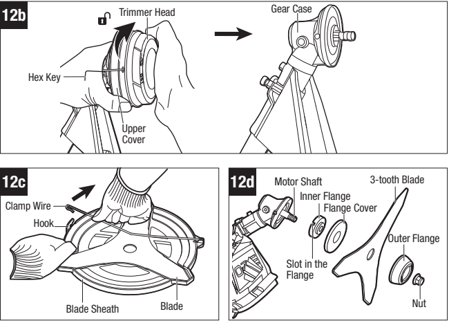

12b Trimmer Head Gear Case

Hex Key

Upper
Cover

12c 12d Motor Shaft 3-tooth Blade
Inner Flange
Clamp Wire Flange Cover
Hook
Outer Flange

Slot in the
Flange

Blade Sheath Blade Nut

56-VOLT LITHIUM-ION COMMERCIAL 17.5" STRING TRIMMER-STX4500/STX4500-FC

37

[[END OF PAGE 37]]

[[START OF PAGE 38]]

[[END OF PAGE 37]]

[[START OF PAGE 38]]

EGO

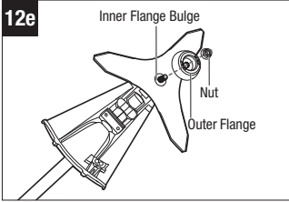

12e Inner Flange Bulge

Nut

Outer Flange

REPLACE THE STRING TRIMMER
GUARD WITH THE BRUSH
CUTTER GUARD

1. Remove the string trimmer guard by loosening the two bolts. Then remove the bolts, washers, and guard (Fig. 13a). Keep the guard in a safe place for future use.

2. Lift the cutter head and face it downward. Align the two mounting holes in the guard with the two assembly holes in the base of the shaft. Make sure that the internal surface of the guard faces towards the metal blade (Fig. 13b).

3. Install the brush cutter guard included in the EGO kit ABB1203-1 with the two bolts and washers from the string trimmer (Fig. 13b).

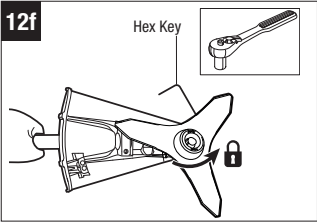

12f Hex Key

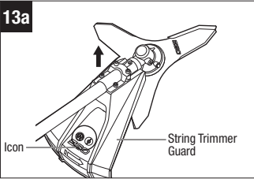

13a

-String Trimmer
Icon- Guard

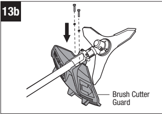

13b

Brush Cutter
Guard

4. Use the supplied hex key to tighten the bolts.

38

56-VOLT LITHIUM-ION COMMERCIAL 17.5" STRING TRIMMER-STX4500/STX4500-FC

[[END OF PAGE 38]]

[[START OF PAGE 39]]

[[END OF PAGE 38]]

[[START OF PAGE 39]]

EGO

USING THE MACHINE WITH 3-TOOTH BLADE (kit ABB1203-1, SOLD SEPARATELY)

To cut wild growth and scrub, lower the rotating blade down onto the growth to achieve a chopping effect. Use the brush cutter like a scythe (sweep it to the right and left) at ground level. Do not use the cutting attachment above waist height.

- A WARNING: The higher the cutting attachment is off the ground, the greater the risk of injury from cuttings being thrown sideways.

- A WARNING: When cutting young stands or other woody materials up to 3/4 in (2 cm) in diameter, use the left side of the blade to avoid blade thrust situations. Do not attempt to cut woody material with a larger diameter, since the blade may catch or jerk the brush cutter forward. This may cause damage to the blade or the brush cutter or loss of control of the brush cutter, resulting in personal injury.

- A WARNING: Improper use of a brush cutter blade may cause it to crack, chip, or shatter. Thrown parts may seriously injure the operator or bystander. To reduce the risk of personal injury, it is essential to take the following precautions:

	■ Avoid contact with hard or solid foreign objects such as stones, rocks, or pieces of metal.

	■Never cut wood or shrubs with a stem diameter of more than 3/4 in (2 cm).

	■Inspect the blade at a regular short intervals for signs of damage. Do not continue working with a damaged blade.

	■Re-sharpen the blade regularly (when it has dulled noticeably) and have it balanced if necessary (should be performed by a qualified service technician).

Blade Thrust

Exercise extreme caution when using the blade with this unit. Blade thrust is the reaction that may occur when the spinning blade contacts anything it cannot cut. This contact may cause the blade to stop for an instant and suddenly "thrust" the unit away from the object that was hit. This reaction can be violent enough to cause the operator to lose control of the unit. Blade thrust can occur without warning if the blade snags, stalls, or binds. This is more likely to occur in areas where it is difficult to see the material being cut. For cutting ease and safety, approach the weeds being cut with the brush cutter from the right to the left. In the event an unexpected object or woody stock is encountered, this practice could minimize the blade thrust reaction.

56-VOLT LITHIUM-ION COMMERCIAL 17.5" STRING TRIMMER-STX4500/STX4500-FC

39

[[END OF PAGE 39]]

[[START OF PAGE 40]]

[[END OF PAGE 39]]

[[START OF PAGE 40]]

EGO

Tips for best brush-cutting

■ Always hold brush cutter on your right side with both hands when operating. Use a firm grip on both handles.

■ Maintain your grip and balance on both feet. Position yourself so that you will not be drawn off balance by the kickback reaction of the cutting blade.

■ Inspect and clear the area of any hidden objects such as glass, rocks, concrete, fencing, wire, wood, metal, etc., which can be thrown or entangled in the blade.

■ Never use blades near sidewalks, fencing, posts, buildings, or other immovable objects.

	- Never use a blade after hitting a hard object without first inspecting it for damage. Do not use if any damage is detected.

■Use the unit for cutting from the right to the left in a broad sweeping action from side to side.

■ Use only the EGO™ blade. Using any other brand blade with this brush cutter could result in serious personal injury.

40

56-VOLT LITHIUM-ION COMMERCIAL 17.5" STRING TRIMMER-STX4500/STX4500-FC

[[END OF PAGE 40]]

[[START OF PAGE 41]]

[[END OF PAGE 40]]

[[START OF PAGE 41]]

EGO

MAINTENANCE

	- A WARNING: When servicing, use only identical replacement parts. Use of any other parts may create a hazard or cause product damage. To ensure safety and reliability, all repairs should be performed by a qualified service technician.

- A WARNING: Battery machines do not have to plugged into an electrical outlet; therefore, they are always in operating condition. To prevent serious personal injury, take extra precautions and care when performing maintenance, service or for changing the cutting accessories or attachments.

- A WARNING: To prevent serious personal injury, remove the battery pack from the machine before servicing, cleaning, or removing material from the unit. All string trimmer service, other than the items listed in these maintenance instructions, should be performed by competent string trimmer service personnel.

GENERAL MAINTENANCE

Avoid using solvents when cleaning plastic parts. Most plastics are susceptible to damage from various types of commercial solvents and may be damaged by their use. Use a clean cloth to remove dirt, dust, oil, grease, etc.

- A WARNING: Avoid using solvents when cleaning plastic parts. Most plastics are susceptible to damage from various types of commercial solvents and may be damaged by their use. Use a clean cloth to remove dirt, dust, oil, grease, etc.

	- A WARNING: When cleaning the machine, DO NOT immerse in water or other liquids.

CLEANING

	■Remove the battery pack.

	■ After each use, clean the debris, clogged soil, grass on the blade or the guard or the grass that may have wrapped itself around the motor shaft or trimmer head with a soft brush.

	■ Wipe the machine surface with a clean cloth moistened with a mild soap solution.

■Use a small brush or a vacuum cleaner to clean the air vents on the rear housing. Keep the air vents free of obstructions.

56-VOLT LITHIUM-ION COMMERCIAL 17.5" STRING TRIMMER-STX4500/STX4500-FC

41

[[END OF PAGE 41]]

[[START OF PAGE 42]]

[[END OF PAGE 41]]

[[START OF PAGE 42]]

EGO

■ Do not use any strong detergents on the plastic housing or the handle. They can be damaged by certain aromatic oils, such as pine and lemon, and by solvents such as kerosene. Moisture can also cause a shock hazard. Wipe off any moisture with a soft dry cloth.

TRIMMER HEAD REPLACEMENT

If the head loosens after it is fixed in position, replace it immediately.

A WARNING: Never use a trimmer with a loose cutting attachment. Replace a cracked, damaged or worn out cutting head immediately, even if damage is limited to superficial cracks. Such attachments may shatter at high speed and cause serious injury.

Remove the trimmer head

Please see the "REPLACE THE STRING TRIMMER HEAD WITH THE 3-TOOTH BLADE" chapter.

Install the new trimmer head

	1. Before installing the new trimmer head, make sure that the inner flange and flange cover are located correctly on the motor shaft as shown in Fig. 14a.

	2. Align the drive shaft with the screw hole of trimmer head, and then pre- tighten the trimmer head onto the shaft COUNTERCLOCKWISE.

	3. Rotate the trimmer head to align the slot in the flange with the shaft- locking hole in the gear case and insert the provided hex key into the aligned holes to act as a stabilizer.

4. Wear gloves. Securely tighten
the trimmer head onto the shaft
COUNTERCLOCKWISE (Fig. 14b).

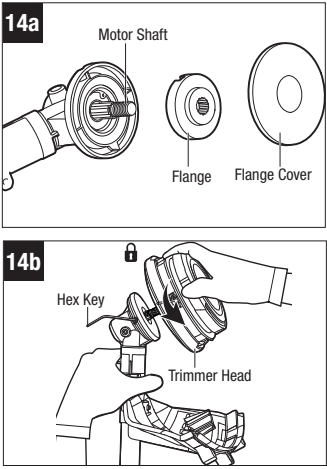

14a
Motor Shaft

Flange Flange Cover

14b

Hex Key

Trimmer Head

42

56-VOLT LITHIUM-ION COMMERCIAL 17.5" STRING TRIMMER-STX4500/STX4500-FC

[[END OF PAGE 42]]

[[START OF PAGE 43]]

[[END OF PAGE 42]]

[[START OF PAGE 43]]

EGO

SHARPEN THE LINE-CUTTING BLADE

A WARNING: Always protect your hands by wearing heavy gloves when performing any maintenance on the line-cutting blade.

	1. Remove the line-cutting blade from the trimmer guard.

2. Secure the blade in a vise.

	3. Wear proper eye protection and gloves and be careful not to cut yourself.

	4. Carefully file the cutting edges of the blade with a fine-tooth file or sharpening stone, maintaining the original cutting edge angle.

	5. Reinstall the line-cutting blade onto the guard and secure it in place with the two screws.

TRANSMISSION GEARS
LUBRICATION

The transmission gears in the cutting head and power head assemblies need to be lubricated periodically with gear grease. Check the gear case grease level approximately every 50 hours of operation by removing the two sealing bolts (Fig. 15a, 15b).

If no grease can be seen on the flanks of the gear, follow the steps below to fill with gear grease to 3/4 capacity. Do not completely fill the transmission gear case.

1. Use the included hex key to loosen and remove the sealing bolt(s).

2. Use a grease gun (not included) to inject some grease into the bolt hole; do not exceed 3/4 capacity.

3. Tighten the sealing bolt(s) after injection.

15a Cutting Head Assembly

Sealing-
Bolt

15b Power Head Assembly

BRUSHLESS

ZGO
COMMERCIAL

Sealing Bolt

56-VOLT LITHIUM-ION COMMERCIAL 17.5" STRING TRIMMER-STX4500/STX4500-FC

43

[[END OF PAGE 43]]

[[START OF PAGE 44]]

[[END OF PAGE 43]]

[[START OF PAGE 44]]

EGO

The grease should meet the following requirements:

■ NLGI Grade Penetration: NLGI-1

■Thickener Type: Ester

■Recommended Operating Temperature Range: -40°F to 356°F (-40°C to 180°C)

■ Other than above, the grease should also have excellent low-temperature startup,EP, mechanical shearing, abrasion resistance and oxidative stability.

TRANSPORTING AND STORING

■If the 3-tooth blade is installed, always place its sheath on the blade before storing or transporting the machine. Use caution to avoid the sharp teeth of the blade (Fig. 16).

■Clean the machine thoroughly
before storing.

■ Store the machine indoors, in a
dry place that is inaccessible to
children.

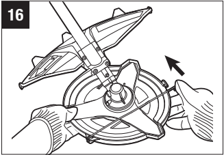

16

■ Keep away from corrosive agents such as garden chemicals and deicing salts.

44

56-VOLT LITHIUM-ION COMMERCIAL 17.5" STRING TRIMMER-STX4500/STX4500-FC

[[END OF PAGE 44]]

[[START OF PAGE 45]]

[[END OF PAGE 44]]

[[START OF PAGE 45]]

EGO

TROUBLESHOOTING

<table><tr><th>PROBLEM</th><th>CAUSE</th><th>SOLUTION</th></tr><tr><td></td><td>■The battery pack is not
attached to the machine.</td><td>■ Attach the battery pack to the
machine.</td></tr><tr><td></td><td>■No electrical contact
between the machine
and the battery pack.</td><td>■ Remove battery, check contacts,
and reinstall the battery pack
until it snaps into place.</td></tr><tr><td></td><td>■The battery pack charge
is depleted.</td><td>■Charge the battery pack.</td></tr><tr><td></td><td>■ The lock-off lever
and trigger switch
are not depressed
simultaneously.</td><td>■ Move the lock-off lever forward
and press the trigger switch at
the same time.</td></tr><tr><td></td><td>■The battery pack is too
hot. See the chapter
"Battery High-
temperature Protection".</td><td>■Remove the battery pack and
cool the battery pack until the
temperature drops below 152 °F
(67 °C).</td></tr><tr><td>Machine will not
start or stops
working.</td><td>■ The string trimmer is
too hot. See the chapter
"Machine High-
temperature Protection".
■ The string trimmer
motor is overloaded.
See the chapter
"Machine Overload
Protection".</td><td>■ Remove the battery pack and
cool the string trimmer until the
temperature drops below 176 °F
(80 °C).
■ The motor will recover when the
load is removed. For continuous
work, decrease the load on the
string trimmer, avoid too long or
oversize cutting line or cutting on
the heavy/woody shrubs.</td></tr><tr><td></td><td>■Heavy cutting line is
used for string trimmer.</td><td>■Use standard nylon cutting line
with diameter no more than
0.105 in (2.7 mm).</td></tr><tr><td></td><td>■The battery pack has
electronics error. See
the chapter "Battery
Electronics Error
Protection".</td><td>■ Replace the battery pack or
contact EGO customer service
center.</td></tr></table>

56-VOLT LITHIUM-ION COMMERCIAL 17.5" STRING TRIMMER-STX4500/STX4500-FC

45

[[END OF PAGE 45]]

[[START OF PAGE 46]]

[[END OF PAGE 45]]

[[START OF PAGE 46]]

EGO

<table><tr><th>PROBLEM</th><th>CAUSE</th><th>SOLUTION</th></tr><tr><td></td><td>■The grease in the gear
case is nearly gone.</td><td>■Lubricate the drive gears
in the gear case, refer to
"TRANSMISSION GEARS
LUBRICATION" section in this
manual.</td></tr><tr><td>Excessive vibra-
tion or noise.</td><td>■The cutting line is
unbalanced.</td><td>■Lightly tap the trimmer head on
the ground while operating with
the trimmer head. If necessary,
tap several times.</td></tr><tr><td></td><td>■ The lower cover of
trimmer head is worn
out.</td><td>■ Before further use, replace
with a new lower cover. Refer
to chapter "RELOADING THE
CUTTING LINE".</td></tr><tr><td rowspan="4">When trimming,
the trimmer head
will not advance
line.</td><td>■ The drive shaft or
trimmer head is bound
with grass.</td><td>■ Stop the string trimmer, remove
the battery and then clean the
drive shaft or the trimmer head
thoroughly.</td></tr><tr><td>■There is not enough line
on the spool.</td><td>Remove the battery and replace
the new cutting line, follow the
section "LINE REPLACEMENT"
in this manual.</td></tr><tr><td>■Line is tangled in the
trimmer head.</td><td>■ Remove the battery, reload the
cutting line, follow the section
"LINE REPLACEMENT" in this
manual.</td></tr><tr><td>■The line is too short.</td><td>■Remove the battery and pull the
lines while alternately pressing
down on and releasing the bump
head.</td></tr></table>

46

56-VOLT LITHIUM-ION COMMERCIAL 17.5" STRING TRIMMER-STX4500/STX4500-FC

[[END OF PAGE 46]]

[[START OF PAGE 47]]

[[END OF PAGE 46]]

[[START OF PAGE 47]]

EGO

<table><tr><th>PROBLEM</th><th>CAUSE</th><th>SOLUTION</th></tr><tr><td>When trimming.
grass wraps
around the trim-
mer head.</td><td>■Cutting tall grass at
ground level.</td><td>■ Cut tall grass from the top down,
removing no more than 8 inches
(20 cm) in each pass to prevent
wrapping.</td></tr><tr><td>When trimming.
the line-cutting
blade on the
guard cannot cut
the line</td><td>■The line-cutting blade
has become dull.</td><td>■ Sharpen the line-cutting blade
with a file or replace it with a
new blade.</td></tr><tr><td>Cracks on the
trimmer head or
the spool retainer
comes loose from
the upper cover.</td><td>■ The trimmer head is
worn out.</td><td>Before further use, replace
with a new trimmer head;
refer to "TRIMMER HEAD
REPLACEMENT" section in this
manual.</td></tr></table>

56-VOLT LITHIUM-ION COMMERCIAL 17.5" STRING TRIMMER-STX4500/STX4500-FC

47

[[END OF PAGE 47]]

[[START OF PAGE 48]]

[[END OF PAGE 47]]

[[START OF PAGE 48]]

EGO

EGO LIMITED WARRANTY

WARRANTY POLICY TERMS AND DURATION

Chervon North America, Inc. ("Chervon North America") provides the following Limited Warranty for EGO products to the original purchaser of EGO products.

The detailed warranty period for each EGO product can be found online at http://egopowerplus.com/warranty-policy.

Please contact EGO Customer Service Toll-Free at 1-855-EGO-5656 any time you have questions or warranty claims or would like a hard copy of the warranty.

LIMITED SERVICE WARRANTY

EGO products are warranted against defects in material or workmanship from the date of original retail purchase for the applicable warranty period. For any properly and timely submitted warranty claim, if Chervon North America determines a product to be defective during the warranty period, the product will receive free repair or replacement as determined by Chervon North America.

HOW TO OBTAIN SERVICE

For warranty service, within the applicable warranty period, please contact EGO customer service toll-free at 1-855-EGO-5656. When requesting warranty service, you must present the original dated sales receipt. An authorized service center will be selected to evaluate and repair the product if defective according to the stated warranty terms. When bringing your product to the authorized service center, there may be a small deposit that will be required when dropping off your tool. This deposit is refundable when the repair service is deemed to be covered under warranty.

ADDITIONAL LIMITATIONS & EXCLUSIONS

This limited warranty applies only to the original purchaser from an authorized EGO retailer and is not transferable. EGO products shall not be considered defective, and this warranty will not apply, where the claimed defect is attributable to any cause other than the above-defined defects. This warranty shall be void if the product has been used for rental purposes. This warranty shall not apply to damage caused by accident, abuse, misuse, alteration, modification, unauthorized repair, liquid contact, fire, earthquake or other external cause; operating the product outside EGO's instructions, specifications

48

56-VOLT LITHIUM-ION COMMERCIAL 17.5" STRING TRIMMER-STX4500/STX4500-FC

[[END OF PAGE 48]]

[[START OF PAGE 49]]

[[END OF PAGE 48]]

[[START OF PAGE 49]]

EGO

or guidelines; or failure to properly service of maintain the product. This warranty also does not apply to cosmetic damage, including but not limited to scratches or dents; defects caused by normal wear and tear or otherwise due to the normal aging of the product.

THIS EXPRESS WARRANTY IS GIVEN IN LIEU OF ALL OTHER WARRANTIES, EXPRESS OR IMPLIED, INCLUDING, BUT NOT LIMITED TO, ANY WARRANTIES OF MERCHANTABILITY OR FITNESS FOR PARTICULAR PURPOSE OR USE, WHICH ARE DISCLAIMED. Any implied warranties, including warranties of merchantability or fitness for a particular purpose, that cannot be disclaimed under state law are limited to the applicable warranty period defined at the beginning of this article. The sole and exclusive remedy in connection with the purchase, installation, use, and/or performance of the EGO products is repair or replacement of the product as determined by Chervon North America. Chervon North America's maximum liability shall not in any case exceed the purchase price paid for the product. CHERVON NORTH AMERICA SHALL NOT BE LIABLE TO THE USER OR TO ANYONE ELSE FOR CONSEQUENTIAL, INCIDENTAL, SPECIAL, EXEMPLARY, INDIRECT, OR PUNITIVE DAMAGES ARISING FROM USE OF THE PRODUCTS, INCLUDING BUT NOT LIMITED TO PERSONAL INJURY, DEATH, PROPERTY DAMAGE, LOST PROFITS, OR OTHER ECONOMIC INJURY. This warranty gives you specific legal rights, and you may also have other rights which vary from state to state. Some states do not allow limitations on how long an implied warranty lasts, the exclusion or limitation of incidental or consequential damages, or the limitations on time to bring certain actions, so such limitations contained herein do not apply to individual consumers in those states.

This warranty is subject to and shall be interpreted according to Michigan law without regard to principles of conflicts of laws. No legal action shall be brought against Chervon North America unless filed within one (1) year after the basis for such legal action becomes known, or with the exercise of reasonable diligence should have become known. Any action not timely filed shall be deemed waived.

For customer service contact us toll-free at: 1-855-EGO-5656 or
EGOPOWERPLUS.COM.
EGO Customer Service
769 Seward Ave. NW, Suite 102
Grand Rapids, Michigan 49504.

56-VOLT LITHIUM-ION COMMERCIAL 17.5" STRING TRIMMER-STX4500/STX4500-FC

49

[[END OF PAGE 49]]

[[START OF PAGE 50]]

[[END OF PAGE 49]]

[[START OF PAGE 50]]

EGO

50

56-VOLT LITHIUM-ION COMMERCIAL 17.5" STRING TRIMMER-STX4500/STX4500-FC

[[END OF PAGE 50]]

[[END OF PAGE 50]]