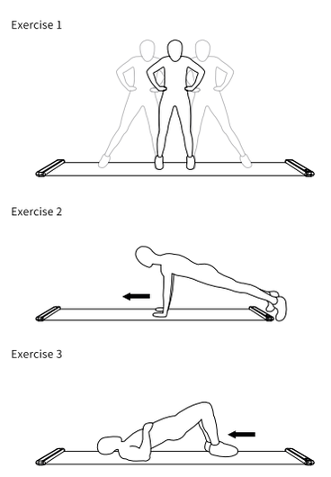
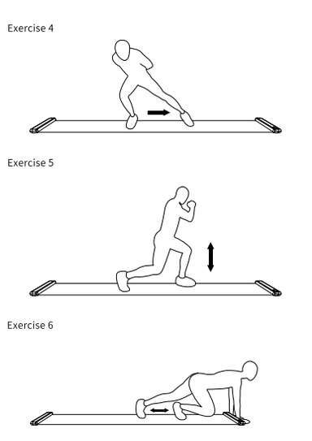
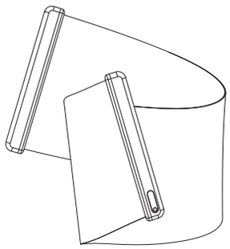
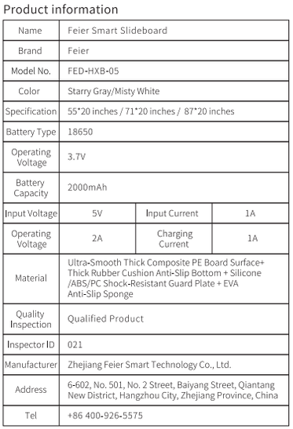

[[START OF PAGE 1]]

[[START OF PAGE 1]]

#

5

320 mm

6

N

100 mm

Feier
DESIGN

Precautions

- 1.Before use, please carefully check whether all parts of the device are firmly connected.

- 2.This product is a sports equipment, and all children and elderly people must use under the supervision of a guardian.

- 3.Beginners are advised to wear protective gear during exercise to prevent injuries.

- 4.Before use, it is recommended to do 5-10 minutes of stretching warm-up exercises.

2

- 5.Before use, please make sure to remove valuable and fragile items such as mobile phones and jewelry from your body to avoid damage.

- 6.Patients with high blood pressure, heart disease, or other illnesses should exercise under the guidance of a doctor.If there is any discomfort during use, stop immediately.

- 7.This product is made of plastic material, please keep it away from heat sources and open flames to prevent deformation of the product or cause a fire.

- 8.The battery can be fully charged in approximately 3 hours, providing about 3 hours of operating time.

9. Please avoid using the device while it's charging.

10. The generation of static electricity and the attraction of fine hair and small debris is a normal phenomenon resulting from the smooth friction between the product's surface, made of PE and nylon.

APP Download

This product requires downloading the "Feier" app for connection and use. Download method: Scan the QR code below to download; or search for "Feier" app in the app store to download.

IOS

Android

Scan the QR code below to download "Feier" APP

1

Exercise 1

Exercise 2

Exercise 3

Product description

1.A slideboard is a training product that allows people who play ice skating, ice hockey, roller skating, fitness, and rehabilitation exercises to exercise in fitness centers or at home. Slideboards have gradually become popular due to their ease of use, portability, and excellent training effects!

2.Athletes who participate in speed skating, roller skating, roller hockey, ice hockey, skiing, figure skating, or fitness have training facilities available throughout the year. However, during certain seasons, they may lack opportunities for training. An effective way to maintain their optimal physical condition is to train on artificial ice surfaces or on land.

3.You can consider using a slideboard to assist you with exercises that focus on movements, strength, agility, and coordination on land. Slideboarding can increase lower body muscle strength and stabilize the legs and waist. After strengthening the muscles around the lower body, it becomes more stable, and upper body movements become easier.

4.In addition, there are many ways to use the slideboard to enhance the strength and agility of various parts of the body.

Maintenance:

1.This product must be used with professional shoe covers. 2.Avoid contact between the slideboard surface and rough or sharp objects, Avoid contact between the slideboard surface and rough or sharp objects. You can clean the slide board with a soft, damp cloth. 3.If the surface lubrication decreases significantly, it is recommended to use transparent shoe oil, lubricating spray, or wax for maintenance. 4. Please store it in a cool, well-ventilated area and shield it from direct sunlight.

Exercise 4

Exercise 5

Exercise 6

Instructions

Feier

1.Power on Place the product on a flat surface, press and hold the power button to turn it on, and it will automatically enter the count exercise mode. 2.Display switching Short press the power button to adjust the display switching of "times," "time," and "calories." 3.Light switching Under the power-on state, double-click the power button to switch the display light. 4.Standby After power-on, the product will automatically enter the standby state, and the light bar on the display end will light up every 5 seconds. 5.Sleep mode If there is no exercise for 2 minutes, the device will enter sleep mode. All displays of the product will be turned off until the next exercise, at which point it will enter standby mode. 6.Clear data In the power-on state of the device, press and hold the power button for 2 seconds to clear all display data. 7.Bluetooth Connection After powering on, the Bluetooth symbol will appear and blink on the display screen. Open the "Feier" APP, click on the Bluetooth icon in the upper right corner of the interface, and automatically search for the Bluetooth name "Feier-HXB". After displaying the device information, click "Connect" to complete the connection. 8.Power off In the power-on state of the device, press and hold the power button O for 4 seconds to turn it off. If there is no operation for 10 minutes in the power-on state of the device, it will automatically shut down.

Feier Smart Slideboard.

Product Manual

<table><tr><th colspan="4">Product information</th></tr><tr><td>Name</td><td colspan="3">Feier Smart Slideboard</td></tr><tr><td>Brand</td><td colspan="3">Feier</td></tr><tr><td>Model No.</td><td colspan="3">FED-HXB-05</td></tr><tr><td>Color</td><td colspan="3">Starry Gray/Misty White</td></tr><tr><td>Specification</td><td colspan="3">55*20 inches/71*20 inches/ 87*20 inches</td></tr><tr><td>Battery Type</td><td colspan="3">18650</td></tr><tr><td>Operating
Voltage</td><td colspan="3">3.7V</td></tr><tr><td>Battery
Capacity</td><td colspan="3">2000mAh</td></tr><tr><td>Input Voltage</td><td>5V</td><td>Input Current</td><td>1A</td></tr><tr><td>Operating
Voltage</td><td>2A</td><td>Charging
Current</td><td>1A</td></tr><tr><td>Material</td><td colspan="3">Ultra-Smooth Thick Composite PE Board Surface+
Thick Rubber Cushion Anti-Slip Bottom + Silicone
/ABS/PC Shock-Resistant Guard Plate + EVA
Anti-Slip Sponge</td></tr><tr><td>Quality
Inspection</td><td colspan="3">Qualified Product</td></tr><tr><td>Inspector ID</td><td colspan="3">021</td></tr><tr><td>Manufacturer</td><td colspan="3">Zhejiang Feier Smart Technology Co., Ltd.</td></tr><tr><td>Address</td><td colspan="3">6-602, No. 501, No. 2 Street, Baiyang Street, Qiantang
New District, Hangzhou City, Zhejiang Province, China</td></tr><tr><td>Tel</td><td colspan="3">+86 400-926-5575</td></tr></table>

3

4

80 mm

[[END OF PAGE 1]]

[[END OF PAGE 1]]