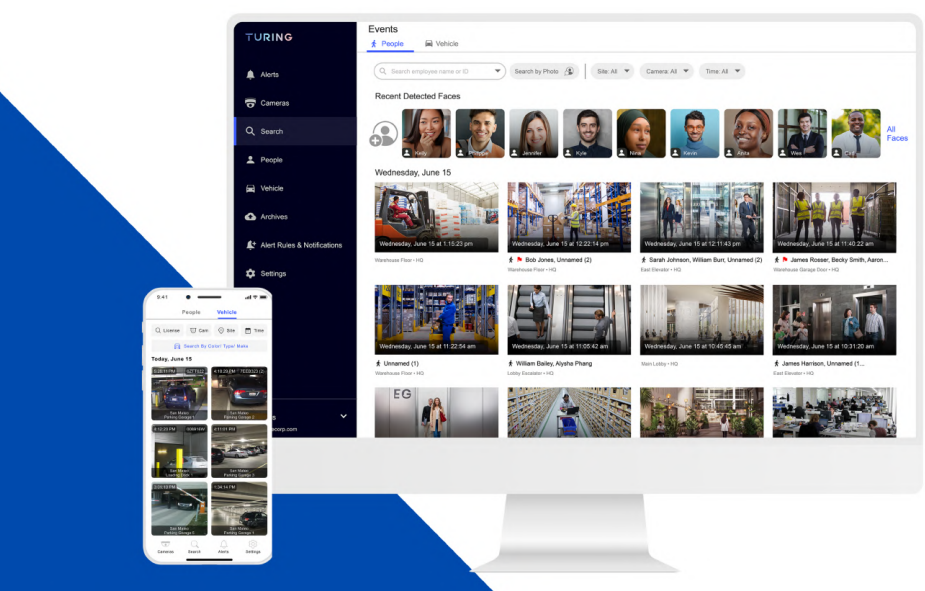

[[START OF PAGE 1]]

[[START OF PAGE 1]]

TURING

Events
TURING
* People Vehicle

(Q Search employee name or ID Search by Photo Camera: Al▾

Recent Detected Faces
Cameras

Q Search
Faces

People
Wednesday, June 15

Vehicle

 Archives

Alert Rules & Notifications Wednesday, June 15 at 1:15:23 pm June 15 at 12:22:14 pm June 15 at 12:11:43 pm

Bob Jones, Unnamed (2) * Sarah Johnson, William Burt, Unnamed (2) James Rosser, Becky Smith, Aaron

Settings

Vehicle

By Typ Wednesday, June 15 at 10:45 45 am Wednesday, June 15 at 10:31:20 am
Today, June 15 Unnamed (1) William Bailey, Alysha Phang James Harrison, Unnamed (1...
East Elevator+HO

EG

Turing Vision

INTEGRATION GUIDE
FOR HANWHA CAMERAS

[[END OF PAGE 1]]

[[START OF PAGE 2]]

[[END OF PAGE 1]]

[[START OF PAGE 2]]

TURING

Adding Hanwha Cameras to Turing Vision:

Checklist, Installation Guide, and Video Tutorials

• Hanwha Camera Installation Steps

	■1. Access Camera's Web UI

	■■■2. Initialize Camera

	■ 3. Verify/Modify Camera Encoding Settings

	■ 4. Enable Motion Detection

	■ 5. Connect & Add Camera(s) to Turing NVR

• Installation Video

• Hanwha Camera FAQs

Turing Al

1730 S El Camino Real #480, San Mateo, CA 99402 877-730-8222, https://turing.ai/

[[END OF PAGE 2]]

[[START OF PAGE 3]]

[[END OF PAGE 2]]

[[START OF PAGE 3]]

TURING

Hanwha Camera Installation Steps

For Steps 1-4, please connect your camera directly to LAN, as shown below

Turing
Bridge

IPC

Internet LAN LAN Turing NVR IPC

POE
Ports IPC
Hanwha
IPC

• Access Camera's Web UI

		- 0 Locate your camera's IP Address

	- TIP: On Turing Smart NVR, use Auto Search under Settings > Camera > Camera to find your camera's IP address

			- Enter your camera's IP address into browser search bar

Turing Al

1730 S El Camino Real #480, San Mateo, CA 99402 877-730-8222, https://turing.ai/

[[END OF PAGE 3]]

[[START OF PAGE 4]]

[[END OF PAGE 3]]

[[START OF PAGE 4]]

TURING

• Initialize Camera

	○ On a factory-defaulted camera, the web UI will prompt you to create a new password for your camera

	- 0 Click Apply to initialize camera(s)

PRO

Administrator password change New password Confirm new password The 3 to 9 characters long, then must include a combination of at least 3 of the wing character types alphabet eters with uppercase or lowercase, mumbers, and special characters the longer than 10 chaders, then t must include a combination of at least 2 of the allowing character types alphabets with uppercase or lowercase, numbers, and special ID may not be used as passed. We recommend not to use your ID string of the pe The following special characters can be used -\@#$%&*-+ You may not mos than 4 consecutive characters (example: 1234, abod, c) You may not use the same character or more times consecutively example: 1111, ass, etc)

Apply

TIP: If installing multiple, use Wisenet's Device Manager to initialize and modify

network settings

Turing Al

1730 S El Camino Real #480, San Mateo, CA 99402 877-730-8222, https://turing.ai/

[[END OF PAGE 4]]

[[START OF PAGE 5]]

[[END OF PAGE 4]]

[[START OF PAGE 5]]

TURING

• Verify/Modify Camera Encoding Settings

	- 0 Go to Basic > Video Profile

	○ Modify the encoding settings to the Turing recommended settings

WWWEVER

WISENET XNV-8082R admin

Video profile

Video profile

User Video profile connection policy Keep connection when profile properties are changed

Date & Time

IP & Port Video profile Add

+PTZ
Type

Video & Audio

H264 Default

 Event ° H.265 H.265

Analytics C MOBILE H.264

Statistics

System Code H.264

Open platform Profile type Default profile

Edge recording profe

Digital PTZ profile

Frame Lock profile

Audio in Enable

Crop encoding Enable

Profile properties Resolution 3840 x 2160 (16:9) A

Frame rate 30 tps

Maximum bitrate kbps (2048-30720)

n

MJPEG profile is not used by the NVR.

On the Turing NVR, "H.264" profile is considered Main Stream, and "H.265" profile is considered Sub Stream.

<table><tr><th></th><th>Main Stream</th><th>Sub Stream</th></tr><tr><td>Video Compression</td><td>H.264</td><td>H.264</td></tr><tr><td>Resolution</td><td>Less than 3MP

(2MP is recommended)</td><td>1280x720 (720P)</td></tr><tr><td>Frame Rate</td><td>15</td><td>15</td></tr><tr><td>Frame Interval</td><td>30</td><td>30</td></tr><tr><td>Bitrate Type</td><td>CBR</td><td>CBR</td></tr><tr><td>Bit Rate</td><td>Less than or equal to 2048</td><td>Less than or equal to 768</td></tr></table>

Turing Al

1730 S El Camino Real #480, San Mateo, CA 99402 877-730-8222, https://turing.ai/

[[END OF PAGE 5]]

[[START OF PAGE 6]]

[[END OF PAGE 5]]

[[START OF PAGE 6]]

TURING

• Enable Motion Detection

		- Go to Analytics > Motion Detection

	○ Click the Enable motion detection checkbox

	○ Edit the detection area, level of detection, sensitivity and minimum duration

as desired

	○ Click Apply to save all settings

0

W http://10.2.11.97/wm/index.html/setup/analytics motionDetection Search D- A * Be

Wisenet WEBVIEWER

WISENET XNV-9082R admin Help

Basic Motion detection

+ PTZ

Enable motion detection
Video & Audio

Network Include area Exclude area Common

✰ Event Area

12345678
Analytics

Shock delection Level of detection

Motion detection

Tampering detection

Defocus detection

Fog detection

Facelupper body detection Sensitivity

IVA + 80
Audio detection

Sound classification Minimum duration (s)

-C + 0
Statistics

System Handover

off
• Open platform

Overlay Enable

Event action settings FTP Enable

E-mail Enable

Record Enable

Turing Al

1730 S El Camino Real #480, San Mateo, CA 99402 877-730-8222, https://turing.ai/

[[END OF PAGE 6]]

[[START OF PAGE 7]]

[[END OF PAGE 6]]

[[START OF PAGE 7]]

TURING

• Connect & Add Camera(s) to Turing NVR

⑧ If desired, you can now connect your Hanwha camera directly to one of the POE ports on the back of the Turing Smart NVR, as shown below

Turing IPC
Bridge

IPC
Internet LAN LAN Turing NVR 444

IPC
POE
Ports
Hanwha
IPC

	- Access your Turing NVR web UI by entering its IP address into a web browser

。 Login and go to Setup > Camera > Camera

	- Select the channel and click Modify

- 0 Edit the username and password fields

° Click Save

<table><tr><th>TURING</th><th>Live</th><th>View</th><th>Playback</th><th>°</th><th>Setup</th><th>3.</th><th></th><th></th><th></th><th></th><th></th><th></th><th>admin Logout</th></tr><tr><td colspan="14">Client v Camera Advanced</td></tr><tr><td>System</td><td></td><td></td><td></td><td></td><td></td><td></td><td></td><td></td><td></td><td></td><td></td><td></td><td></td></tr><tr><td>Camera ^</td><td colspan="3">Auto Switch to H.265 On</td><td>@off</td><td>Note: Effective</td><td>when first connected</td><td></td><td></td><td></td><td></td><td></td><td></td><td></td></tr><tr><td>Camera</td><td>Auto Switch</td><td>to Smart</td><td>Encoding Off</td><td></td><td></td><td>Note: Effective when first connected</td><td></td><td></td><td></td><td></td><td></td><td></td><td></td></tr><tr><td>Encoding

OSD</td><td>Refresh</td><td></td><td colspan="11">Modify Auto Search Search Segment Batch Edit Pass..</td></tr><tr><td></td><td></td><td></td><td>Camera ID</td><td></td><td>Address</td><td>Port</td><td>Remote Camera ID</td><td>Protocol</td><td>Status</td><td>Vendor</td><td>Model</td><td>Configure</td><td>Access</td></tr><tr><td>Schedule</td><td></td><td></td><td>D1 (Camera 01)</td><td></td><td>172.16.0.107</td><td>80</td><td></td><td>ONVIF</td><td></td><td>ONVIF</td><td>VX-4V-CO-BI</td><td></td><td>Access</td></tr><tr><td></td><td></td><td></td><td>D2 IP Camera 021</td><td></td><td>172.16.0.105</td><td>80</td><td></td><td>ONVIF</td><td></td><td>Avigilon</td><td>2.0C-H4A-DP1</td><td></td><td>Access</td></tr><tr><td>Motion</td><td>D</td><td colspan="3">DB IP Camera 031</td><td>172.16.0.105</td><td>80</td><td>1</td><td>ONVIF</td><td></td><td>Pelco</td><td>IME129</td><td>.</td><td>Access</td></tr><tr><td>Video Loss</td><td></td><td colspan="3">D4 IP Camera 04)</td><td>172.16.0.108</td><td>an</td><td>1</td><td>ONVIE</td><td>M</td><td>AXIS</td><td>M2026-LE-MI</td><td></td><td></td></tr><tr><td>Tampering</td><td>✓</td><td>5</td><td>DS OP Camera 05)</td><td></td><td>172.16.0.109</td><td>80</td><td>1</td><td>ONVIF</td><td></td><td>Samsung Techwin</td><td>QNV-7010R</td><td></td><td></td></tr><tr><td>Privacy Mask</td><td></td><td>6</td><td>D6 IP Camera 06)</td><td></td><td>172.16.0.7</td><td>80</td><td>1</td><td>ONVIF</td><td>D</td><td></td><td></td><td></td><td>Access</td></tr><tr><td>Snapshot</td><td></td><td>7</td><td>D7 OP Camera 07)</td><td></td><td>172.16.0.0</td><td>80</td><td>1</td><td>ONVIF</td><td></td><td></td><td></td><td></td><td></td></tr><tr><td>Audio Detection</td><td></td><td></td><td>DB IP Camera 08)</td><td></td><td>172.16.0.102</td><td>80</td><td>1</td><td>Private</td><td>D</td><td></td><td>SC-2085WD-10-F28</td><td></td><td>Access</td></tr><tr><td>Human Body Detection</td><td></td><td></td><td></td><td></td><td></td><td></td><td></td><td></td><td></td><td></td><td></td><td></td><td></td></tr><tr><td>Hard Disk</td><td></td><td></td><td></td><td></td><td></td><td></td><td></td><td></td><td></td><td></td><td></td><td></td><td></td></tr><tr><td>Alarm</td><td></td><td></td><td></td><td></td><td></td><td></td><td></td><td></td><td></td><td></td><td></td><td></td><td></td></tr><tr><td>Alert</td><td></td><td></td><td></td><td></td><td></td><td></td><td></td><td></td><td></td><td></td><td></td><td></td><td></td></tr><tr><td>Network</td><td></td><td></td><td></td><td></td><td></td><td></td><td></td><td></td><td></td><td></td><td></td><td></td><td></td></tr><tr><td>User</td><td></td><td></td><td></td><td></td><td></td><td></td><td></td><td></td><td></td><td></td><td></td><td></td><td></td></tr><tr><td>Maintenance</td><td></td><td></td><td></td><td></td><td></td><td></td><td></td><td></td><td></td><td></td><td></td><td></td><td></td></tr><tr><td></td><td></td><td></td><td></td><td></td><td></td><td></td><td></td><td></td><td></td><td></td><td></td><td></td><td></td></tr></table>

Turing Al

1730 S El Camino Real #480, San Mateo, CA 99402 877-730-8222, https://turing.ai/

[[END OF PAGE 7]]

[[START OF PAGE 8]]

[[END OF PAGE 7]]

[[START OF PAGE 8]]

TURING

tp://10.2.11.37/cgi-bin/main-cgi

W Wisenet WEBVIEWER TR-MRP082T

TURING M Live View Playback Setup Smart

Client Cameral Advanced

System
Add Mode Plug-and-Play ✓
Camera

Camera

Encoding IP Address: 172.16.0.9

OSD Port

Image Usemame admin
Schedule
Password
Motion
Remote Camera ID 1
Video Loss

Tampering
Extended Transmission On Off
Privacy Mask

Snapshot
Search Save Cancel
Audio Detection

Human Body Detection

Hard Disk

Alarm

Alert

Network

Platform

User

Maintenance

Installation Video

Click Here to Watch the Installation Video

New Tab +

C Q Search with Google or enter address =

import bookmarks.. 64CH T
10.2.8.37 http://10.2.8.37

10.2.9.74 http://10.2.9.74

10.2.11.37-http://10.2.11.37

10.2.10.236-http://10.2.10.236

AXIS M2025-LE-http/10.2.8.41

10.2.11.70 http://10.2.11.70

This time, search with: G a b W *

a Etsy 2 2

Amazon Etsy 10.2.8.37 10.2.9.74 10.2.11.37 10.2.10.236 10.2.8.41 10.2.11.70
Sponsored Sponsored

Recommended by Pocket Learn more

theringer.com 16 min comparecredit.com saveur.com-3 min
Life As Lisa Simpson 2 Impressive Cards Charging Tortilla Española Recipe
For decades, Yeardley Smith has given 0% Interest Until 2024 This classic Spanish dish can be sliced
voice to the precocious, impassioned With these, you can focus on paying off into wedges for breakfast or lunch, or

Turing Al

1730 S El Camino Real #480, San Mateo, CA 99402 877-730-8222, https://turing.ai/

[[END OF PAGE 8]]

[[START OF PAGE 9]]

[[END OF PAGE 8]]

[[START OF PAGE 9]]

TURING

Hanwha Camera FAQs

Q: Does the Turing Vision platform support Smart VCA Events from Hanwha camera? At the moment, Turing Smart NVR and Turing Vision only support Motion events.

Turing Al

1730 S El Camino Real #480, San Mateo, CA 99402 877-730-8222, https://turing.ai/

[[END OF PAGE 9]]

[[START OF PAGE 10]]

[[END OF PAGE 9]]

[[START OF PAGE 10]]

TURING

INTEGRATION GUIDE
FOR HANWHA
CAMERAS

Contact Us:

877-730-8222

sales@turingvideo.com

[[END OF PAGE 10]]

[[END OF PAGE 10]]