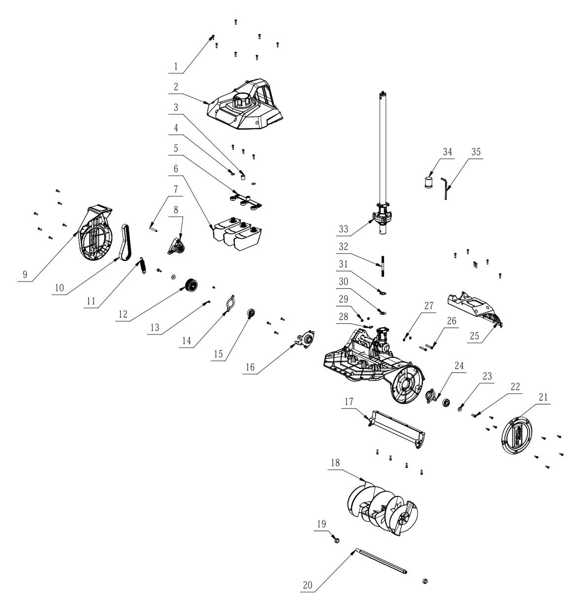
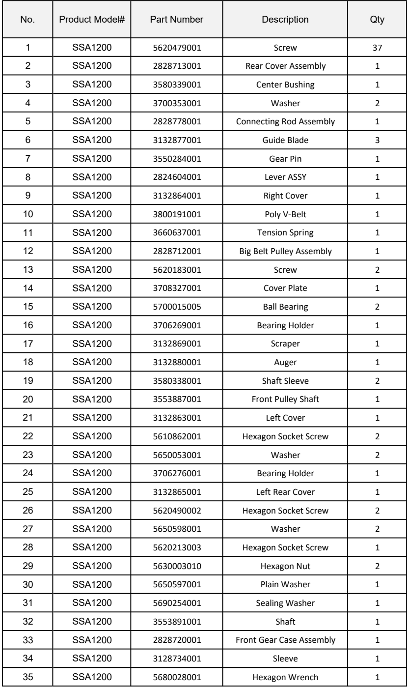

[[START OF PAGE 1]]

[[START OF PAGE 1]]

EGO®

Product Description:Multi-head Snow Shovel
Model Number: 4009
Body Number: 0760042001
Version:A
Issue Date: 2022/01/21

1

2

3

4

5 34 35

6

7

8

33

31
9 327222
30
10
11 29
27
12 28
26
13
25
14

15

16 24
23
22
21
17

18

CLO

19

20

[[END OF PAGE 1]]

[[START OF PAGE 2]]

[[END OF PAGE 1]]

[[START OF PAGE 2]]

Service Part List_SSA1200_Version A

<table><tr><th>No.</th><th>Product Model#</th><th>Part Number</th><th>Description</th><th>Qty</th></tr><tr><td>1</td><td>SSA1200</td><td>5620479001</td><td>Screw</td><td>37</td></tr><tr><td>2</td><td>SSA1200</td><td>2828713001</td><td>Rear Cover Assembly</td><td>1</td></tr><tr><td>3</td><td>SSA1200</td><td>3580339001</td><td>Center Bushing</td><td>1</td></tr><tr><td>4</td><td>SSA1200</td><td>3700353001</td><td>Washer</td><td>2</td></tr><tr><td>5</td><td>SSA1200</td><td>2828778001</td><td>Connecting Rod Assembly</td><td>1</td></tr><tr><td>6</td><td>SSA1200</td><td>3132877001</td><td>Guide Blade</td><td>3</td></tr><tr><td>7</td><td>SSA1200</td><td>3550284001</td><td>Gear Pin</td><td>1</td></tr><tr><td>8</td><td>SSA1200</td><td>2824604001</td><td>Lever ASSY</td><td>1</td></tr><tr><td>9</td><td>SSA1200</td><td>3132864001</td><td>Right Cover</td><td>1</td></tr><tr><td>10</td><td>SSA1200</td><td>3800191001</td><td>Poly V-Belt</td><td>1</td></tr><tr><td>11</td><td>SSA1200</td><td>3660637001</td><td>Tension Spring</td><td>1</td></tr><tr><td>12</td><td>SSA1200</td><td>2828712001</td><td>Big Belt Pulley Assembly</td><td>1</td></tr><tr><td>13</td><td>SSA1200</td><td>5620183001</td><td>Screw</td><td>2</td></tr><tr><td>14</td><td>SSA1200</td><td>3708327001</td><td>Cover Plate</td><td>1</td></tr><tr><td>15</td><td>SSA1200</td><td>5700015005</td><td>Ball Bearing</td><td>2</td></tr><tr><td>16</td><td>SSA1200</td><td>3706269001</td><td>Bearing Holder</td><td>1</td></tr><tr><td>17</td><td>SSA1200</td><td>3132869001</td><td>Scraper</td><td>1</td></tr><tr><td>18</td><td>SSA1200</td><td>3132880001</td><td>Auger</td><td>1</td></tr><tr><td>19</td><td>SSA1200</td><td>3580338001</td><td>Shaft Sleeve</td><td>2</td></tr><tr><td>20</td><td>SSA1200</td><td>3553887001</td><td>Front Pulley Shaft</td><td>1</td></tr><tr><td>21</td><td>SSA1200</td><td>3132863001</td><td>Left Cover</td><td>1</td></tr><tr><td>22</td><td>SSA1200</td><td>5610862001</td><td>Hexagon Socket Screw</td><td>2</td></tr><tr><td>23</td><td>SSA1200</td><td>5650053001</td><td>Washer</td><td>2</td></tr><tr><td>24</td><td>SSA1200</td><td>3706276001</td><td>Bearing Holder</td><td>1</td></tr><tr><td>25</td><td>SSA1200</td><td>3132865001</td><td>Left Rear Cover</td><td>1</td></tr><tr><td>26</td><td>SSA1200</td><td>5620490002</td><td>Hexagon Socket Screw</td><td>2</td></tr><tr><td>27</td><td>SSA1200</td><td>5650598001</td><td>Washer</td><td>2</td></tr><tr><td>28</td><td>SSA1200</td><td>5620213003</td><td>Hexagon Socket Screw</td><td>1</td></tr><tr><td>29</td><td>SSA1200</td><td>5630003010</td><td>Hexagon Nut</td><td>2</td></tr><tr><td>30</td><td>SSA1200</td><td>5650597001</td><td>Plain Washer</td><td>1</td></tr><tr><td>31</td><td>SSA1200</td><td>5690254001</td><td>Sealing Washer</td><td>1</td></tr><tr><td>32</td><td>SSA1200</td><td>3553891001</td><td>Shaft</td><td>1</td></tr><tr><td>33</td><td>SSA1200</td><td>2828720001</td><td>Front Gear Case Assembly</td><td>1</td></tr><tr><td>34</td><td>SSA1200</td><td>3128734001</td><td>Sleeve</td><td>1</td></tr><tr><td>35</td><td>SSA1200</td><td>5680028001</td><td>Hexagon Wrench</td><td>1</td></tr></table>

[[END OF PAGE 2]]

[[END OF PAGE 2]]