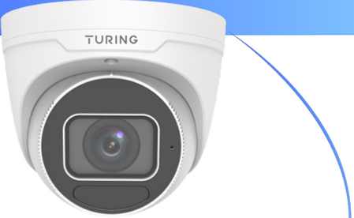
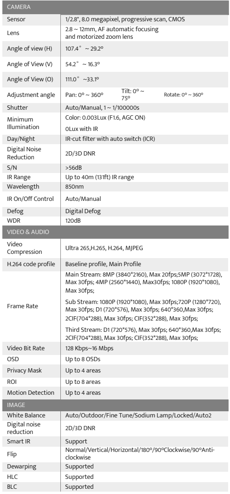
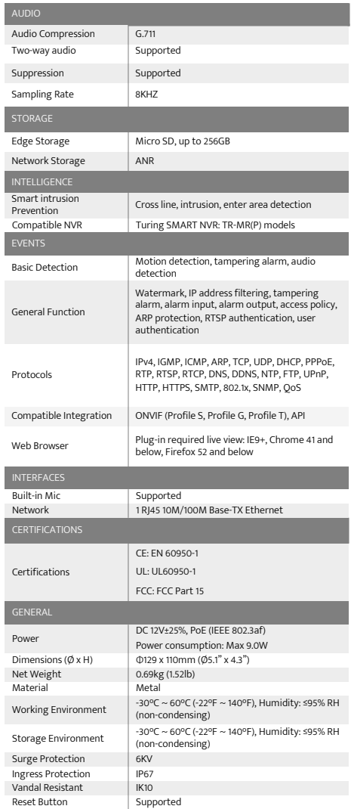
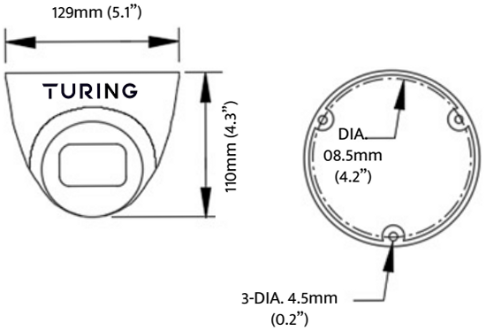
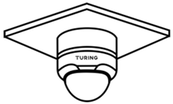
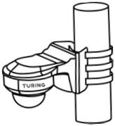
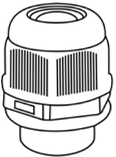
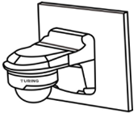
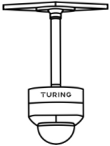

[[START OF PAGE 1]]

[[START OF PAGE 1]]

SMART Series | TP-MVD8MV2

TURING

TP-MVD8MV2

8MP HD TwilightVision™M IR VF Turret Network Camera

TURING

KEY FEATURES

- To be used with SMART Series NVR with Turing Vision Cloud

	- 2.8~12mm Motorized Lens

		- Max. 8MP (3840*2160)@20fps

			✓ TwilightVisionTM technology superior low-light performance

				✓ Built-in Mic

					✓ Smart IR, up to 40m (131 ft)

						✓ Supports 256 G Micro SD card

							✓ IP67, IK10, WDR

ENDAA
COMPLIANT

turing.ai

sales@turingvideo.com

(877) 730-8222

OnvifⓇ

[[END OF PAGE 1]]

[[START OF PAGE 2]]

[[END OF PAGE 1]]

[[START OF PAGE 2]]

SMART Series | TP-MVD8MV2

TURING

SPECIFICATIONS

<table><tr><th colspan="2">CAMERA</th></tr><tr><td>Sensor</td><td>1/2.8", 8.0 megapixel, progressive scan, CMOS</td></tr><tr><td>Lens</td><td>2.8-12mm, AF automatic focusing
and motorized zoom lens</td></tr><tr><td>Angle of view (H)</td><td>107.4° ~ 29.2°</td></tr><tr><td>Angle of View (V)</td><td>54.2° -16.3°</td></tr><tr><td>Angle of View (O)</td><td>111.0° ~33.1°</td></tr><tr><td>Adjustment angle</td><td>Tilt: 0° ~
Pan: 0° ~ 360° Rotate: 0° ~ 360°
75°</td></tr><tr><td>Shutter</td><td>Auto/Manual, 1~ 1/100000s</td></tr><tr><td>Minimum
Illumination</td><td>Color: 0.003Lux (F1.6, AGC ON)
OLux with IR</td></tr><tr><td>Day/Night</td><td>IR-cut filter with auto switch (ICR)</td></tr><tr><td>Digital Noise
Reduction</td><td>2D/3D DNR</td></tr><tr><td>S/N</td><td>&gt;56dB</td></tr><tr><td>IR Range</td><td>Up to 40m (131ft) IR range</td></tr><tr><td>Wavelength</td><td>850nm</td></tr><tr><td>IR On/Off Control</td><td>Auto/Manual</td></tr><tr><td>Defog</td><td>Digital Defog</td></tr><tr><td>WDR</td><td>120dB</td></tr><tr><td colspan="2">VIDEO &amp; AUDIO</td></tr><tr><td>Video
Compression</td><td>Ultra 265,H.265, H.264, MJPEG</td></tr><tr><td>H.264 code profile</td><td>Baseline profile, Main Profile</td></tr><tr><td></td><td>Main Stream: 8MP (3840*2160), Max 20fps;5MP (3072*1728),
Max 30fps; 4MP (2560*1440), Max30fps; 1080P (1920*1080),
Max 30fps;</td></tr><tr><td>Frame Rate</td><td>Sub Stream: 1080P (1920*1080), Max 30fps;720P (1280*720),
Max 30fps; D1 (720*576), Max 30fps; 640*360,Max 30fps;
2CIF(704*288), Max 30fps; CIF(352*288), Max 30fps;</td></tr><tr><td></td><td>Third Stream: D1 (720*576), Max 30fps; 640*360,Max 30fps;
2CIF(704*288), Max 30fps; CIF(352*288), Max 30fps;</td></tr><tr><td>Video Bit Rate</td><td>128 Kbps~16 Mbps</td></tr><tr><td>OSD</td><td>Up to 8 OSDs</td></tr><tr><td>Privacy Mask</td><td>Up to 4 areas</td></tr><tr><td>ROI</td><td>Up to 8 areas</td></tr><tr><td>Motion Detection</td><td>Up to 4 areas</td></tr><tr><td colspan="2">IMAGE</td></tr><tr><td>White Balance</td><td>Auto/Outdoor/Fine Tune/Sodium Lamp/Locked/Auto2</td></tr><tr><td>Digital noise
reduction</td><td>2D/3D DNR</td></tr><tr><td>Smart IR</td><td>Support</td></tr><tr><td>Flip</td><td>Normal/Vertical/Horizontal/180°/90°Clockwise/90°Anti-
clockwise</td></tr><tr><td>Dewarping</td><td>Supported</td></tr><tr><td>HLC</td><td>Supported</td></tr><tr><td>BLC</td><td>Supported</td></tr></table>

<table><tr><th colspan="2">AUDIO</th></tr><tr><td>Audio Compression</td><td>G.711</td></tr><tr><td>Two-way audio</td><td>Supported</td></tr><tr><td>Suppression</td><td>Supported</td></tr><tr><td>Sampling Rate</td><td>8KHZ</td></tr><tr><td colspan="2">STORAGE</td></tr><tr><td>Edge Storage</td><td>Micro SD, up to 256GB</td></tr><tr><td>Network Storage</td><td>ANR</td></tr><tr><td colspan="2">INTELLIGENCE</td></tr><tr><td>Smart intrusion
Prevention</td><td>Cross line, intrusion, enter area detection</td></tr><tr><td>Compatible NVR</td><td>Turing SMART NVR: TR-MR(P) models</td></tr><tr><td colspan="2">EVENTS</td></tr><tr><td>Basic Detection</td><td>Motion detection, tampering alarm, audio
detection</td></tr><tr><td>General Function</td><td>Watermark, IP address filtering, tampering
alarm, alarm input, alarm output, access policy,
ARP protection, RTSP authentication, user
authentication</td></tr><tr><td>Protocols</td><td>IPv4, IGMP, ICMP, ARP, TCP, UDP, DHCP, PPPOE,
RTP, RTSP, RTCP, DNS, DDNS, NTP, FTP, UPnP,
HTTP, HTTPS, SMTP, 802.1x, SNMP, QoS</td></tr><tr><td>Compatible Integration</td><td>ONVIF (Profile S, Profile G, Profile T), API</td></tr><tr><td>Web Browser</td><td>Plug-in required live view: IE9+, Chrome 41 and
below, Firefox 52 and below</td></tr><tr><td colspan="2">INTERFACES</td></tr><tr><td>Built-in Mic</td><td>Supported</td></tr><tr><td>Network</td><td>1 RJ45 10M/100M Base-TX Ethernet</td></tr><tr><td colspan="2">CERTIFICATIONS</td></tr><tr><td></td><td>CE: EN 60950-1</td></tr><tr><td>Certifications</td><td>UL: UL60950-1</td></tr><tr><td></td><td>FCC: FCC Part 15</td></tr><tr><td colspan="2">GENERAL</td></tr><tr><td>Power</td><td>DC 12V+25%, POE (IEEE 802.3af)
Power consumption: Max 9.0W</td></tr><tr><td>Dimensions (ØxH)</td><td>0129 x 110mm (05.1" x 4.3")</td></tr><tr><td>Net Weight</td><td>0.69kg (1.52lb)</td></tr><tr><td>Material</td><td>Metal</td></tr><tr><td>Working Environment</td><td>-30°C ~ 60°C (-22°F ~140°F), Humidity: ≤95% RH
(non-condensing)</td></tr><tr><td>Storage Environment</td><td>-30°C ~ 60°C (-22°F ~140°F), Humidity: ≤95% RH
(non-condensing)</td></tr><tr><td>Surge Protection</td><td>6KV</td></tr><tr><td>Ingress Protection</td><td>IP67</td></tr><tr><td>Vandal Resistant</td><td>IK10</td></tr><tr><td>Reset Button</td><td>Supported</td></tr></table>

T

turing.ai
sales@turingvideo.com

(877) 730-8222

2

[[END OF PAGE 2]]

[[START OF PAGE 3]]

[[END OF PAGE 2]]

[[START OF PAGE 3]]

SMART Series | TP-MVD8MV2

TURING

DIMENSIONS

129mm (5.1")

TURING

DIA.
110mm (4.3")
08.5mm
(4.2")

3-DIA. 4.5mm
(0.2")

MOUNTING

TURING

Junction Box: TP-VDJB

Pole Mount: TP-UDPM
Wall Mount: TP-VDWM
WM w/ Junc. Box: TP-VDWJ

Optional Cable Gland:
TP-UWPJ

Wall Mount: TP-VDWM
w/ Junction Box: TP-VDWJ

TURING

Pendant Mount: TP-AIPMB
Junction Box: TP-VDJB
Optional Extensions: TP-IPME2 (9") &
TP-IPME5 (22)"

turing.ai
sales@turingvideo.com

(877) 730-8222

3

[[END OF PAGE 3]]

[[END OF PAGE 3]]