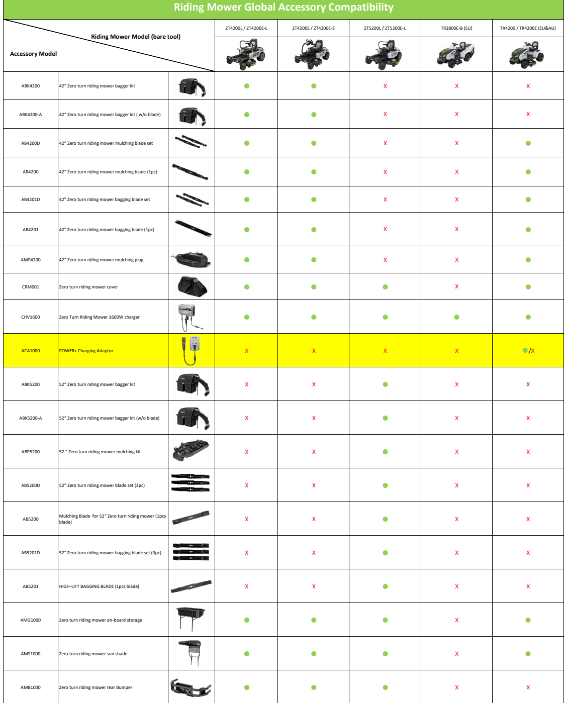
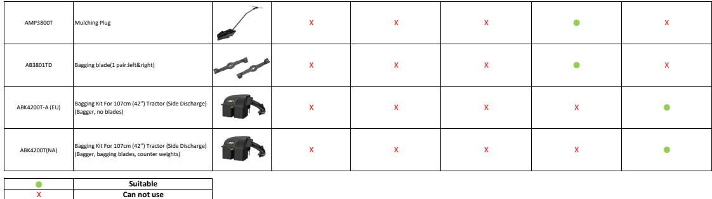

[[START OF PAGE 1]]

[[START OF PAGE 1]]

<table><tr><th colspan="8">Riding Mower Global Accessory Compatibility</th></tr><tr><td rowspan="2" colspan="3">Riding Mower Model (bare tool)

Accessory Model</td><td>ZT4200L/ZT4200E-L</td><td>ZT4200S/ZT4200E-S</td><td>ZT5200L/ZT5200E-L</td><td>TR3800E-B (EU)</td><td>TR4200/TR4200E (EU&amp;AU)</td></tr><tr><td></td><td></td><td></td><td></td><td></td></tr><tr><td>ABK4200</td><td>42" Zero turn riding mower bagger kit</td><td></td><td></td><td></td><td></td><td></td><td></td></tr><tr><td>ABK4200-A</td><td>42" Zero turn riding mower bagger kit (w/o blade)</td><td></td><td></td><td></td><td>X</td><td>X</td><td></td></tr><tr><td>AB4200D</td><td>42" Zero turn riding mower mulching blade set</td><td></td><td></td><td></td><td>X</td><td>X</td><td></td></tr><tr><td>AB4200</td><td>42" Zero turn riding mower mulching blade (1pc)</td><td></td><td></td><td></td><td>X</td><td>X</td><td></td></tr><tr><td>AB4201D</td><td>42" Zero turn riding mower bagging blade set</td><td></td><td></td><td></td><td>X</td><td>X</td><td></td></tr><tr><td>AB4201</td><td>42" Zero turn riding mower bagging blade (1pc)</td><td></td><td></td><td></td><td>X</td><td>X</td><td></td></tr><tr><td>AMP4200</td><td>42" Zero turn riding mower mulching plug</td><td></td><td></td><td></td><td>X</td><td>X</td><td></td></tr><tr><td>CRM001</td><td>Zero turn riding mower cover</td><td></td><td></td><td></td><td></td><td>x</td><td></td></tr><tr><td>CHV1600</td><td>Zero Turn Riding Mower 1600W charger</td><td></td><td></td><td></td><td></td><td></td><td></td></tr><tr><td>ACA1000</td><td>POWER+ Charging Adaptor</td><td></td><td></td><td>X</td><td></td><td>X</td><td></td></tr><tr><td>ABK5200</td><td>52" Zero turn riding mower bagger kit</td><td></td><td></td><td>X</td><td></td><td>X</td><td></td></tr><tr><td>ABK5200-A</td><td>52" Zero turn riding mower bagger kit (w/o blade)</td><td></td><td>X</td><td>X</td><td></td><td></td><td></td></tr><tr><td>ABP5200</td><td>52" Zero turn riding mower mulching kit</td><td></td><td></td><td></td><td></td><td></td><td></td></tr><tr><td>AB5200D</td><td>52" Zero turn riding mower blade set (3pc)</td><td></td><td>X</td><td>X</td><td></td><td>X</td><td>x</td></tr><tr><td>AB5200</td><td>Mulching Blade for 52" Zero turn riding mower (1pcs
blade)</td><td></td><td>X</td><td>X</td><td></td><td>X</td><td>X</td></tr><tr><td>AB5201D</td><td>52" Zero turn riding mower bagging blade set (3pc)</td><td></td><td>X</td><td>X</td><td></td><td>X</td><td></td></tr><tr><td>AB5201</td><td>HIGH-LIFT BAGGING BLADE (1pcs blade)</td><td></td><td></td><td></td><td></td><td></td><td></td></tr><tr><td>AMG1000</td><td>Zero turn riding mower on-board storage</td><td></td><td></td><td></td><td></td><td>X</td><td></td></tr><tr><td>AMS1000</td><td>Zero turn riding mower sun shade</td><td></td><td></td><td></td><td></td><td>X</td><td></td></tr><tr><td>AMB1000</td><td>Zero turn riding mower rear Bumper</td><td></td><td></td><td></td><td></td><td>X</td><td>x</td></tr></table>

[[END OF PAGE 1]]

[[START OF PAGE 2]]

[[END OF PAGE 1]]

[[START OF PAGE 2]]

<table><tr><th>AMP3800T</th><th>Mulching Plug</th><th></th><th>X</th><th>X</th><th>X</th><th></th><th>X</th></tr><tr><td>AB3801TD</td><td>Bagging blade(1 pair:left&amp;right)</td><td></td><td></td><td></td><td>X</td><td></td><td></td></tr><tr><td>ABK4200T-A (EU)</td><td>Bagging Kit For 107cm (42") Tractor (Side Discharge)
(Bagger, no blades)</td><td></td><td></td><td></td><td></td><td></td><td></td></tr><tr><td>ABK4200T(NA)</td><td>Bagging Kit For 107cm (42") Tractor (Side Discharge)
(Bagger, bagging blades, counter weights)</td><td></td><td></td><td>X</td><td>X</td><td>X</td><td></td></tr><tr><td>•

×</td><td>Suitable
Can not use</td><td></td><td></td><td></td><td></td><td></td><td></td></tr></table>

[[END OF PAGE 2]]

[[END OF PAGE 2]]