[[START OF PAGE 1]]

[[START OF PAGE 1]]

EGO™

Product Description: Zero Turn Riding Mower
Model Number: ZT4200S
Body Number: 2829467001S01
Version: A
Issue Date: 2022/10/20

202

22

21

20 19

18

201

23

24

25

26

27

17

2

193

3

20

4

16

15

6

14

1

=

13

203

Page 1 of 14

[[END OF PAGE 1]]

[[START OF PAGE 2]]

[[END OF PAGE 1]]

[[START OF PAGE 2]]

EGO™

Product Description: Zero Turn Riding Mower
Model Number: ZT4200S
Body Number: 1000056001S01
Version: A
Issue Date: 2022/10/20

211

58

48
214
49
59
78 77 76 75 74 58 73
50

60

61

30
38
31 72
39 209
32 40

33 41 72
51

34 52 71
35
212
36

70

44
37 45 213 69

206
68

62

53 63 208

54

55 64

67

56 66
65
57 207

Page 2 of 14

[[END OF PAGE 2]]

[[START OF PAGE 3]]

[[END OF PAGE 2]]

[[START OF PAGE 3]]

EGO™

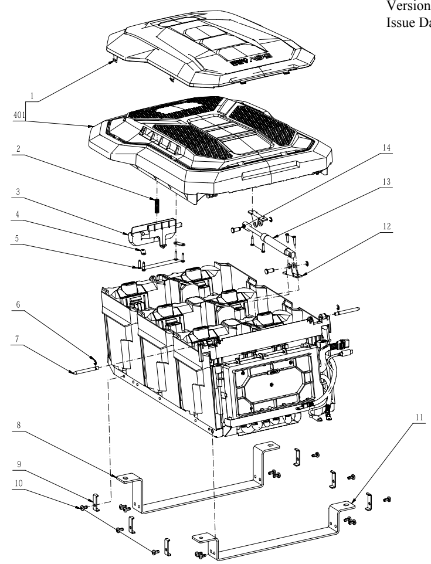

401

2 14

13
3

4

12

5

6

11
8

ES
9

10

Product Description: Zero Turn Riding Mower
Model Number: ZT4200S
Body Number: 1000031001_S
Version: A
Issue Date: 2022/10/20

201

Page 3 of 14

[[END OF PAGE 3]]

[[START OF PAGE 4]]

[[END OF PAGE 3]]

[[START OF PAGE 4]]

EGO®™

Product Description: Zero Turn Riding Mower
Model Number: ZT4200S
Body Number: 2831382001S01
Version: A
Issue Date: 2022/10/26

16

24

25

26

28

1

29

30

31

19

20

2

3

4

5

22

13

Page 1 of 1

[[END OF PAGE 4]]

[[START OF PAGE 5]]

[[END OF PAGE 4]]

[[START OF PAGE 5]]

EGO™

Product Description: Zero Turn Riding Mower
Model Number: ZT4200S
Body Number: 1000031001_S
Version: A
Issue Date: 2022/10/20

203

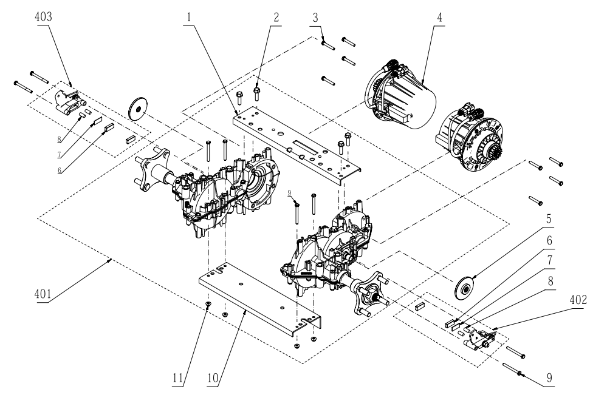

403 2 4

-
-

5

6

8
401 402

11/ 10 9

Page 5 of 14

[[END OF PAGE 5]]

[[START OF PAGE 6]]

[[END OF PAGE 5]]

[[START OF PAGE 6]]

EGO™

Product Description: Zero Turn Riding Mower
Model Number: ZT4200S
Body Number: 2829461001S01
Version: A
Issue Date: 2022/10/20

204

401

402

3

0

00

5

Page 6 of 14

[[END OF PAGE 6]]

[[START OF PAGE 7]]

[[END OF PAGE 6]]

[[START OF PAGE 7]]

EGO™

Product Description: Zero Turn Riding Mower
Model Number: ZT4200S
Body Number: 2829473001S01
Version: A
Issue Date: 2022/10/20

205

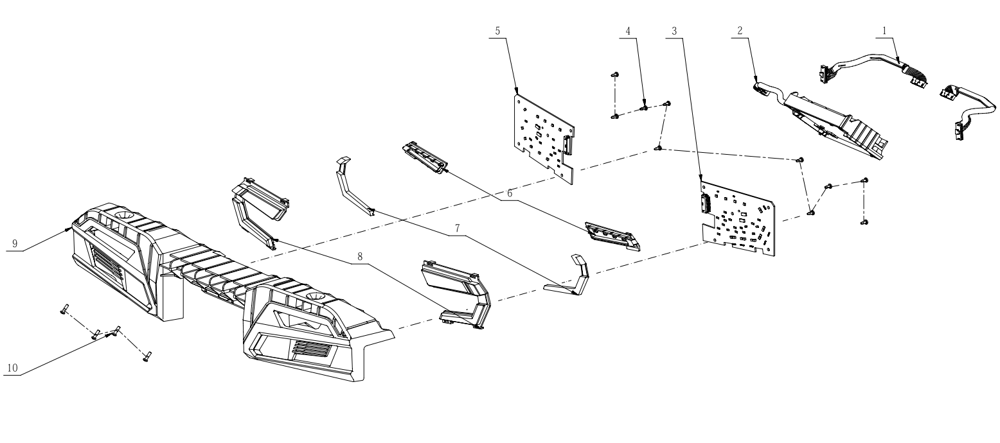

5 3

9

10

Page 7 of 14

[[END OF PAGE 7]]

[[START OF PAGE 8]]

[[END OF PAGE 7]]

[[START OF PAGE 8]]

EGO™

Product Description: Zero Turn Riding Mower
Model Number: ZT4200S
Body Number: 1000031001_S
Version: A
Issue Date: 2022/10/20

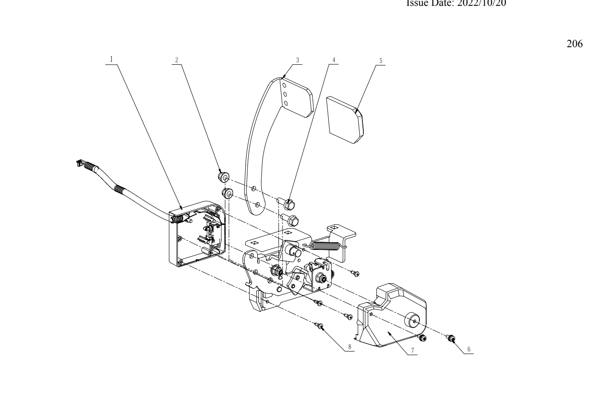

206

6

Page 8 of 14

[[END OF PAGE 8]]

[[START OF PAGE 9]]

[[END OF PAGE 8]]

[[START OF PAGE 9]]

EGO™

Product Description: Zero Turn Riding Mower
Model Number: ZT4200S
Body Number: 1000031001_S
Version: A
Issue Date: 2022/10/20

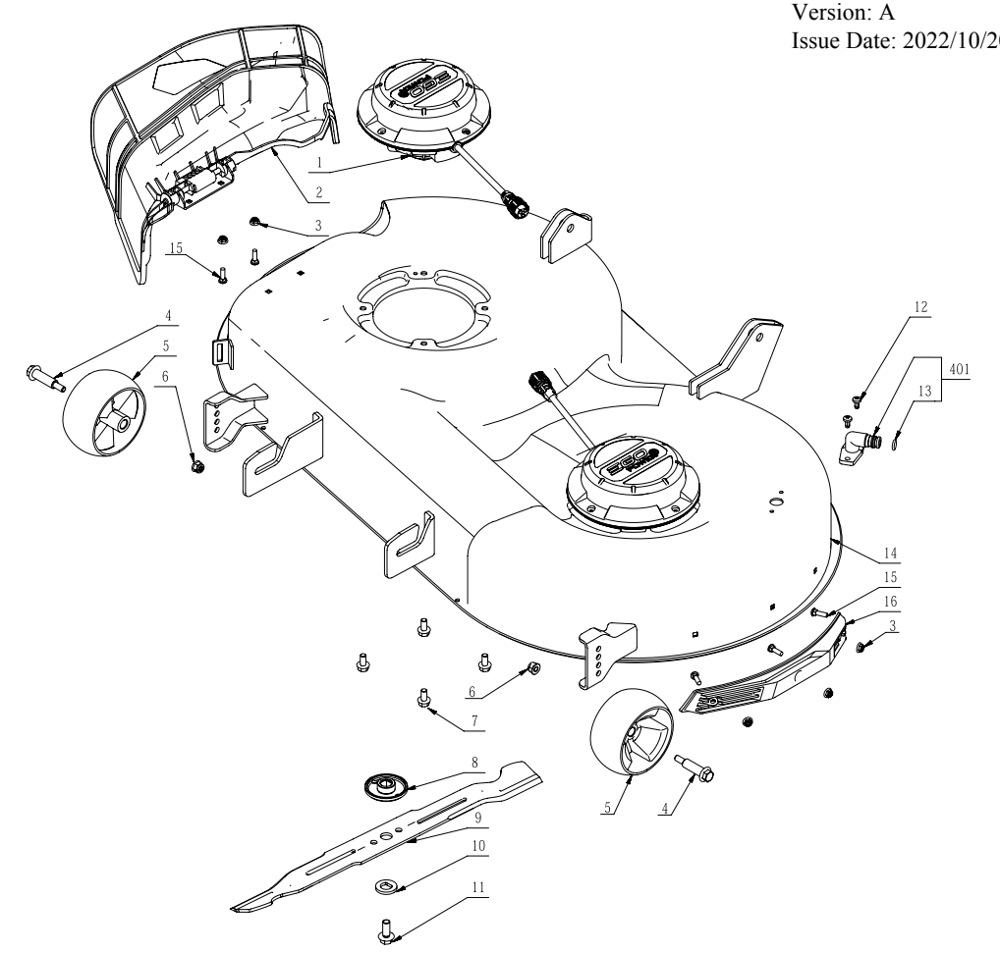

12

401

14

15

16

10

207

Page 9 of 14

[[END OF PAGE 9]]

[[START OF PAGE 10]]

[[END OF PAGE 9]]

[[START OF PAGE 10]]

EGO™

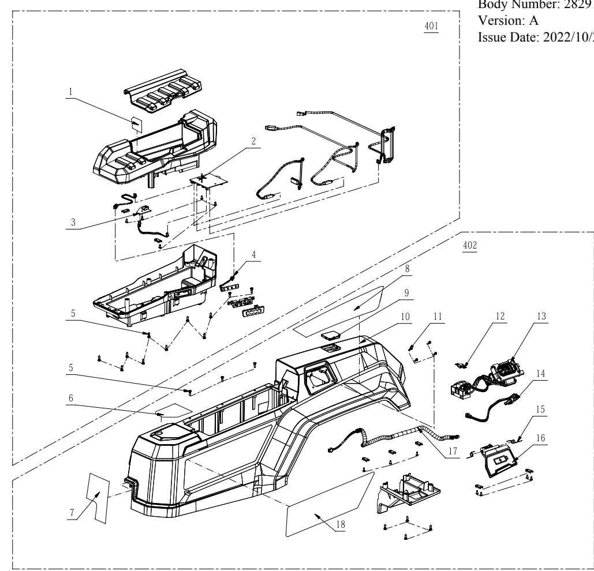

401

3

402

5 12 13

5

6

16

A

18

Product Description: Zero Turn Riding Mower
Model Number: ZT4200S
Body Number: 2829174001S01
Version: A
Issue Date: 2022/10/20

208

Page 10 of 14

[[END OF PAGE 10]]

[[START OF PAGE 11]]

[[END OF PAGE 10]]

[[START OF PAGE 11]]

EGO™

Product Description: Zero Turn Riding Mower
Model Number: ZT4200S
Body Number: 1000031001_S
Version: A
Issue Date: 2022/10/20

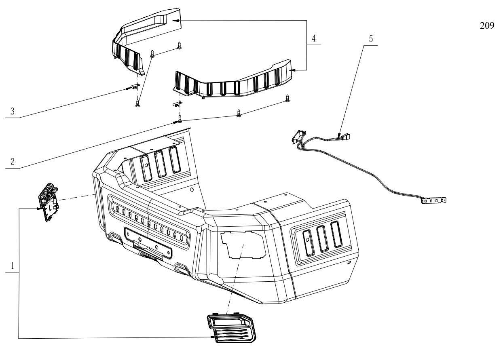

209

4 5

3

2 1800

6070_0_00

000 800

1

Page 11 of 14

[[END OF PAGE 11]]

[[START OF PAGE 12]]

[[END OF PAGE 11]]

[[START OF PAGE 12]]

EGO™

Product Description: Zero Turn Riding Mower
Model Number: ZT4200S
Body Number: 2829374001S01
Version: A
Issue Date: 2022/10/20

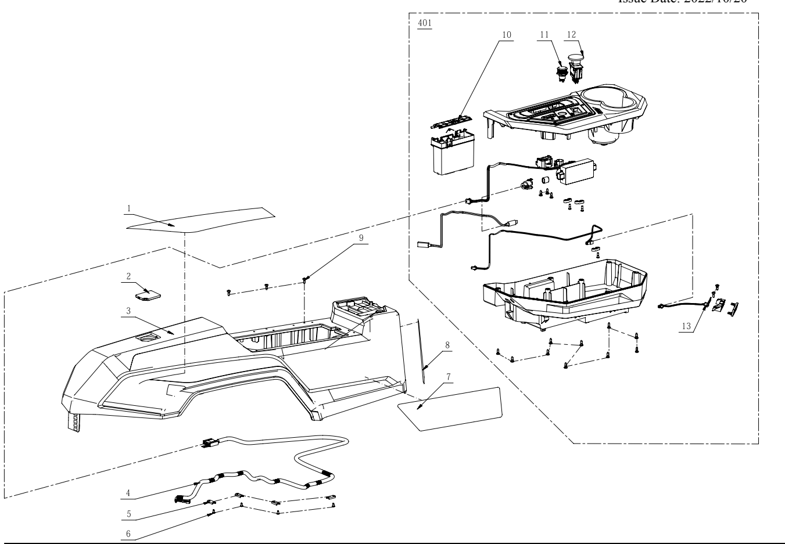

401
10 12

D

9

4

5

6

210

Page 12 of 14

[[END OF PAGE 12]]

[[START OF PAGE 13]]

[[END OF PAGE 12]]

[[START OF PAGE 13]]

EGO™

Product Description: Zero Turn Riding Mower
Model Number: ZT4200S
Body Number: 1000031001_S
Version: A
Issue Date: 2022/10/20

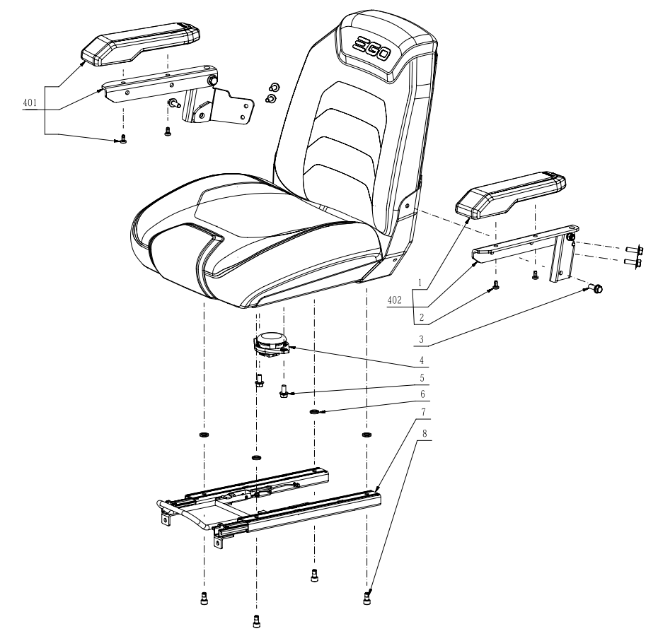

860

8Q
401

402

3

4

5

6

8

211

Page 13 of 14

[[END OF PAGE 13]]

[[START OF PAGE 14]]

[[END OF PAGE 13]]

[[START OF PAGE 14]]

EGO®™

Product Description: Zero Turn Riding Mower
Model Number: ZT4200S
Body Number: 2829179001S01
Version: A
Issue Date: 2022/10/20

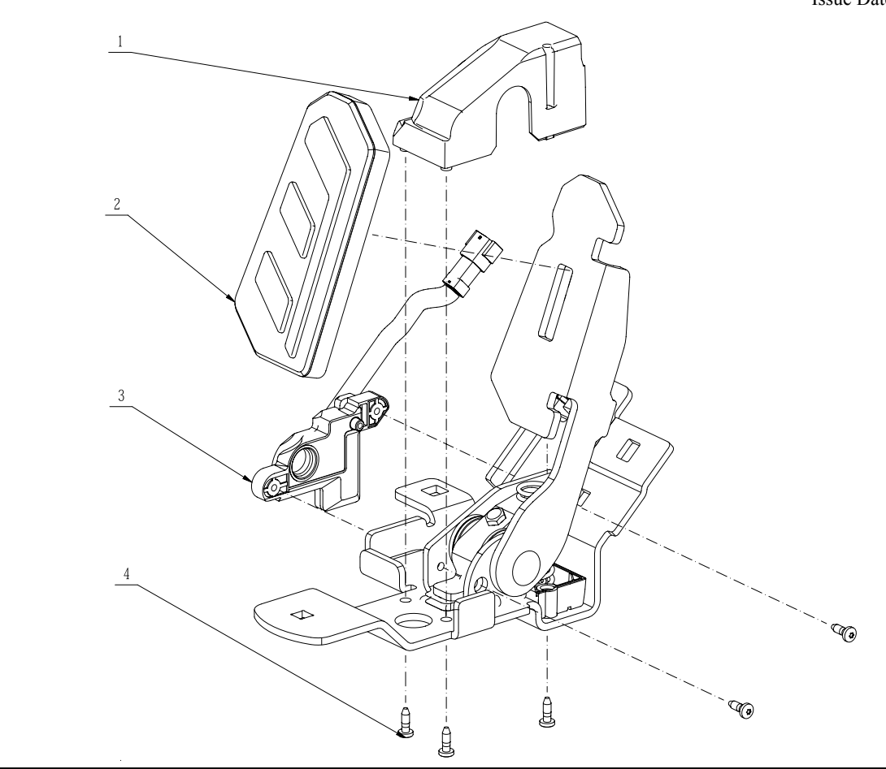

2

3

a

4

Co-

212

Page 14 of 14

[[END OF PAGE 14]]

[[START OF PAGE 15]]

[[END OF PAGE 14]]

[[START OF PAGE 15]]

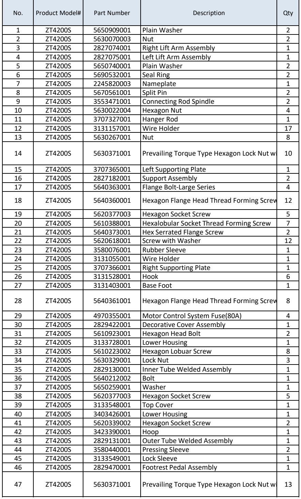

<table><tr><th>No.</th><th>Product Model#</th><th>Part Number</th><th>Description</th><th>Qty</th></tr><tr><td>1</td><td>ZT4200S</td><td>5650909001</td><td>Plain Washer</td><td>2</td></tr><tr><td>2</td><td>ZT4200S</td><td>5630070003</td><td>Nut</td><td>2</td></tr><tr><td>3</td><td>ZT4200S</td><td>2827074001</td><td>Right Lift Arm Assembly</td><td>1</td></tr><tr><td>4</td><td>ZT4200S</td><td>2827075001</td><td>Left Lift Arm Assembly</td><td>1</td></tr><tr><td>5</td><td>ZT4200S</td><td>5650740001</td><td>Plain Washer</td><td>2</td></tr><tr><td></td><td>ZT4200S</td><td>5690532001</td><td>Seal Ring</td><td>2</td></tr><tr><td>67822222</td><td>ZT4200S</td><td>2245820003</td><td>Nameplate</td><td>1</td></tr><tr><td></td><td>ZT4200S</td><td>5670561001</td><td>Split Pin</td><td></td></tr><tr><td>9</td><td>ZT4200S</td><td>3553471001</td><td>Connecting Rod Spindle</td><td></td></tr><tr><td>10</td><td>ZT4200S</td><td>5630022004</td><td>Hexagon Nut</td><td></td></tr><tr><td>11</td><td>ZT4200S</td><td>3707327001</td><td>Hanger Rod</td><td></td></tr><tr><td>12</td><td>ZT4200S</td><td>3131157001</td><td>Wire Holder</td><td>224178</td></tr><tr><td>13</td><td>ZT4200S</td><td>5630267001</td><td>Nut</td><td></td></tr><tr><td>± 14</td><td>ZT4200S</td><td>5630371001</td><td>Prevailing Torque Type Hexagon Lock Nut w</td><td>10</td></tr><tr><td>15</td><td>ZT4200S</td><td>3707365001</td><td>Left Supporting Plate</td><td>1</td></tr><tr><td>222 16</td><td>ZT4200S</td><td>2827182001</td><td>|Support Assembly</td><td></td></tr><tr><td>17</td><td>ZT4200S</td><td>5640363001</td><td>Flange Bolt-Large Series</td><td></td></tr><tr><td>2222222222</td><td>ZT4200S</td><td>5640360001</td><td>Hexagon Flange Head Thread Forming Screw</td><td>1242</td></tr><tr><td></td><td>ZT4200S</td><td>5620377003</td><td>Hexagon Socket Screw</td><td>5</td></tr><tr><td></td><td>ZT4200S</td><td>5610388001</td><td>Hexalobular Socket Thread Forming Screw</td><td>7</td></tr><tr><td></td><td>ZT4200S</td><td>5640373001</td><td>Hex Serrated Flange Screw</td><td>2</td></tr><tr><td></td><td>ZT4200S</td><td>5620618001</td><td>Screw with Washer</td><td>12</td></tr><tr><td></td><td>ZT4200S</td><td>3580076001</td><td>Rubber Sleeve</td><td>1</td></tr><tr><td></td><td>ZT4200S</td><td>3131055001</td><td>Wire Holder</td><td>1</td></tr><tr><td></td><td>ZT4200S</td><td>3707366001</td><td>Right Supporting Plate</td><td>1</td></tr><tr><td></td><td>ZT4200S</td><td>3131528001</td><td>Hook</td><td>6</td></tr><tr><td></td><td>ZT4200S</td><td>3131403001</td><td>Base Foot</td><td>1</td></tr><tr><td>28
222-23-361327772444</td><td>ZT4200S</td><td>5640361001</td><td>Hexagon Flange Head Thread Forming Screw</td><td>8</td></tr><tr><td>29</td><td>ZT4200S</td><td>4970355001</td><td>Motor Control System Fuse(80A)</td><td>4</td></tr><tr><td>30</td><td>ZT4200S</td><td>2829422001</td><td>Decorative Cover Assembly</td><td>1</td></tr><tr><td></td><td>ZT4200S</td><td>5610923001</td><td>Hexagon Head Bolt</td><td>2</td></tr><tr><td></td><td>ZT4200S</td><td>3133728001</td><td>Lower Housing</td><td>1</td></tr><tr><td></td><td>ZT4200S</td><td>5610223002</td><td>Hexagon Lobuar Screw</td><td>8</td></tr><tr><td></td><td>ZT4200S</td><td>5630329001</td><td>Lock Nut</td><td>3</td></tr><tr><td>35</td><td>ZT4200S</td><td>2829130001</td><td>Inner Tube Welded Assembly</td><td>1</td></tr><tr><td></td><td>ZT4200S</td><td>5640212002</td><td>Bolt</td><td>1</td></tr><tr><td></td><td>ZT4200S</td><td>5650259001</td><td>Washer</td><td>1</td></tr><tr><td>38</td><td>ZT4200S</td><td>5620377003</td><td>Hexagon Socket Screw</td><td>5</td></tr><tr><td>39</td><td>ZT4200S</td><td>3133548001</td><td>Top Cover</td><td>1</td></tr><tr><td>40</td><td>ZT4200S</td><td>3403426001</td><td>Lower Housing</td><td>1</td></tr><tr><td></td><td>ZT4200S</td><td>5620339002</td><td>Hexagon Socket Screw</td><td>2</td></tr><tr><td></td><td>ZT4200S</td><td>3423390001</td><td>Hoop</td><td>1</td></tr><tr><td></td><td>ZT4200S</td><td>2829131001</td><td>Outer Tube Welded Assembly</td><td>1</td></tr><tr><td></td><td>ZT4200S</td><td>3580440001</td><td>Pressing Sleeve</td><td>2</td></tr><tr><td>45</td><td>ZT4200S</td><td>3133549001</td><td>Lock Sleeve</td><td>1</td></tr><tr><td></td><td>ZT4200S</td><td>2829470001</td><td>Footrest Pedal Assembly</td><td>1</td></tr><tr><td>7 47</td><td>ZT4200S</td><td>5630371001</td><td>Prevailing Torque Type Hexagon Lock Nut w</td><td>13 13</td></tr></table>

[[END OF PAGE 15]]

[[START OF PAGE 16]]

[[END OF PAGE 15]]

[[START OF PAGE 16]]

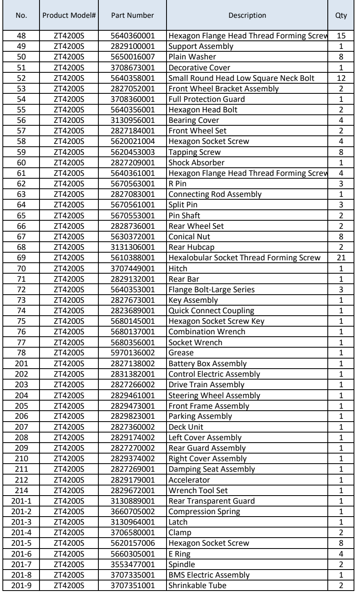

<table><tr><th>No.</th><th>Product Model#</th><th>Part Number</th><th>Description</th><th>Qty</th></tr><tr><td>48</td><td>ZT4200S</td><td>5640360001</td><td>Hexagon Flange Head Thread Forming Screw</td><td>15</td></tr><tr><td>49</td><td>ZT4200S</td><td>2829100001</td><td>Support Assembly</td><td>1</td></tr><tr><td>50</td><td>ZT4200S</td><td>5650016007</td><td>Plain Washer</td><td>8</td></tr><tr><td>51</td><td>ZT4200S</td><td>3708673001</td><td>Decorative Cover</td><td>1</td></tr><tr><td>52</td><td>ZT4200S</td><td>5640358001</td><td>Small Round Head Low Square Neck Bolt</td><td>12</td></tr><tr><td>53</td><td>ZT4200S</td><td>2827052001</td><td>Front Wheel Bracket Assembly</td><td>2</td></tr><tr><td>54</td><td>ZT4200S</td><td>3708360001</td><td>Full Protection Guard</td><td>1</td></tr><tr><td>55</td><td>ZT4200S</td><td>5640356001</td><td>Hexagon Head Bolt</td><td>2</td></tr><tr><td>56</td><td>ZT4200S</td><td>3130956001</td><td>Bearing Cover</td><td>4</td></tr><tr><td>57</td><td>ZT4200S</td><td>2827184001</td><td>Front Wheel Set</td><td>2</td></tr><tr><td>58</td><td>ZT4200S</td><td>5620021004</td><td>Hexagon Socket Screw</td><td>4</td></tr><tr><td>59</td><td>ZT4200S</td><td>5620453003</td><td>Tapping Screw</td><td>8</td></tr><tr><td>60</td><td>ZT4200S</td><td>2827209001</td><td>Shock Absorber</td><td>1</td></tr><tr><td>61</td><td>ZT4200S</td><td>5640361001</td><td>Hexagon Flange Head Thread Forming Screw</td><td>4</td></tr><tr><td>62</td><td>ZT4200S</td><td>5670563001</td><td>R Pin</td><td>3</td></tr><tr><td>63</td><td>ZT4200S</td><td>2827083001</td><td>Connecting Rod Assembly</td><td>1</td></tr><tr><td>64</td><td>ZT4200S</td><td>5670561001</td><td>Split Pin</td><td>3</td></tr><tr><td>65</td><td>ZT4200S</td><td>5670553001</td><td>Pin Shaft</td><td>2</td></tr><tr><td>66</td><td>ZT4200S</td><td>2828736001</td><td>Rear Wheel Set</td><td>2</td></tr><tr><td>67</td><td>ZT4200S</td><td>5630372001</td><td>Conical Nut</td><td>8</td></tr><tr><td>68</td><td>ZT4200S</td><td>3131306001</td><td>Rear Hubcap</td><td>2</td></tr><tr><td>69</td><td>ZT4200S</td><td>5610388001</td><td>Hexalobular Socket Thread Forming Screw</td><td>21</td></tr><tr><td>70</td><td>ZT4200S</td><td>3707449001</td><td>Hitch</td><td>1</td></tr><tr><td>71</td><td>ZT4200S</td><td>2829132001</td><td>Rear Bar</td><td>1</td></tr><tr><td>72</td><td>ZT4200S</td><td>5640353001</td><td>Flange Bolt-Large Series</td><td>3</td></tr><tr><td>73</td><td>ZT4200S</td><td>2827673001</td><td>Key Assembly</td><td>1</td></tr><tr><td>74</td><td>ZT4200S</td><td>2823689001</td><td>Quick Connect Coupling</td><td>1</td></tr><tr><td>75</td><td>ZT4200S</td><td>5680145001</td><td>|Hexagon Socket Screw Key</td><td>1</td></tr><tr><td>76</td><td>ZT4200S</td><td>5680137001</td><td>Combination Wrench</td><td>1</td></tr><tr><td>77</td><td>ZT4200S</td><td>5680356001</td><td>Socket Wrench</td><td>1</td></tr><tr><td>78</td><td>ZT4200S</td><td>5970136002</td><td>Grease</td><td>1</td></tr><tr><td>201</td><td>ZT4200S</td><td>2827138002</td><td>Battery Box Assembly</td><td>1</td></tr><tr><td>202</td><td>ZT4200S</td><td>2831382001</td><td>Control Electric Assembly</td><td>1</td></tr><tr><td>203</td><td>ZT4200S</td><td>2827266002</td><td>Drive Train Assembly</td><td>1</td></tr><tr><td>204</td><td>ZT4200S</td><td>2829461001</td><td>Steering Wheel Assembly</td><td>1</td></tr><tr><td>205</td><td>ZT4200S</td><td>2829473001</td><td>Front Frame Assembly</td><td>1</td></tr><tr><td>206</td><td>ZT4200S</td><td>2829823001</td><td>Parking Assembly</td><td>1</td></tr><tr><td>207</td><td>ZT4200S</td><td>2827360002</td><td>Deck Unit</td><td>1</td></tr><tr><td>208</td><td>ZT4200S</td><td>2829174002</td><td>Left Cover Assembly</td><td>1</td></tr><tr><td>209</td><td>ZT4200S</td><td>2827270002</td><td>Rear Guard Assembly</td><td>1</td></tr><tr><td>210</td><td>ZT4200S</td><td>2829374002</td><td>Right Cover Assembly</td><td>1</td></tr><tr><td>211</td><td>ZT4200S</td><td>2827269001</td><td>Damping Seat Assembly</td><td>1</td></tr><tr><td>212</td><td>ZT4200S</td><td>2829179001</td><td>Accelerator</td><td>1</td></tr><tr><td>214</td><td>ZT4200S</td><td>2829672001</td><td>Wrench Tool Set</td><td>1</td></tr><tr><td>201-1</td><td>ZT4200S</td><td>3130889001</td><td>Rear Transparent Guard</td><td>1</td></tr><tr><td>201-2</td><td>ZT4200S</td><td>3660705002</td><td>Compression Spring</td><td>1</td></tr><tr><td>201-3</td><td>ZT4200S</td><td>3130964001</td><td>Latch</td><td>1</td></tr><tr><td>201-4</td><td>ZT4200S</td><td>3706580001</td><td>Clamp</td><td>2</td></tr><tr><td>201-5</td><td>ZT4200S</td><td>5620157006</td><td>Hexagon Socket Screw</td><td>8</td></tr><tr><td>201-6</td><td>ZT4200S</td><td>5660305001</td><td>E Ring</td><td>4</td></tr><tr><td>201-7</td><td>ZT4200S</td><td>3553477001</td><td>Spindle</td><td>2</td></tr><tr><td>201-8</td><td>ZT4200S</td><td>3707335001</td><td>BMS Electric Assembly</td><td>1</td></tr><tr><td>201-9</td><td>ZT4200S</td><td>3707351001</td><td>Shrinkable Tube</td><td>2</td></tr></table>

[[END OF PAGE 16]]

[[START OF PAGE 17]]

[[END OF PAGE 16]]

[[START OF PAGE 17]]

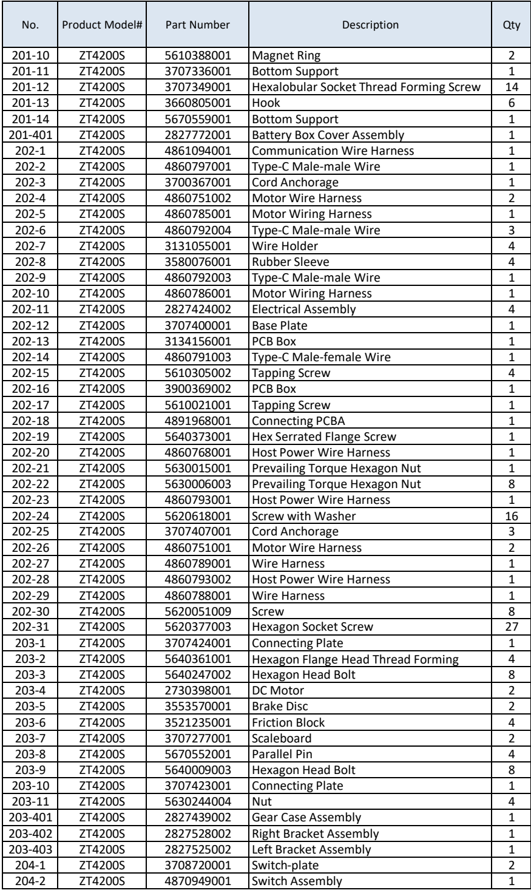

<table><tr><th>No.</th><th>Product Model#</th><th>Part Number</th><th>Description</th><th>Qty</th></tr><tr><td>201-10</td><td>ZT4200S</td><td>5610388001</td><td>Magnet Ring</td><td>2</td></tr><tr><td>201-11</td><td>ZT4200S</td><td>3707336001</td><td>Bottom Support</td><td>1</td></tr><tr><td>201-12</td><td>ZT4200S</td><td>3707349001</td><td>Hexalobular Socket Thread Forming Screw</td><td>14</td></tr><tr><td>201-13</td><td>ZT4200S</td><td>3660805001</td><td>Hook</td><td>6</td></tr><tr><td>201-14</td><td>ZT4200S</td><td>5670559001</td><td>Bottom Support</td><td>1</td></tr><tr><td>201-401</td><td>ZT4200S</td><td>2827772001</td><td>Battery Box Cover Assembly</td><td>1</td></tr><tr><td>202-1</td><td>ZT4200S</td><td>4861094001</td><td>Communication Wire Harness</td><td>1</td></tr><tr><td>202-2</td><td>ZT4200S</td><td>4860797001</td><td>Type-C Male-male Wire</td><td>1</td></tr><tr><td>202-3</td><td>ZT4200S</td><td>3700367001</td><td>Cord Anchorage</td><td>1</td></tr><tr><td>202-4</td><td>ZT4200S</td><td>4860751002</td><td>Motor Wire Harness</td><td>2</td></tr><tr><td>202-5</td><td>ZT4200S</td><td>4860785001</td><td>Motor Wiring Harness</td><td>1</td></tr><tr><td>202-6</td><td>ZT4200S</td><td>4860792004</td><td>Type-C Male-male Wire</td><td>3</td></tr><tr><td>202-7</td><td>ZT4200S</td><td>3131055001</td><td>Wire Holder</td><td>4</td></tr><tr><td>202-8</td><td>ZT4200S</td><td>3580076001</td><td>Rubber Sleeve</td><td>4</td></tr><tr><td>202-9</td><td>ZT4200S</td><td>4860792003</td><td>Type-C Male-male Wire</td><td>1</td></tr><tr><td>202-10</td><td>ZT4200S</td><td>4860786001</td><td>Motor Wiring Harness</td><td>1</td></tr><tr><td>202-11</td><td>ZT4200S</td><td>2827424002</td><td>Electrical Assembly</td><td>4</td></tr><tr><td>202-12</td><td>ZT4200S</td><td>3707400001</td><td>Base Plate</td><td>1</td></tr><tr><td>202-13</td><td>ZT4200S</td><td>3134156001</td><td>PCB Box</td><td>1</td></tr><tr><td>202-14</td><td>ZT4200S</td><td>4860791003</td><td>Type-C Male-female Wire</td><td>1</td></tr><tr><td>202-15</td><td>ZT4200S</td><td>5610305002</td><td>Tapping Screw</td><td>4</td></tr><tr><td>202-16</td><td>ZT4200S</td><td>3900369002</td><td>PCB Box</td><td>1</td></tr><tr><td>202-17</td><td>ZT4200S</td><td>5610021001</td><td>Tapping Screw</td><td>1</td></tr><tr><td>202-18</td><td>ZT4200S</td><td>4891968001</td><td>Connecting PCBA</td><td>1</td></tr><tr><td>202-19</td><td>ZT4200S</td><td>5640373001</td><td>Hex Serrated Flange Screw</td><td>1</td></tr><tr><td>202-20</td><td>ZT4200S</td><td>4860768001</td><td>Host Power Wire Harness</td><td>1</td></tr><tr><td>202-21</td><td>ZT4200S</td><td>5630015001</td><td>Prevailing Torque Hexagon Nut</td><td>1</td></tr><tr><td>202-22</td><td>ZT4200S</td><td>5630006003</td><td>Prevailing Torque Hexagon Nut</td><td>8</td></tr><tr><td>202-23</td><td>ZT4200S</td><td>4860793001</td><td>Host Power Wire Harness</td><td>1</td></tr><tr><td>202-24</td><td>ZT4200S</td><td>5620618001</td><td>Screw with Washer</td><td>16</td></tr><tr><td>202-25</td><td>ZT4200S</td><td>3707407001</td><td>Cord Anchorage</td><td>3</td></tr><tr><td>202-26</td><td>ZT4200S</td><td>4860751001</td><td>Motor Wire Harness</td><td>2</td></tr><tr><td>202-27</td><td>ZT4200S</td><td>4860789001</td><td>Wire Harness</td><td>1</td></tr><tr><td>202-28</td><td>ZT4200S</td><td>4860793002</td><td>Host Power Wire Harness</td><td>1</td></tr><tr><td>202-29</td><td>ZT4200S</td><td>4860788001</td><td>Wire Harness</td><td>1</td></tr><tr><td>202-30</td><td>ZT4200S</td><td>5620051009</td><td>Screw</td><td>8</td></tr><tr><td>202-31</td><td>ZT4200S</td><td>5620377003</td><td>Hexagon Socket Screw</td><td>27</td></tr><tr><td>203-1</td><td>ZT4200S</td><td>3707424001</td><td>Connecting Plate</td><td>1</td></tr><tr><td>203-2</td><td>ZT4200S</td><td>5640361001</td><td>Hexagon Flange Head Thread Forming</td><td>4</td></tr><tr><td>203-3</td><td>ZT4200S</td><td>5640247002</td><td>Hexagon Head Bolt</td><td>8</td></tr><tr><td>203-4</td><td>ZT4200S</td><td>2730398001</td><td>DC Motor</td><td></td></tr><tr><td>203-5</td><td>ZT4200S</td><td>3553570001</td><td>Brake Disc</td><td>224</td></tr><tr><td>203-6</td><td>ZT4200S</td><td>3521235001</td><td>Friction Block</td><td></td></tr><tr><td>203-7</td><td>ZT4200S</td><td>3707277001</td><td>Scaleboard</td><td>2</td></tr><tr><td>203-8</td><td>ZT4200S</td><td>5670552001</td><td>Parallel Pin</td><td>4</td></tr><tr><td>203-9</td><td>ZT4200S</td><td>5640009003</td><td>Hexagon Head Bolt</td><td>8</td></tr><tr><td>203-10</td><td>ZT4200S</td><td>3707423001</td><td>Connecting Plate</td><td>1</td></tr><tr><td>203-11</td><td>ZT4200S</td><td>5630244004</td><td>Nut</td><td>4</td></tr><tr><td>203-401</td><td>ZT4200S</td><td>2827439002</td><td>Gear Case Assembly</td><td>1</td></tr><tr><td>203-402</td><td>ZT4200S</td><td>2827528002</td><td>Right Bracket Assembly</td><td>1</td></tr><tr><td>203-403</td><td>ZT4200S</td><td>2827525002</td><td>Left Bracket Assembly</td><td>1</td></tr><tr><td>204-1</td><td>ZT4200S</td><td>3708720001</td><td>Switch-plate</td><td>2</td></tr><tr><td>204-2</td><td>ZT4200S</td><td>4870949001</td><td>Switch Assembly</td><td>1</td></tr></table>

[[END OF PAGE 17]]

[[START OF PAGE 18]]

[[END OF PAGE 17]]

[[START OF PAGE 18]]

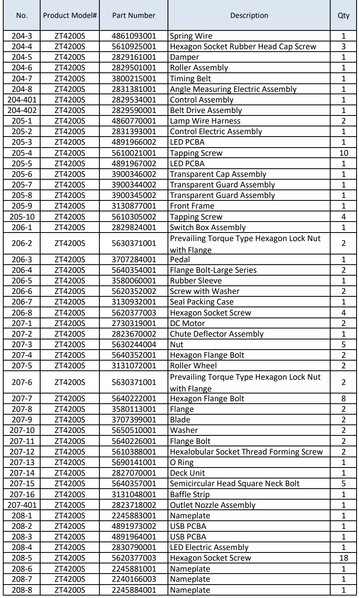

<table><tr><th>No.</th><th>Product Model#</th><th>Part Number</th><th>Description</th><th>Qty</th></tr><tr><td>204-3</td><td>ZT4200S</td><td>4861093001</td><td>Spring Wire</td><td>1</td></tr><tr><td>204-4</td><td>ZT4200S</td><td>5610925001</td><td>Hexagon Socket Rubber Head Cap Screw</td><td>3</td></tr><tr><td>204-5</td><td>ZT4200S</td><td>2829161001</td><td>Damper</td><td>1</td></tr><tr><td>204-6</td><td>ZT4200S</td><td>2829501001</td><td>Roller Assembly</td><td>1</td></tr><tr><td>204-7</td><td>ZT4200S</td><td>3800215001</td><td>Timing Belt</td><td>1</td></tr><tr><td>204-8</td><td>ZT4200S</td><td>2831381001</td><td>|Angle Measuring Electric Assembly</td><td>1</td></tr><tr><td>204-401</td><td>ZT4200S</td><td>2829534001</td><td>Control Assembly</td><td>1</td></tr><tr><td>204-402</td><td>ZT4200S</td><td>2829590001</td><td>Belt Drive Assembly</td><td>1</td></tr><tr><td>205-1</td><td>ZT4200S</td><td>4860770001</td><td>Lamp Wire Harness</td><td>2</td></tr><tr><td>205-2</td><td>ZT4200S</td><td>2831393001</td><td>Control Electric Assembly</td><td>1</td></tr><tr><td>205-3</td><td>ZT4200S</td><td>4891966002</td><td>LED PCBA</td><td>1</td></tr><tr><td>205-4</td><td>ZT4200S</td><td>5610021001</td><td>Tapping Screw</td><td>10</td></tr><tr><td>205-5</td><td>ZT4200S</td><td>4891967002</td><td>LED PCBA</td><td>1</td></tr><tr><td>205-6</td><td>ZT4200S</td><td>3900346002</td><td>Transparent Cap Assembly</td><td>1</td></tr><tr><td>205-7</td><td>ZT4200S</td><td>3900344002</td><td>Transparent Guard Assembly</td><td>1</td></tr><tr><td>205-8</td><td>ZT4200S</td><td>3900345002</td><td>Transparent Guard Assembly</td><td>1</td></tr><tr><td>205-9</td><td>ZT4200S</td><td>3130877001</td><td>Front Frame</td><td>1</td></tr><tr><td>205-10</td><td>ZT4200S</td><td>5610305002</td><td>Tapping Screw</td><td>4</td></tr><tr><td>206-1</td><td>ZT4200S</td><td>2829824001</td><td>Switch Box Assembly</td><td>1</td></tr><tr><td>206-2</td><td>ZT4200S</td><td>5630371001</td><td>Prevailing Torque Type Hexagon Lock Nut
with Flange</td><td>2</td></tr><tr><td>206-3</td><td>ZT4200S</td><td>3707284001</td><td>Pedal</td><td>1</td></tr><tr><td>206-4</td><td>ZT4200S</td><td>5640354001</td><td>Flange Bolt-Large Series</td><td>2</td></tr><tr><td>206-5</td><td>ZT4200S</td><td>3580060001</td><td>Rubber Sleeve</td><td>1</td></tr><tr><td>206-6</td><td>ZT4200S</td><td>5620352002</td><td>Screw with Washer</td><td>2</td></tr><tr><td>206-7</td><td>ZT4200S</td><td>3130932001</td><td>Seal Packing Case</td><td>1</td></tr><tr><td>206-8</td><td>ZT4200S</td><td>5620377003</td><td>Hexagon Socket Screw</td><td>4</td></tr><tr><td>207-1</td><td>ZT4200S</td><td>2730319001</td><td>DC Motor</td><td>2</td></tr><tr><td>207-2</td><td>ZT4200S</td><td>2823670002</td><td>Chute Deflector Assembly</td><td>1</td></tr><tr><td>207-3</td><td>ZT4200S</td><td>5630244004</td><td>Nut</td><td>5</td></tr><tr><td>207-4</td><td>ZT4200S</td><td>5640352001</td><td>Hexagon Flange Bolt</td><td>2</td></tr><tr><td>207-5</td><td>ZT4200S</td><td>3131072001</td><td>Roller Wheel</td><td>2</td></tr><tr><td>207-6</td><td>ZT4200S</td><td>5630371001</td><td>Prevailing Torque Type Hexagon Lock Nut
with Flange</td><td>2</td></tr><tr><td>207-7</td><td>ZT4200S</td><td>5640222001</td><td>Hexagon Flange Bolt</td><td></td></tr><tr><td>207-8</td><td>ZT4200S</td><td>3580113001</td><td>Flange</td><td></td></tr><tr><td>207-9</td><td>ZT4200S</td><td>3707399001</td><td>Blade</td><td>82222</td></tr><tr><td>207-10</td><td>ZT4200S</td><td>5650510001</td><td>Washer</td><td></td></tr><tr><td>207-11</td><td>ZT4200S</td><td>5640226001</td><td>Flange Bolt</td><td></td></tr><tr><td>207-12</td><td>ZT4200S</td><td>5610388001</td><td>Hexalobular Socket Thread Forming Screw</td><td>2</td></tr><tr><td>207-13</td><td>ZT4200S</td><td>5690141001</td><td>O Ring</td><td>1</td></tr><tr><td>207-14</td><td>ZT4200S</td><td>2827070001</td><td>Deck Unit</td><td>1</td></tr><tr><td>207-15</td><td>ZT4200S</td><td>5640357001</td><td>Semicircular Head Square Neck Bolt</td><td>5</td></tr><tr><td>207-16</td><td>ZT4200S</td><td>3131048001</td><td>Baffle Strip</td><td>1</td></tr><tr><td>207-401</td><td>ZT4200S</td><td>2823718002</td><td>Outlet Nozzle Assembly</td><td>1</td></tr><tr><td>208-1</td><td>ZT4200S</td><td>2245883001</td><td>Nameplate</td><td>1</td></tr><tr><td>208-2</td><td>ZT4200S</td><td>4891973002</td><td>USB PCBA</td><td>1</td></tr><tr><td>208-3</td><td>ZT4200S</td><td>4891964001</td><td>USB PCBA</td><td>1</td></tr><tr><td>208-4</td><td>ZT4200S</td><td>2830790001</td><td>LED Electric Assembly</td><td>1</td></tr><tr><td>208-5</td><td>ZT4200S</td><td>5620377003</td><td>Hexagon Socket Screw</td><td>18</td></tr><tr><td>208-6</td><td>ZT4200S</td><td>2245881001</td><td>Nameplate</td><td>1</td></tr><tr><td>208-7</td><td>ZT4200S</td><td>2240166003</td><td>Nameplate</td><td>1</td></tr><tr><td>208-8</td><td>ZT4200S</td><td>2245884001</td><td>Nameplate</td><td>1</td></tr></table>

[[END OF PAGE 18]]

[[START OF PAGE 19]]

[[END OF PAGE 18]]

[[START OF PAGE 19]]

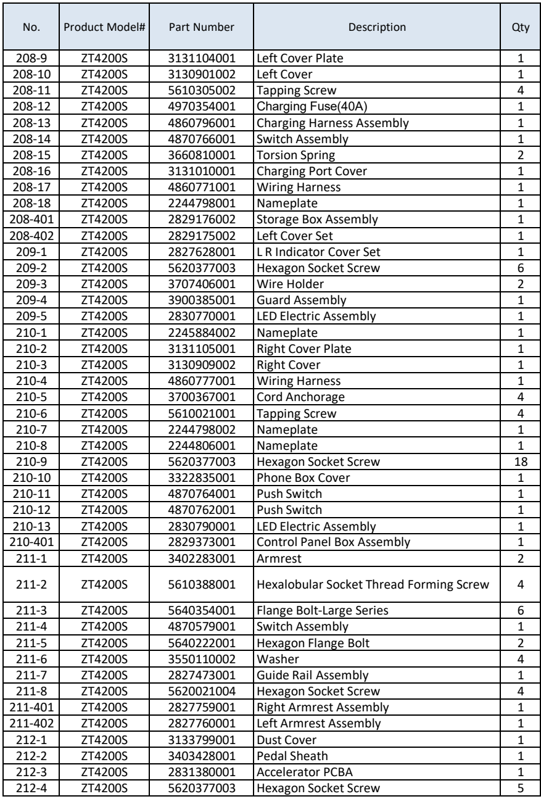

<table><tr><th>No.</th><th>Product Model#</th><th>Part Number</th><th>Description</th><th>Qty</th></tr><tr><td>208-9</td><td>ZT4200S</td><td>3131104001</td><td>Left Cover Plate</td><td>1</td></tr><tr><td>208-10</td><td>ZT4200S</td><td>3130901002</td><td>Left Cover</td><td>1</td></tr><tr><td>208-11</td><td>ZT4200S</td><td>5610305002</td><td>Tapping Screw</td><td>4</td></tr><tr><td>208-12</td><td>ZT4200S</td><td>4970354001</td><td>Charging Fuse(40A)</td><td>1</td></tr><tr><td>208-13</td><td>ZT4200S</td><td>4860796001</td><td>Charging Harness Assembly</td><td>1</td></tr><tr><td>208-14</td><td>ZT4200S</td><td>4870766001</td><td>Switch Assembly</td><td>1</td></tr><tr><td>208-15</td><td>ZT4200S</td><td>3660810001</td><td>Torsion Spring</td><td>2</td></tr><tr><td>208-16</td><td>ZT4200S</td><td>3131010001</td><td>Charging Port Cover</td><td>1</td></tr><tr><td>208-17</td><td>ZT4200S</td><td>4860771001</td><td>Wiring Harness</td><td>1</td></tr><tr><td>208-18</td><td>ZT4200S</td><td>2244798001</td><td>Nameplate</td><td>1</td></tr><tr><td>208-401</td><td>ZT4200S</td><td>2829176002</td><td>Storage Box Assembly</td><td>1</td></tr><tr><td>208-402</td><td>ZT4200S</td><td>2829175002</td><td>Left Cover Set</td><td>1</td></tr><tr><td>209-1</td><td>ZT4200S</td><td>2827628001</td><td>LR Indicator Cover Set</td><td>1</td></tr><tr><td>209-2</td><td>ZT4200S</td><td>5620377003</td><td>Hexagon Socket Screw</td><td>6</td></tr><tr><td>209-3</td><td>ZT4200S</td><td>3707406001</td><td>Wire Holder</td><td>2</td></tr><tr><td>209-4</td><td>ZT4200S</td><td>3900385001</td><td>Guard Assembly</td><td>1</td></tr><tr><td>209-5</td><td>ZT4200S</td><td>2830770001</td><td>LED Electric Assembly</td><td>1</td></tr><tr><td>210-1</td><td>ZT4200S</td><td>2245884002</td><td>Nameplate</td><td>1</td></tr><tr><td>210-2</td><td>ZT4200S</td><td>3131105001</td><td>Right Cover Plate</td><td>1</td></tr><tr><td>210-3</td><td>ZT4200S</td><td>3130909002</td><td>Right Cover</td><td>1</td></tr><tr><td>210-4</td><td>ZT4200S</td><td>4860777001</td><td>Wiring Harness</td><td>1</td></tr><tr><td>210-5</td><td>ZT4200S</td><td>3700367001</td><td>Cord Anchorage</td><td>4</td></tr><tr><td>210-6</td><td>ZT4200S</td><td>5610021001</td><td>Tapping Screw</td><td>4</td></tr><tr><td>210-7</td><td>ZT4200S</td><td>2244798002</td><td>|Nameplate</td><td>1</td></tr><tr><td>210-8</td><td>ZT4200S</td><td>2244806001</td><td>Nameplate</td><td>1</td></tr><tr><td>210-9</td><td>ZT4200S</td><td>5620377003</td><td>Hexagon Socket Screw</td><td>18</td></tr><tr><td>210-10</td><td>ZT4200S</td><td>3322835001</td><td>Phone Box Cover</td><td>1</td></tr><tr><td>210-11</td><td>ZT4200S</td><td>4870764001</td><td>Push Switch</td><td>1</td></tr><tr><td>210-12</td><td>ZT4200S</td><td>4870762001</td><td>Push Switch</td><td>1</td></tr><tr><td>210-13</td><td>ZT4200S</td><td>2830790001</td><td>LED Electric Assembly</td><td>1</td></tr><tr><td>210-401</td><td>ZT4200S</td><td>2829373001</td><td>Control Panel Box Assembly</td><td>1</td></tr><tr><td>211-1</td><td>ZT4200S</td><td>3402283001</td><td>Armrest</td><td>2</td></tr><tr><td>211-2</td><td>ZT4200S</td><td>5610388001</td><td>Hexalobular Socket Thread Forming Screw</td><td>4</td></tr><tr><td>211-3</td><td>ZT4200S</td><td>5640354001</td><td>Flange Bolt-Large Series</td><td>6</td></tr><tr><td>211-4</td><td>ZT4200S</td><td>4870579001</td><td>Switch Assembly</td><td>1</td></tr><tr><td>211-5</td><td>ZT4200S</td><td>5640222001</td><td>Hexagon Flange Bolt</td><td>2</td></tr><tr><td>211-6</td><td>ZT4200S</td><td>3550110002</td><td>Washer</td><td>4</td></tr><tr><td>211-7</td><td>ZT4200S</td><td>2827473001</td><td>Guide Rail Assembly</td><td>1</td></tr><tr><td>211-8</td><td>ZT4200S</td><td>5620021004</td><td>Hexagon Socket Screw</td><td>4</td></tr><tr><td>211-401</td><td>ZT4200S</td><td>2827759001</td><td>Right Armrest Assembly</td><td>1</td></tr><tr><td>211-402</td><td>ZT4200S</td><td>2827760001</td><td>Left Armrest Assembly</td><td>1</td></tr><tr><td>212-1</td><td>ZT4200S</td><td>3133799001</td><td>Dust Cover</td><td>1</td></tr><tr><td>212-2</td><td>ZT4200S</td><td>3403428001</td><td>Pedal Sheath</td><td>1</td></tr><tr><td>212-3</td><td>ZT4200S</td><td>2831380001</td><td>Accelerator PCBA</td><td>1</td></tr><tr><td>212-4</td><td>ZT4200S</td><td>5620377003</td><td>Hexagon Socket Screw</td><td>5</td></tr></table>

[[END OF PAGE 19]]

[[END OF PAGE 19]]