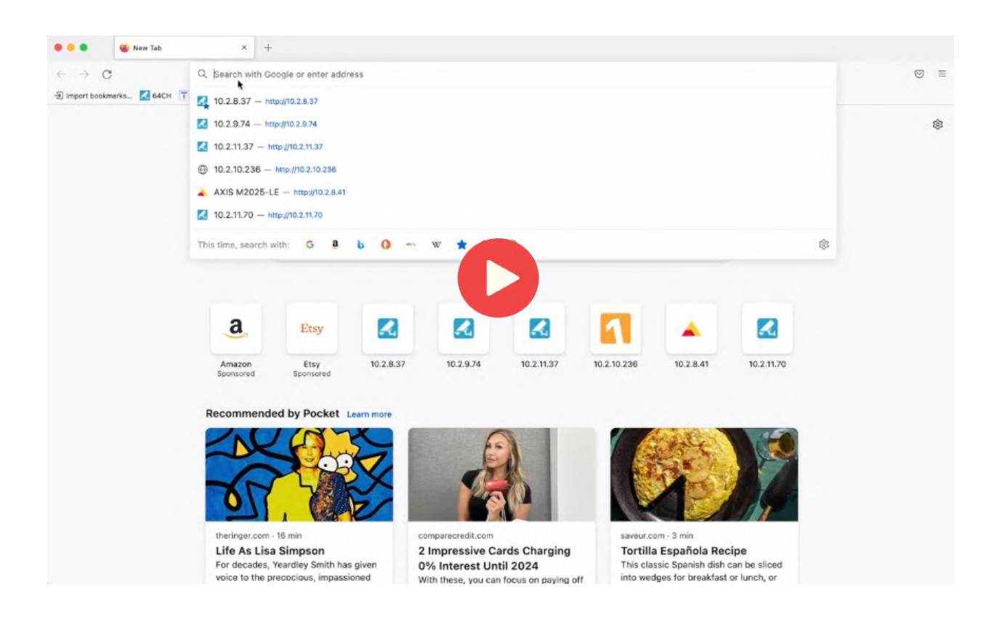

# TURING

## **Turing Vision INTEGRATION GUIDE FOR HANWHA CAMERAS**

Adding Hanwha Cameras to Turing Vision:

## Checklist, Installation Guide, and Video Tutorials

- Hanwha Camera [Installation](#page-2-0) Steps
  - 1. Access [Camera's](#page-2-1) Web UI
  - 2. [Initialize](#page-3-0) Camera
  - 3. [Verify/Modify](#page-4-0) Camera Encoding Settings
  - 4. Enable Motion [Detection](#page-5-0)
  - 5. Connect & Add [Camera\(s\)](#page-6-0) to Turing NVR
- [Installation](#page-7-0) Video
- [Hanwha](#page-7-0) Camera FAQs

## Hanwha Camera Installation Steps

- ● Access Camera's Web UI
  - Locate your camera's IP Address

○ Enter your camera's IP address into browser search bar

- ● Initialize Camera
  - On a factory-defaulted camera, the web UI will prompt you to create a new

password for your camera

○ Click Apply to initialize camera(s)

| W http://10.2.11.97/wmf/index.html#/change_password W Wisenet WEBVIEWER $\overline{\phantom{a}}^{\times}$ | C Search                                                                                                                                                                                                        | $\Box$ $\times$ $\overline{\phantom{a}}$ $\bigcirc$ $\bigcirc$ $\bigcirc$ $\bigcirc$ $\Omega -$ |
|-----------------------------------------------------------------------------------------------------------------|-----------------------------------------------------------------------------------------------------------------------------------------------------------------------------------------------------------------|-------------------------------------------------------------------------------------------------------------|
|                                                                                                                 |                                                                                                                                                                                                                 |                                                                                                             |
|                                                                                                                 |                                                                                                                                                                                                                 |                                                                                                             |
|                                                                                                                 |                                                                                                                                                                                                                 |                                                                                                             |
|                                                                                                                 |                                                                                                                                                                                                                 |                                                                                                             |
|                                                                                                                 |                                                                                                                                                                                                                 |                                                                                                             |
|                                                                                                                 |                                                                                                                                                                                                                 |                                                                                                             |
|                                                                                                                 | Administrator password change                                                                                                                                                                                   |                                                                                                             |
|                                                                                                                 |                                                                                                                                                                                                                 |                                                                                                             |
|                                                                                                                 | New password                                                                                                                                                                                                    |                                                                                                             |
|                                                                                                                 | Confirm new password                                                                                                                                                                                            |                                                                                                             |
|                                                                                                                 | If the password is 8 to 9 characters long, then it must include a combination of at least 3 of the following character types: alphabet letters with uppercase or lowercase, numbers, and special characters. |                                                                                                             |
|                                                                                                                 |                                                                                                                                                                                                                 |                                                                                                             |
|                                                                                                                 | If the password is longer than 10 characters, then it must include a combination of at least 2 of the following character types: alphabet letters with uppercase or lowercase, numbers, and special          |                                                                                                             |
|                                                                                                                 | characters. ID may not be used as password. We recommend not to use your ID string as part of the password.                                                                                                  |                                                                                                             |
|                                                                                                                 | The following special characters can be used: ~'{@#\$%^&'{)_-+={{{{}};'"'~?/                                                                                                                                    |                                                                                                             |
|                                                                                                                 | You may not use more than 4 consecutive characters. (example: 1234, abcd, etc.) You may not use the same character 4 or more times consecutively. (example: IIII, 1111, aaaa, etc.)                          |                                                                                                             |

TIP: If installing multiple, use [Wisenet's](https://www.hanwhasecurity.com/resources/tools/wisenet-device-manager/) Device Manager to initialize and modify network settings

- ● Verify/Modify Camera Encoding Settings
  - Go to Basic > Video Profile
  - Modify the encoding settings to the Turing recommended settings

| $\leftarrow$ W Wisenet WEBVIEWER  | $\times$   | W http://10.2.11.97/wmf/index.html#/setup/basic_videoProfile |                                                     |                                                                                          | C Search                                         |                | P - ⓐ ☆ ◎ ●             |
|--------------------------------------|------------|--------------------------------------------------------------|-----------------------------------------------------|------------------------------------------------------------------------------------------|--------------------------------------------------|----------------|-------------------------|
| <b>WISENET</b>                       |            |                                                              |                                                     | $\bigcirc$ $\mathcal{L}_{\mathcal{L}}$                                                |                                                  |                | Help XNV-9082R admin |
| $\equiv \text{ Basic}$               |            | Video profile                                                |                                                     |                                                                                          |                                                  |                |                         |
| Video profile User Date & Time |            | Video profile connection policy                              | Keep connection when profile properties are changed |                                                                                          |                                                  |                |                         |
| IP & Port                            |            | Video profile                                                | Add Delete                                       |                                                                                          |                                                  |                |                         |
| $+$ PTZ                              | $\leq$     |                                                              |                                                     | Name                                                                                     | Codec                                            | Type           |                         |
| 🚟 Video & Audio                      | $\epsilon$ |                                                              | $\circ$                                             | <b>MJPEG</b>                                                                             | <b>MJPEG</b>                                     | Record / Event |                         |
| ch Network                           | $\epsilon$ |                                                              | $\odot$                                             | H.264                                                                                    | H 264                                 | Default        |                         |
| ♠ Event                              | $\epsilon$ |                                                              | $\bigcirc$                                          | H.265                                                                                    | H.265                                            |                |                         |
| ☐ Analytics                          | $\epsilon$ |                                                              | $\circ$                                             | <b>MOBILE</b>                                                                            | H.264                                            |                |                         |
| $\cdot$ Statistics                   | $\epsilon$ |                                                              | Name                                                | H.264                                                                                    |                                                  |                |                         |
| System                               | $\epsilon$ |                                                              | Codec                                               | $\check{\phantom{a}}$ H.264                                                           |                                                  |                |                         |
| Open platform                        | $\epsilon$ |                                                              | <b>Profile type</b>                                 | Default profile Edge recording profile ☐ Digital PTZ profile Frame Lock profile |                                                  |                |                         |
|                                      |            |                                                              | Audio in                                            | Enable                                                                                   |                                                  |                |                         |
|                                      |            | Crop encoding                                                | $\Box$ Enable                                       | Set area                                                                                 |                                                  |                |                         |
|                                      |            | <b>Profile properties</b>                                    | <b>Resolution</b>                                   | 3840 X 2160 (16:9)                                                                       | $\check{\phantom{a}}$                            |                |                         |
|                                      |            |                                                              | Frame rate                                          | $30 \\$                                                                                  | $\textcolor{red}{\blacktriangledown}~\text{fps}$ |                |                         |
|                                      |            |                                                              | <b>Maximum bitrate</b>                              | 12288                                                                                    | kbps (2048 ~ 30720)                              |                |                         |
|                                      |            | Advanced                                                     |                                                     |                                                                                          | $\qquad \qquad \blacksquare$                     |                |                         |

|                          | <b>Main Stream</b>                    | <b>Sub Stream</b>         |  |  |
|--------------------------|---------------------------------------|---------------------------|--|--|
| <b>Video Compression</b> | H.264                                 | H.264                     |  |  |
| <b>Resolution</b>        | Less than 3MP (2MP is recommended) | 1280x720 (720P)           |  |  |
| <b>Frame Rate</b>        | 15                                    | 15                        |  |  |
| Frame Interval           | 30                                    | 30                        |  |  |
| <b>Bitrate Type</b>      | CBR                                   | CBR                       |  |  |
| <b>Bit Rate</b>          | Less than or equal to 2048            | Less than or equal to 768 |  |  |

- ● Enable Motion Detection
  - Go to Analytics > Motion Detection
  - Click the Enable motion detection checkbox
  - Edit the detection area, level of detection, sensitivity and minimum duration as desired
  - Click Apply to save all settings

| Θ                                                        |             | W http://10.2.11.97/wmf/index.html#/setup/analytics_motionDetection |                |               | - C Search                                                                    | p- ⑥☆◎ 🥲                  |
|----------------------------------------------------------|-------------|---------------------------------------------------------------------|----------------|---------------|-------------------------------------------------------------------------------|---------------------------|
| $\times$ $\Box$ W Wisenet WEBVIEWER <b>WISENET</b> |             |                                                                     |                | Ę.            | $\bigoplus$                                                                   | ? Help XNV-9082R admin |
| ⊞ Basic                                                  | $\prec$     | Motion detection                                                    |                |               |                                                                               |                           |
| $+$ PTZ                                                  | $\leq$      |                                                                     |                |               |                                                                               |                           |
| 🛨 Video & Audio                                          | $\leq$      | Enable motion detection                                             |                |               |                                                                               |                           |
| $\bar{m}$ Network                                        | $\langle$   | Include area                                                        | Exclude area   | Common        |                                                                               |                           |
| ♣ Event                                                  | $\leq$      |                                                                     |                |               | Area                                                                          |                           |
| $\Box$ Analytics                                         | $\sim$      |                                                                     |                |               | $\begin{array}{cccccccccccccccc}\n1 & 2 & 3 & 4 & 5 & 6 & 7 & 8\n\end{array}$ |                           |
| Shock detection                                          |             |                                                                     |                |               | Level of detection                                                            |                           |
| <b>Motion detection</b>                                  |             |                                                                     |                |               | 100 00 00 00 00 00 1 1 1 1 1 1 1 1 1 1 1 $\left[ + \right]$             |                           |
| Tampering detection Defocus detection                 |             |                                                                     |                |               | $\begin{array}{ c c } \hline & 5 \\ \hline \end{array}$                       |                           |
| Fog detection                                            |             |                                                                     |                |               | $\bullet$ $\Box$                                                              |                           |
| Face/upper body detection                                |             |                                                                     |                |               | Sensitivity                                                                   |                           |
| <b>IVA</b>                                               |             |                                                                     |                |               | $\Box$ F 80                                                             |                           |
| Audio detection                                          |             |                                                                     |                |               | Minimum duration (s)                                                          |                           |
| Sound classification                                     |             |                                                                     |                |               | $\Box\bullet$ $\boxed{+}$ $\theta$                                      |                           |
| <b>III</b> Statistics                                    | $\leqslant$ |                                                                     |                |               |                                                                               |                           |
| $\odot$ System                                           | $\leq$      |                                                                     |                |               | Handover                                                                      |                           |
| Open platform                                            | $\leq$      |                                                                     |                |               | $\checkmark$ Off                                                           |                           |
|                                                          |             | Overlay                                                             | ☐ Enable       |               |                                                                               |                           |
|                                                          |             | <b>Event action settings</b>                                        | $\mathsf{FTP}$ | Enable        |                                                                               |                           |
|                                                          |             |                                                                     | E-mail         | Enable        |                                                                               |                           |
|                                                          |             |                                                                     | Record         | $\Box$ Enable |                                                                               |                           |
|                                                          |             |                                                                     |                |               | $\qquad \qquad \blacksquare$                                                  |                           |

## ● Connect & Add Camera(s) to Turing NVR

- Access your Turing NVR web UI by entering its IP address into a web browser
- Login and go to Setup > Camera > Camera
- Select the channel and click Modify
- Edit the username and password fields
- Click Save

| TURING                                                                                                                                                                                               | $\Box$ Live View                             | Playback 1                        | Setup                                           | Smart                                |                  |          |                              |                                  |                  |               | admin Logout |
|------------------------------------------------------------------------------------------------------------------------------------------------------------------------------------------------------|-------------------------------------------------|-----------------------------------|-------------------------------------------------|--------------------------------------|------------------|----------|------------------------------|----------------------------------|------------------|---------------|-----------------|
| Client $\checkmark$                                                                                                                                                                               | Camera                                          | Advanced                          |                                                 |                                      |                  |          |                              |                                  |                  |               |                 |
| System $\check{\phantom{a}}$                                                                                                                                                                      |                                                 |                                   |                                                 |                                      |                  |          |                              |                                  |                  |               |                 |
| Camera $\sim$                                                                                                                                                                                     | Auto Switch to H.265                            |                                   | ○ On • Off Note: Effective when first connected |                                      |                  |          |                              |                                  |                  |               |                 |
| Camera                                                                                                                                                                                               |                                                 | Auto Switch to Smart Encoding Off |                                                 | Note: Effective when first connected |                  |          |                              |                                  |                  |               |                 |
| Encoding                                                                                                                                                                                             | Refresh                                         | Modify Delete                  | Auto Search Search Segment                      | Batch Edit Pass                      |                  |          |                              |                                  |                  |               |                 |
| OSD                                                                                                                                                                                                  | No. $\Box$                                   | Camera ID                         | Address                                         | Port                                 | Remote Camera ID | Protocol | <b>Status</b>                | Vendor                           | Model            | Configure     | Access          |
| Image $\quad \text{Schedule}$                                                                                                                                                                     | $\Box$ 1                                     | D1 (Camera 01)                    | 172.16.0.107                                    | $80\\$                               | 1                | ONVIF    | $\Box$                       | ONVIF                            | VX-4V-OD-RI      | $\theta$      | Access          |
|                                                                                                                                                                                                      | $\Box$ $\overline{2}$                        | D2 (IP Camera 02)                 | 172.16.0.105                                    | 80                                   | $\overline{1}$   | ONVIF    | $\Box$                       | Avigilon                         | 2.0C-H4A-DP1     | $\mathcal{A}$ | Access          |
| Motion                                                                                                                                                                                               | $\Box$ $\overline{3}$                        | D3 (IP Camera 03)                 | 172.16.0.106                                    | 80                                   | $\mathbf{1}$     | ONVIF    | $\qquad \qquad \blacksquare$ | Pelco                            | IME129           | $\theta$      | Access          |
| Video Loss                                                                                                                                                                                           | $\Box$ $\overline{4}$                        | D4 (IP Camera 04)                 | 172.16.0.108                                    | 80                                   | $\mathbf{1}$     | ONVIF    | $\Box$                       | AXIS                             | M2026-LE-MkII    | $\theta$      | Access          |
| Tampering                                                                                                                                                                                            | $\color{red}\blacktriangledown$ $\mathsf{S}$ | D5 (IP Camera 05)                 | 172.16.0.109                                    | $80\\$                               | $\mathbf{1}$     | ONVIF    | $\Box$                       | Samsung Techwin                  | QNV-7010R        | $\mathcal{A}$ | Access          |
| Privacy Mask                                                                                                                                                                                         | $\Box$ 6                                     | D6 (IP Camera 06)                 | 172.16.0.7                                      | 80                                   | $\overline{1}$   | ONVIF    | $\boxplus \mathbb{N}$        |                                  |                  |               | Access          |
| $\scriptstyle \sf Snapshot$                                                                                                                                                                          | $\Box$ $\overline{7}$                        | D7 (IP Camera 07)                 | 172.16.0.8                                      | 80                                   | $1 -$            | ONVIF    | $\boxplus \mathbb{N}$        |                                  |                  |               | Access          |
| <b>Audio Detection</b> <b>Human Body Detection</b>                                                                                                                                                | $\Box$ 8                                     | D8 (IP Camera 08)                 | 172.16.0.102                                    | 80                                   | $\mathbf{1}$     | Private  | $\Box$                       | $\quad \  \  \, =\quad \  \  \,$ | SC-2085WD-I0-F28 | $\mathcal{I}$ | Access          |
| Hard Disk $\checkmark\\$ Alarm $\checkmark$ Alert $\checkmark\\$ Network $\checkmark$ <b>Platform</b> $\checkmark$ User $\checkmark$ Maintenance $\checkmark$ |                                                 |                                   |                                                 |                                      |                  |          |                              |                                  |                  |               |                 |

| ⋐ http://10.2.11.37/cgi-bin/main-cgi     |                       |                                 |                                                   | $\bullet$ C Search |  |
|---------------------------------------------|-----------------------|---------------------------------|---------------------------------------------------|--------------------|--|
| <b>W</b> Wisenet WEBVIEWER                  |                       | $\times$ TR-MRP082T          |                                                   |                    |  |
| TURING                                      |                       | $\Box$ Live View Playback | Setup                                             | Smart              |  |
| Client                                      | $\checkmark$          | Camera                          | Advanced                                          |                    |  |
| System                                      | $\check{\phantom{a}}$ |                                 |                                                   |                    |  |
| Camera                                      | $\sim$                | Add Mode                        | $\checkmark$ Plug-and-Play                     |                    |  |
| Camera                                      |                       | Protocol                        | Private $\checkmark$                           |                    |  |
| Encoding                                    |                       | IP Address                      | 172.16.0.9                                        |                    |  |
| OSD                                         |                       | $\mathsf{Port}$                 | 80                                                |                    |  |
| Image                                       |                       | Username                        | admin                                             |                    |  |
| Schedule                                    |                       | Password                        | $\bullet\bullet\bullet\bullet\bullet$             |                    |  |
| Motion                                      |                       | Remote Camera ID                | $\checkmark\\$ 1                               |                    |  |
| Video Loss                                  |                       |                                 |                                                   |                    |  |
| <b>Tampering</b>                            |                       | <b>Extended Transmission</b>    | $\bigcirc \mathsf{On} \ \circledast \mathsf{Off}$ |                    |  |
| Privacy Mask $\scriptstyle \sf Snapshot$ |                       |                                 |                                                   |                    |  |
| <b>Audio Detection</b>                      |                       | Save Search                  | Cancel                                            |                    |  |
| <b>Human Body Detection</b>                 |                       |                                 |                                                   |                    |  |
| <b>Hard Disk</b>                            | $\check{\phantom{a}}$ |                                 |                                                   |                    |  |
| Alarm                                       | $\check{\phantom{a}}$ |                                 |                                                   |                    |  |
| Alert                                       |                       |                                 |                                                   |                    |  |
|                                             | $\checkmark\\$        |                                 |                                                   |                    |  |
| Network                                     | $\checkmark\\$        |                                 |                                                   |                    |  |
| <b>Platform</b>                             | $\check{\phantom{a}}$ |                                 |                                                   |                    |  |
| User                                        | $\checkmark\\$        |                                 |                                                   |                    |  |
| Maintenance                                 | $\checkmark\\$        |                                 |                                                   |                    |  |
|                                             |                       |                                 |                                                   |                    |  |

### Installation Video

### Click Here to Watch the [Installation](https://turingvideo.wistia.com/medias/jv14yoc6e7) Video

## Hanwha Camera FAQs

## Q: Does the Turing Vision platform support Smart VCA Events from Hanwha camera?

At the moment, Turing Smart NVR and Turing Vision only support Motion events.

# **TURING INTEGRATION GUIDE FOR HANWHA CAMERAS**

**Contact Us:** 

877-730-8222 sales@turingvideo.com