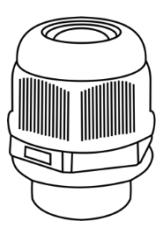

## TP-MVD8MV2

8MP HD TwilightVision**™** IR VF Turret Network Camera

## KEY FEATURES

- ✓ To be used with SMART Series NVR with Turing Vision Cloud
- ✓ 2.8~12mm Motorized Lens
- ✓ Max. 8MP (3840\*2160)@20fps
- ✓ TwilightVision™ technology superior low-light performance
- ✓ Built-in Mic
- ✓ Smart IR, up to 40m (131 ft)
- ✓ Supports 256 G Micro SD card
- ✓ IP67, IK10, WDR

turing.ai sales@turingvideo.com (877) 730-8222

## **SPECIFICATIONS**

| <b>CAMERA</b>              |                                                                                                                                                                            |  |
|----------------------------|----------------------------------------------------------------------------------------------------------------------------------------------------------------------------|--|
| Sensor                     | 1/2.8", 8.0 megapixel, progressive scan, CMOS                                                                                                                              |  |
| Lens                       | 2.8 ~ 12mm, AF automatic focusing and motorized zoom lens                                                                                                               |  |
| Angle of view (H)          | $107.4^{\circ} \sim 29.2^{\circ}$                                                                                                                                          |  |
| Angle of View (V)          | $54.2^{\circ} \sim 16.3^{\circ}$                                                                                                                                           |  |
| Angle of View (O)          | $111.0^{\circ}$ ~33.1°                                                                                                                                                     |  |
| Adjustment angle           | Tilt: 0º ~ Rotate: 0° ~ 360° Pan: $0^{\circ}$ ~ 360° 75 o                                                                                              |  |
| Shutter                    | Auto/Manual, 1 ~ 1/100000s                                                                                                                                                 |  |
| Minimum Illumination    | Color: 0.003Lux (F1.6, AGC ON) OLux with IR                                                                                                                             |  |
| Day/Night                  | IR-cut filter with auto switch (ICR)                                                                                                                                       |  |
| Digital Noise Reduction | 2D/3D DNR                                                                                                                                                                  |  |
| S/N                        | $>56$ dB                                                                                                                                                                   |  |
| IR Range                   | Up to 40m (131ft) IR range                                                                                                                                                 |  |
| Wavelength                 | 850nm                                                                                                                                                                      |  |
| IR On/Off Control          | Auto/Manual                                                                                                                                                                |  |
| Defog                      | Digital Defog                                                                                                                                                              |  |
| <b>WDR</b>                 | 120dB                                                                                                                                                                      |  |
| <b>VIDEO &amp; AUDIO</b>   |                                                                                                                                                                            |  |
| Video Compression       | Ultra 265, H.265, H.264, MJPEG                                                                                                                                             |  |
| H.264 code profile         | Baseline profile, Main Profile                                                                                                                                             |  |
|                            | Main Stream: 8MP (3840*2160), Max 20fps;5MP (3072*1728), Max 30fps; 4MP (2560*1440), Max30fps; 1080P (1920*1080), Max 30fps;                                         |  |
| Frame Rate                 | Sub Stream: 1080P (1920*1080), Max 30fps;720P (1280*720), Max 30fps; D1 (720*576), Max 30fps; 640*360, Max 30fps; 2CIF(704*288), Max 30fps; CIF(352*288), Max 30fps; |  |
|                            | Third Stream: D1 (720*576), Max 30fps; 640*360, Max 30fps; 2CIF(704*288), Max 30fps; CIF(352*288), Max 30fps;                                                           |  |
| Video Bit Rate             | 128 Kbps~16 Mbps                                                                                                                                                           |  |
| OSD                        | Up to 8 OSDs                                                                                                                                                               |  |
| Privacy Mask               | Up to 4 areas                                                                                                                                                              |  |
| <b>ROI</b>                 | Up to 8 areas                                                                                                                                                              |  |
| Motion Detection           | Up to 4 areas                                                                                                                                                              |  |
| <b>IMAGE</b>               |                                                                                                                                                                            |  |
| White Balance              | Auto/Outdoor/Fine Tune/Sodium Lamp/Locked/Auto2                                                                                                                            |  |
| Digital noise reduction | 2D/3D DNR                                                                                                                                                                  |  |
| Smart IR                   | Support                                                                                                                                                                    |  |
| Flip                       | Normal/Vertical/Horizontal/180°/90°Clockwise/90°Anti- clockwise                                                                                                         |  |
| Dewarping                  | Supported                                                                                                                                                                  |  |
| HLC                        | Supported                                                                                                                                                                  |  |
| BLC                        | Supported                                                                                                                                                                  |  |

| <b>AUDIO</b>                 |                                                                                                                                                               |  |  |
|------------------------------|---------------------------------------------------------------------------------------------------------------------------------------------------------------|--|--|
| Audio Compression            | G.711                                                                                                                                                         |  |  |
| Two-way audio                | Supported                                                                                                                                                     |  |  |
| Suppression                  | Supported                                                                                                                                                     |  |  |
| Sampling Rate                | 8KHZ                                                                                                                                                          |  |  |
| <b>STORAGE</b>               |                                                                                                                                                               |  |  |
| Edge Storage                 | Micro SD, up to 256GB                                                                                                                                         |  |  |
| Network Storage              | ANR                                                                                                                                                           |  |  |
| INTELLIGENCE                 |                                                                                                                                                               |  |  |
| Smart intrusion              | Cross line, intrusion, enter area detection                                                                                                                   |  |  |
| Prevention Compatible NVR | Turing SMART NVR: TR-MR(P) models                                                                                                                             |  |  |
| <b>EVENTS</b>                |                                                                                                                                                               |  |  |
|                              |                                                                                                                                                               |  |  |
| Basic Detection              | Motion detection, tampering alarm, audio detection                                                                                                         |  |  |
| <b>General Function</b>      | Watermark, IP address filtering, tampering alarm, alarm input, alarm output, access policy, ARP protection, RTSP authentication, user authentication |  |  |
| Protocols                    | IPv4, IGMP, ICMP, ARP, TCP, UDP, DHCP, PPPOE, RTP, RTSP, RTCP, DNS, DDNS, NTP, FTP, UPnP, HTTP, HTTPS, SMTP, 802.1x, SNMP, QoS                          |  |  |
| Compatible Integration       | ONVIF (Profile S, Profile G, Profile T), API                                                                                                                  |  |  |
| Web Browser                  | Plug-in required live view: IE9+, Chrome 41 and below, Firefox 52 and below                                                                                |  |  |
| <b>INTERFACES</b>            |                                                                                                                                                               |  |  |
| <b>Built-in Mic</b>          | Supported                                                                                                                                                     |  |  |
| Network                      | 1 RJ45 10M/100M Base-TX Ethernet                                                                                                                              |  |  |
| CERTIFICATIONS               |                                                                                                                                                               |  |  |
|                              | CE: EN 60950-1                                                                                                                                                |  |  |
| Certifications               | UL: UL60950-1                                                                                                                                                 |  |  |
|                              | FCC: FCC Part 15                                                                                                                                              |  |  |
| GENERAL                      |                                                                                                                                                               |  |  |
| Power                        | DC 12V±25%, PoE (IEEE 802.3af)                                                                                                                                |  |  |
|                              | Power consumption: Max 9.0W                                                                                                                                   |  |  |
| Dimensions ( $\phi$ x H)     | $\Phi$ 129 x 110mm ( $\Phi$ 5.1" x 4.3")                                                                                                                      |  |  |
| Net Weight Material       | 0.69kg (1.52lb) Metal                                                                                                                                      |  |  |
| Working Environment          | -30°C ~ 60°C (-22°F ~ 140°F), Humidity: ≤95% RH (non-condensing)                                                                                           |  |  |
| Storage Environment          | -30°C ~ 60°C (-22°F ~ 140°F), Humidity: ≤95% RH (non-condensing)                                                                                           |  |  |
| Surge Protection             | 6KV                                                                                                                                                           |  |  |
| Ingress Protection           | IP67                                                                                                                                                          |  |  |
| Vandal Resistant             | <b>IK10</b>                                                                                                                                                   |  |  |
| Reset Button                 | Supported                                                                                                                                                     |  |  |

## **DIMENSIONS**

**MOUNTING** 

Junction Box: TP-VDJB

Pole Mount: TP-UDPM **Wall Mount: TP-VDWM** WM w/ Junc. Box: TP-VDWJ

**Optional Cable Gland: TP-UWPJ** 

Wall Mount: TP-VDWM w/ Junction Box: TP-VDWJ

Pendant Mount: TP-AIPMB Junction Box: TP-VDJB Optional Extensions: TP-IPME2 (9") & TP-IPME5 (22)"

