# FEIER TREADMILL — STAR 100 —

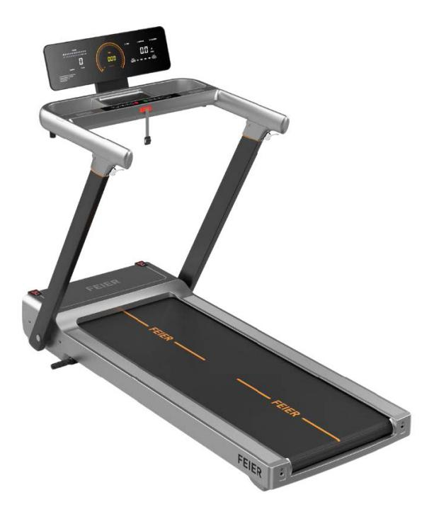

Retain this owner's manual for future reference Read and follow all instructions in this owner's manual

# Customer Care

If you have any questions or concerns, please feel free to contact us.

Website: www.feierfitness.com

Email address: support@feierfitness.com

Contact Us

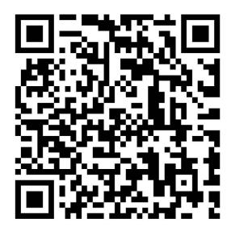

Thanks for purchasing this product .The product will help you keep fitter, healthier and better in a very easy way.

#### User Guide :

1. Always connect the power plug to a socket with a grounded circuit and the socket must have a special circuit

to avoid sharing with other electrical equipment.

2. Ensure the treadmill stable on the ground before use.

3. Check if its function normal or not before running.

4. Stand on two side rails when the treadmill starts

5. Clipped the safety key to your clothes when upcoming to control any emergency.

6. Follow the running belt with left leg to do preparation before trial run. Only when you feel you can run, you can

stand on the treadmill and do it with the right posture. And only one person is allowed to exercise on the treadmill,

overload exercise is strictly prohibited.

7. After running, you can stop the treadmill by pulling out the safety key or pressing the "stop" button.

8. Remember to turn off the power and pull out the plug when you finish exercising.

#### Safety precaution :

- Place the treadmill indoors to avoid any water and no heavy stuff.
- When using the fitness device, wear comfortable clothing and preferably sports or aerobic shoes.
- Keep children away from the treadmill to avoid any accident.
- No overload to give damages to motor, controller, roller and running belt. Make routine maintenance to the treadmill.
- Keep less indoor dust and a certain extent of humidity to avoid interference of console and controller.
- Keep the treadmill continuously running no more than 2 hours.
- Keep good air circulation when running.
- There should be 2000x1000mm safe space at the end of treadmill when running。
- Stop running if any discomfort and consult the doctor.
- Reserve the silicon bottle to some place that children cannot reach, to avoid serious mistake.
- Prohibit the user jumping off the treadmill directly after use.
- Pull out the power plug gently from the socket.

- Stop the machine if anything wrong and cut the power immediately.
- Ask local distributor to handle any issue or provide service. Dismantle the components personally is not allowed.

#### DANGER!

To reduce accidents or harm, please check following rules.

- Ensure your clothes zipped up before running.
- Do not wear clothes that easily hooked.
- Keep power cord away from hot objects.
- Keep children away from the treadmill.
- If something is wrong, support the handle bar to push up and leave running belt.
- Do not use the treadmill outdoor.
- Cut off the power before move of the treadmill.
- Do not open motor and roller cover unless professionals.
- This machine can be used under 10A circuit.
- Ensure that only one person at a time uses the fitness device.
- The HRC testing may be not as exact as medical devices so its results for reference only.
- Stop exercising immediately should you feel unwell or if you feel pain in your joints or muscles. In particular, keep an eye on how your body is responding to the exercise program. Dizziness is a sign that you are exercising too intensively with the device. At the first signs of dizziness, lay down on the ground until you feel better.

#### Prohibit !

Following patients under treatment need to get use of the treadmill after approval of professional doctor.

- (1)The person with backache or used to get hurt in the leg ,waist ,neck . Those with numbness of legs, waist, neck and hands (those with chronic diseases such as inter vertebral disc protrusion, spinal slip, cervical vertebra protrusion, etc.)
- (2)The patient with deformational arthritis , rheumatism or gout .
- (3)The patient with osteoporosis .
- (4)The patient with a bad circulatory system like heart disease ,vascular disorders and vascular hypertension .
- (5)The patient with respiratory disturbance.
- (6)The patient with Artificial heart rhythm problem.
- (7)The patient with malignant tumors.
- (8)The patient with thrombosis .
- (9)The patient with diabet caused perceptual disturbance.
- (10)The person with skin injury .
- (11)The patient with a high fever above 38℃.
- (12)The person with bent back bone.
- (13)The person with pregnance or in (menstrual) period.
- (14)The person feels discomfortable.
- (15)The person is obviously in a bad condition.
- (16)The person for the purpose of rehabilitation.
- (17)The person having abnormal physical features.

Above cases may cause accident or poor health

- Stop exercising immediately should you feel unwell like pain in your joints or muscles, dizziness, numb, and abnormal heart beat, and consult the doctor as soon as possible.
- Keep children away from this product. Children may get hurt if you ignore this.
- Told the children that this is not a toy. Children may get hurt if you ignore this.
- when using, taking out, putting back or moving this product, please make sure there is nobody or pets around.
- Stop use this product when the cover cracked (inner parts come out) or welded parts drop off, may cause

danger or injury.

- Do not jump up or down from the treadmill when running, may fall down and get injury.
- Do not use or reserve the treadmill outdoor or near bathroom to avoid water.
- Do not use or reserve the treadmill in the area exposed to direct sunlight, and avoid high temperature places like electric blanket and warmer, may cause electric leakage or fire.
- Do not use when the power line or plug damaged, or the socket is loose, may cause electric shock, short circuit or fire.
- Do not damage or twist the power cord, also do not put heavy things on it, may cause fire or electric shock.
- Only for one person at a time, tell people around not too close, may fall down and cause injury.
- People who is not conscious or can't operate by himself cannot use the treadmill, may cause accident or get injury.
- Disassemble, repair, change by customer themselves are forbid absolutely, may cause mechanical breakdown and injury.
- To avoid water!
- the main body and operating components cannot meet with water or drink, may cause electric shock and fire.
- Do not use the treadmill after meals or or doing other activities or when feel tired, may cause damage to your health.
- This product is for home use. It cannot be used in school or gymnasium where are lots of unspecific users, may cause injury.
- Do not use the product when you feel the body become slow after drink, may cause accident or injury.
- Do not use the product when you have hard object in your pocket, may cause accident or injury.
- The power plug cannot be attached with needle, waste or water, may cause electric shock, short circuit and fire.
- Do not pull out the plug or switch the power to "off" while operating, may cause injury.
- Do not operate with wet hands!
- Do not pull out or insert the plug with wet hands, may cause electric shock or injury.

- Remember to pull out the plug when not using.
- Dust and dampness can damage insulation and then cause electric leakage and fire.
- Pull out the plug when maintenance, may cause electric shock and injury.
- Stop using immediately when the product cannot start or have something abnormal, pull out the plug and make a trouble call, may cause electric shock and injury.
- Pull out the plug when meet with power failure suddenly, may cause accident and injury when power resumption.
- You should hold the plug not the wire when pulling out the plug, may cause short circuit, electric shock and fire.
- The product must have grounded connection. The grounded connection can provide a channel with least resistance for the current when the product is malfunction, thus can reduce the danger of electric shock.
- The product is equipped with electric wire for grounding conductor and grounding plug. The plug must insert into the socket that conformed to the local regulations.
- Incorrect connection of grounding conductor may cause electric shock. If you are not sure about the grounding connection, please ask a professional electrician to check. if the plug of the product is not match your socket, you should ask for an electrician to install a correct socket.
- The product has grounding plug. Please confirm that you have the matched socket first. Socket adapter is not allowed.

# **Explosive drawing**

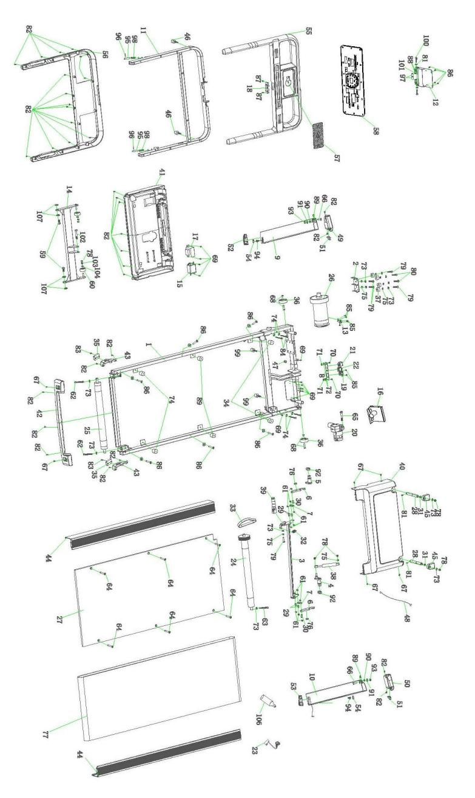

## Parts list

| No | Description                | QTY |
|----|----------------------------|-----|
| 1  | Main frame                 | 1   |
| 2  | Motor mount                | 1   |
| 3  | Foot link weldment         | 2   |
| 4  | Right rotation fixed plate | 1   |
| 5  | Left rotation fixed plate  | 1   |
| 6  | Step rotating fixed plate  | 2   |
| 7  | Foot link fixing plate     | 2   |
| 8  | Switch fixing plate        | 1   |
| 9  | Left stand post            | 1   |
| 10 | Right stand post           | 1   |
| 11 | Monitor frame              | 1   |
| 12 | Monitor bracket            | 1   |
| 13 | Speed sensor               | 1   |
| 14 | Incline frame              | 1   |
| 15 | Filter                     | 1   |
| 16 | Controller                 | 1   |
| 17 | Inductance                 | 1   |
| 18 | Safety key                 | 1   |
| 19 | Plug socket                | 1   |
| 20 | Incline motor              | 1   |
| 21 | Rocker switch              | 1   |
| 22 | Fuse                       | 1   |
| 23 | Plug                       | 1   |
| 24 | Front roller               | 1   |
| 25 | Rear roller                | 1   |
| 26 | Motor                      | 1   |
| 27 | Running board              | 1   |
| 28 | Stretched steps shaft      | 2   |
| 29 | Circlip shaft-1            | 4   |
| 30 | Circlip shaft-2            | 2   |
| 31 | O-ring seal                | 2   |
| 32 | Spring                     | 1   |
| 33 | Motor belt                 | 1   |
| 34 | Cylindrical cushion        | 6   |
| 35 | Square foot pad            | 2   |
| 36 | Wheel-1                    | 2   |
| 37 | Rubber cushion             | 4   |
| 38 | Cylinder                   | 1   |

| 39 | Foot folding rod                                                    | 1  |
|----|---------------------------------------------------------------------|----|
| 40 | Upper motor cover                                                   | 1  |
| 41 | Lower motor cover                                                   | 1  |
| 42 | Rear cover                                                          | 1  |
| 43 | Feet pad cover                                                      | 2  |
| 44 | Side rail                                                           | 2  |
| 45 | Stretch foot pad                                                    | 2  |
| 46 | Adjustable cushion                                                  | 2  |
| 47 | Magnetic ring                                                       | 1  |
| 48 | Communication wire                                                  | 1  |
| 49 | Cover of left stand post                                            | 1  |
| 50 | Cover of right stand post                                           | 1  |
| 51 | Button                                                              | 2  |
| 52 | Left stand post cap                                                 | 1  |
| 53 | right stand post cap                                                | 1  |
| 54 | Crank cover                                                         | 2  |
| 55 | Monitor tray upper housing                                          | 1  |
| 56 | Monitor tray lower housing                                          | 1  |
| 57 | Anti-sliding sheet                                                  | 1  |
| 58 | Monitor                                                             | 1  |
| 59 | Hexagon socket head half tooth bolts M10×40×20                      | 1  |
| 60 | Wheel-2                                                             | 2  |
| 61 | Elastic stop for shaftΦ10                                           | 12 |
| 62 | Hexagon socket head full thread bolts M8×75                         | 2  |
| 63 | Hexagon socket head full thread bolts M8×60                         | 1  |
| 64 | Hexagon socket head countersunk head full thread bolts M6×25        | 6  |
| 65 | Hexagon socket head large flat head half tooth bolt M10×35×20       | 1  |
| 66 | Hexagon socket head flat head full thread boltsΦ16×2.3×M8×23        | 2  |
| 67 | Cross recessed large flat head full tooth bolts M5×10               | 4  |
| 68 | Hexagon socket head large flat head hollow bolt set                 | 2  |
| 69 | Cross recessed large flat head full tooth bolts M4×10 (steel nails) | 8  |
| 70 | Cross recessed large flat head full tooth bolts M5×15               | 2  |
| 71 | Hex Nut M5                                                          | 2  |
| 72 | Flat washer Φ5                                                      | 2  |
| 73 | Flat washer Φ8                                                      | 12 |
| 74 | Round cushion-2                                                     | 2  |
| 75 | Elastic washer Φ8                                                   | 9  |
| 76 | Hexagonal lock nut M10                                              | 2  |
| 77 | Running belt                                                        | 1  |
| 78 | Hexagonal lock nut M8                                               | 4  |
| 79 | Hexagon socket head pan head full thread bolts M8×25                | 5  |

| 80  | Hexagon socket head large flat head half tooth bolt M8×50×20  | 2  |
|-----|---------------------------------------------------------------|----|
| 81  | M6 Step gasket                                                | 2  |
| 81  | Hexagon socket head pan head full thread bolts M6×15          | 2  |
| 82  | Cross recessed large flat head self-tapping screw ST4×16      | 38 |
| 83  | Cross recessed large flat head full tooth bolts M4×10         | 2  |
| 84  | Hexagon head full thread bolts M8×50                          | 4  |
| 85  | Cross recessed countersunk head tapping screw ST3×10          | 6  |
| 86  | Cross recessed countersunk head tapping screw ST4×15          | 10 |
| 87  | Cross recessed large flat head self-tapping screw ST4×10      | 2  |
| 88  | Spring -1                                                     | 2  |
| 89  | Round cushion-3                                               | 2  |
| 90  | Spring -3                                                     | 4  |
| 91  | M8 step gasket                                                | 2  |
| 92  | Shaft retaining ring Φ25                                      | 2  |
| 93  | Hexagon lock thin nut M8                                      | 2  |
| 94  | Hexagon large flange head full tooth bolts 5/16-18UNC-25      | 2  |
| 95  | Pin shaft                                                     | 2  |
| 96  | Headless Full Thread Bolts                                    | 2  |
| 97  | Positioning beads                                             | 2  |
| 98  | Spring                                                        | 2  |
| 99  | Feet pad                                                      | 2  |
| 100 | Hexagon head full thread bolts M6×30                          | 2  |
| 101 | Hex Nut M6                                                    | 4  |
| 102 | Hexagon socket head large flat head half tooth bolt M10×55×25 | 1  |
| 103 | Elastic washer Φ10                                            | 2  |
| 104 | Flat washer Φ10                                               | 2  |
| 105 | Hexagon socket head pan head half thread bolt M10×40×20       | 2  |
| 106 | Silicone oil bottle                                           | 1  |
| 107 | Incline bushing                                               | 4  |
|     |                                                               |    |

### Packing list

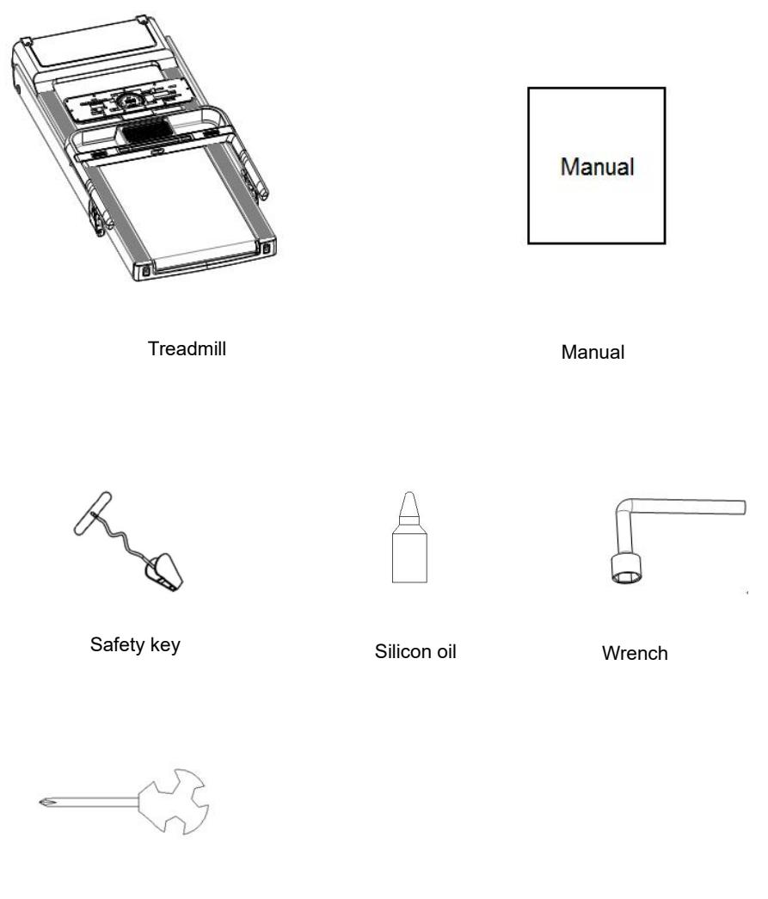

Cross Wrench 14×17×75

### Main parts

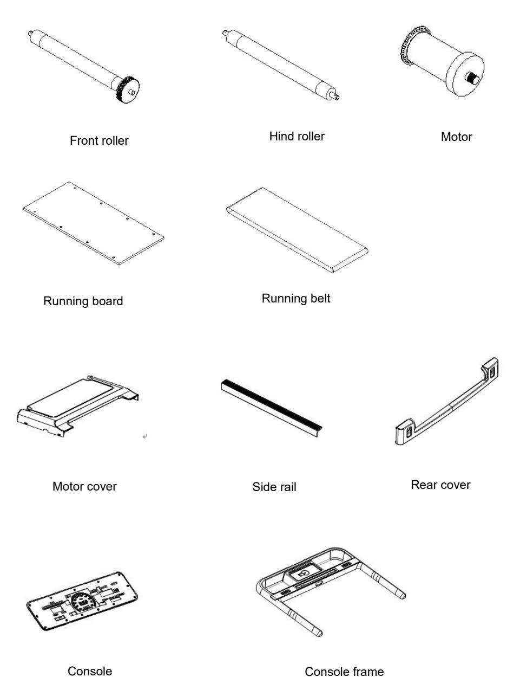

## Treadmill instruction

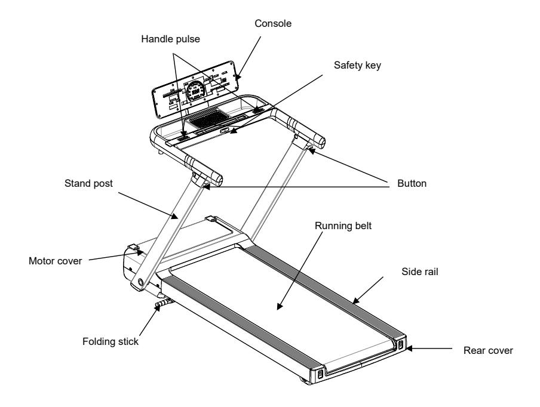

### Technical information

| Max load        | 264.6 LB            |  |  |  |  |  |
|--------------------|------------------------|--|--|--|--|--|
|                    | Fold:1700*790*270mm    |  |  |  |  |  |
| Dimension          | Unfold:1700*790*1280mm |  |  |  |  |  |
| Running surface | 1400*500mm             |  |  |  |  |  |
| Speed              | 0.6-11.2 mph        |  |  |  |  |  |

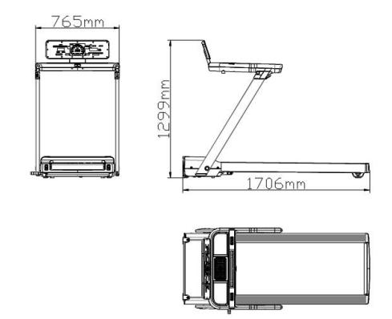

Remark:WE RESERVE THE RIGHT TO AMEND THE PRODUCT WITHOUT PRIOR NOTICE.

## Unfold instruction

Step 1:Taking the treadmill out of the box, then turn out the foot folding rod (1) from the underside of the running deck with your foot , and then lift the stand post( 2) directly when you step on the foot folding rod.

Step2:After lifting the stand post, hold handle bar (1) with one hand and pull up the monitor tray (2) with the other hand.

Step 3 : Pull up the monitor to the right position where is suitable for your personal preference, then the treadmill is unfolded and you could run on it.

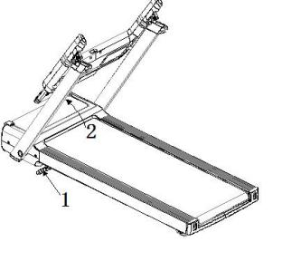

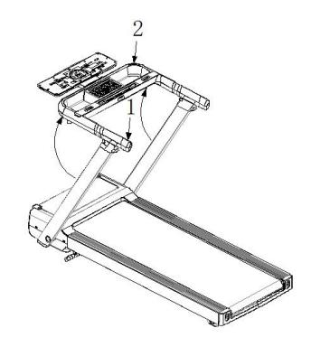

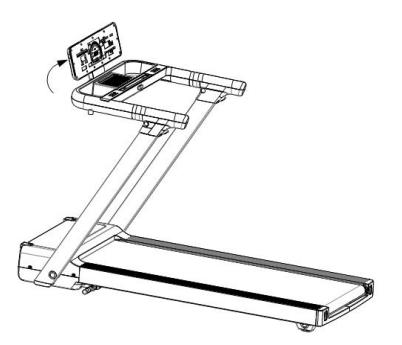

# Folding instruction

Step 1:Push down the monitor to be same level of monitor tray as right picture

Step 2:Press the button (1) and then lay down the monitor tray as right picture.

Step 3: Step firmly on the foot folding rod (1) with your foot and the stand post will lay down slowly.

Step 4: Pull off the power cord from the front of treadmill, then pull out the two stretch foot pad (1) as below picture, and then lift the treadmill to stand on the ground.

(Caution: Do not strike after standing up.)

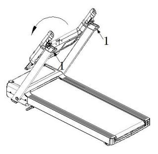

## Monitor function instruction

### LED windows

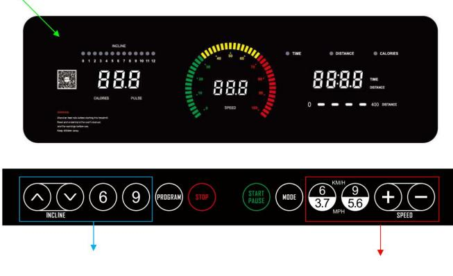

For incline adjustment For speed adjustment

#### 1. Monitor function

- .1 P0 is the user manual program, P1-P36 are built-in automatic training programs, 3 USER programs and BMI;
- .2 LED display, 12 operation keys;
- .3 Speed and distance conversion function between metric and inch;
- .4 Operating speed range : 0.6~11.2mph;
- .5 Incline range:0~12%;
- .6 Overload, over-current protection, explosion-proof shock, anti-speeding, anti-electromagnetic interference and other safety protection functions;
- .7 System self-check, abnormal information prompt function;
- .8 ERP function;

#### LED window display:

- .1 "DISTANCE""TIME" window: Display numerical values for distance and time;
- .2 "CALORIES" window:Display the number of calories;
- .3 "INCLINE" window:Display the value of the incline;
- .4 "PULSE" window:Displays the value of the heart rate;
- .5 "SPEED" window:Display speed value;

### 3 Metric-Imperial Conversion Instructions:

- 3.1 Pull off the safety key and then press the "PROGRAM" and "MODE" keys at the same time, the display shows 0.6, which means converting from kilometers to miles;;
- 3.2 Pull off the safety key and then press the "PROGRAM" and "MODE" keys at the same time, the display shows 1.0, which means converting from miles to kilometers;

### 4 Key button operation Instructions:

- 4.1 "PROGRAM": Program select key: when the treadmill is stopped, cycle select the program "P0-P36 U01~U03 FAT" as you prefer.
- 4.2 "MODE": When the initial state of manual mode is selected, it is normal mode. Under manual mode, press the MODE button to cycle select the countdown time mode -> countdown distance mode -> count down calories -> normal mode; The reposition of default countdown time is 30 minutes for P1-P36 program.
- 4.3 "START/PAUSE": When the treadmill is stopped, press the this key to turn on the treadmill. When the treadmill is running, press this key to pause treadmill.
- 4.4 "STOP": In the running state, press the STOP button to slow stop; When displaying ERR prompt information, press it to clear the displayed information.
- 4.5 "+":Speed increment key, in stop or BMI state, this key is used to set parameter increment. In the running state, it is used to increase speed.
- 4.6 "-":Speed decrement key, in stop or BMI state, it is used to set parameter decrement. In running state, it is used to decrease speed.
- 4.7 "QUICK SPEED 6/9": Speed instant keys, in the running state of the treadmill, directly set the speed to the specified value of the key.
- 4.8 " ": Incline Increment Key.
- 4.9 " ": Decrease slope key.
- 4.10 "QUICK INCLINE": 6, 9 Incline instant keys, in the running state of the treadmill, directly set the speed to the specified value of the key.

### 5. Safety key:

The safety key consists of a tact switch, a clothespin and a nylon rope, and has the safety precaution function of emergency stop. In any state, as long as the safety key is out of position, the treadmill stops running, the keyboard of the electronic watch is forbidden to operate, and the screen displays "E-07" with a prompt tone. Each time the security lock is placed, the screen will be fully displayed for 2 seconds, and then enter the default working state of the system.

#### 6. USER mode:

In the USER mode, user can access or set your own sport program, press "PROGRAM" key to cycle select "U01-U03", then press "MODE" key to set parameters, or press the "STRAT" key to start running directly. Press "MODE" key can set your own program (10 sections of speed and incline). After setting, user can press "START" to exercise. The exclusive program for user will be saved and user can use it directly next time.

### 7. Guidelines for Safe Use:

- 7.1 Insert the plug of the power cord into the 10A power socket with safety grounding, turn on the power switch, the screen of the monitor is fully displayed and accompanied by a prompt sound, and then identify the safety key;
- 7.2 Put the safety key in the position on the console, put the clothespin on the clothes of your chest, and enter the default working state after the screen is fully displayed for 2 seconds. All the counters are cleared, the set values are reset, and the treadmill is in the positive timing mode of manual program P0;
- 7.3 Press the "PROGRAM" key to cycle select the automatic program:P0~P36;U01,U02,U03,BMI;
  - a) P0" is a user-defined program. Press the "MODE" key to cycle select four training modes. The training speed and incline are set by the user. The default values are: speed 1.0KM/H and incline 0%.

Training mode 1:Time counting, time, distance, and calories are counted up, and the setting function is turned off;

Training mode 2: Countdown time, the time window flashes in the setting state, press "+", "-" key to modify the setting value, setting range: 5-99 minutes, default value: 30:00;

Training mode 3:Countdown distance, the distance window flashes in the setting state, press the "+", "-" keys to modify the setting value, the setting range: 1.0-99.0KM, the default value: 1.0KM;

Training mode4: Count down calories, the calorie window flashes in the setting state, press the "+", "-" keys to modify the setting value, the setting range: 20-990 CAL, the default value: 50 CAL;

- b) "P1-P36" is the system setting program, it only trains in the countdown time mode, the time window flashes in the setting state, press the "+" and "-" keys to modify the set value, and press the "MODE" key to reset to the default value , setting range: 5-99MIN, default value: 30:00.
- 7.4 After setting the training mode, press the "START" button, the screen starts to display a 5-second countdown, accompanied by 5 beeps sound. After the countdown is 1, the treadmill starts gently, accelerates slowly to the displayed speed, and then stabilizes run at constant speed.
  - a) In running state, press "+", "-" key or "QUICK SPEED" key to adjust the treadmill speed;
  - b) In P1-P36, the speed and incline of each program are divided into 10 segments, and each

segment is divided equally according to the set time. The speed or incline adjusted by the key is only valid in the current segment, and when switching between different segments, three beeps sounds will be occurred. When the program runs 10 segments, the motor stops automatically, accompanied by a long stop prompt sound;

- 7.5 When the motor is running, press the "START" key, the motor switches between the two states of pause and running. Restart in a suspended state, the recorded running data and processes remain unchanged;
- 7.6 When the motor is running, press the "STOP" button, the motor will slow down slowly until it stops smoothly, and all settings will return to the default state;
- 7.7 During motor running, press " ", " " key or "QUICK INCLINE" to adjust the treadmill inclnation;
- 7.8 In any state, remove the safety lock, the screen will display "E-07", accompanied by a prompt sound, the treadmill will stop running;
- 7.9 The electronic control system is under safety monitoring at any time. As long as an abnormality is found, the running treadmill will stop in an emergency, and the screen will display the abnormal information prompt, accompanied by a prompt sound.
- 7.10 When an abnormal message is displayed on the screen, press the "STOP" key, the system will clear the displayed message once;
- 7.11 Body fat test method: Press the "PROGRAM" key to select the program BMI, press the "MODE" key to select the item number, and press the "+" and "-" keys to set the parameters.
  - A) F1 (Sex):1 Indicates gender; setting parameter range: 1-2, "1" indicates male, "2" indicates female, default value: 1;
  - B) F2 (Age):Indicates age; setting parameter range: 1-99 years old, default value: 25 years old;
  - C) F3 (Height) : Indicates height; setting parameter range: 100-220CM(39-87inch), default value: 170CM(67inch);

D) F3 (Weight) : Indicates weight; setting parameter range: 20-150KG(44-330lb), default value: 70KG(154lb);

E) F5 (BMI):Indicates that the parameter setting is completed and the body fat test state is entered. Please hold your hands on the heart rate sensors on the left and right handles, wait for 4 seconds, and the parameter display window will display the body fat percentage (BMI) of the test subject; according to Asian standards, body fat percentage (BMI) Fat less than 18 is thin, between 18 and 24 is ideal body weight, between 25 and 28 is overweight, and greater than 29 is obese (this data is only for exercise reference). Default: 24.

### 8. ERP Conversion function:

The system is powered on by default in ERP mode. When the treadmill is not operated, it will enter the sleep state in about 4.5 minutes to save power consumption. Press any key to wake up the system. In standby mode, press and hold the MODE button for about 3 seconds to display '2222' to cancel the ERP function, and then long press for about 3 seconds to display '1111' to return to the ERP mode.

### 9. Lubrication remind function

This machine has a built-in lubrication warning. After running a distance of 300 km, the monitor will display OIL. This means that your machine needs lubrication. Lubricate the belt as indicated in the LUBRICATION section and then press any key for 6 seconds. This will clear the warning and reset the distance until the next lubrication.

### Automatic program P1-P36 metric speed table

| LEVEL      |               | 1   | 2   | 3    | 4    | 5    | 6    | 7    | 8    | 9    | 10  |
|------------|---------------|-----|-----|------|------|------|------|------|------|------|-----|
| PROG P1 | CLS. SPEED | 1.0 | 3.0 | 5.0  | 5.0  | 5.0  | 7.0  | 7.0  | 5.0  | 3.0  | 2.0 |
|            | INCLINE       | 2   | 2   | 8    | 6    | 6    | 4    | 4    | 6    | 2    | 2   |
| P2         | SPEED         | 2.0 | 3.0 | 5.0  | 8.0  | 5.0  | 5.0  | 6.0  | 8.0  | 4.0  | 3.0 |
|            | INCLINE       | 3   | 3   | 2    | 2    | 8    | 8    | 4    | 4    | 4    | 4   |
|            | SPEED         | 2.0 | 3.0 | 7.0  | 8.0  | 5.0  | 5.0  | 5.0  | 8.0  | 4.0  | 3.0 |
| P3         | INCLINE       | 1   | 2   | 5    | 7    | 7    | 4    | 4    | 6    | 2    | 2   |
|            | SPEED         | 2.0 | 2.0 | 5.0  | 8.0  | 8.0  | 8.0  | 8.0  | 5.0  | 3.0  | 2.0 |
| P4         | INCLINE       | 3   | 3   | 9    | 9    | 9    | 9    | 9    | 6    | 2    | 2   |
|            | SPEED         | 3.0 | 4.0 | 8.0  | 9.0  | 10.0 | 10.0 | 10.0 | 7.0  | 4.0  | 3.0 |
| P5         | INCLINE       | 2   | 2   | 8    | 6    | 6    | 6    | 6    | 6    | 1    | 1   |
|            | SPEED         | 3.0 | 4.0 | 6.0  | 7.0  | 7.0  | 7.0  | 9.0  | 10.0 | 5.0  | 3.0 |
| P6         | INCLINE       | 1   | 8   | 8    | 7    | 7    | 7    | 7    | 5    | 3    | 1   |
|            | SPEED         | 3.0 | 4.0 | 4.0  | 10.0 | 4.0  | 9.0  | 4.0  | 11.0 | 3.0  | 2.0 |
| P7         | INCLINE       | 1   | 1   | 6    | 6    | 6    | 8    | 8    | 10   | 6    | 2   |
|            | SPEED         | 3.0 | 5.0 | 7.0  | 9.0  | 3.0  | 5.0  | 7.0  | 5.0  | 11.0 | 5.0 |
| P8         | INCLINE       | 3   | 3   | 3    | 7    | 7    | 3    | 3    | 3    | 5    | 5   |
|            | SPEED         | 3.0 | 7.0 | 10.0 | 4.0  | 7.0  | 11.0 | 5.0  | 4.0  | 12.0 | 6.0 |
| P9         | INCLINE       | 3   | 6   | 7    | 3    | 8    | 8    | 3    | 8    | 4    | 4   |
|            | SPEED         | 3.0 | 5.0 | 9.0  | 10.0 | 6.0  | 6.0  | 9.0  | 6.0  | 11.0 | 3.0 |
| P10        | INCLINE       | 2   | 7   | 5    | 5    | 8    | 8    | 8    | 8    | 4    | 4   |
|            | SPEED         | 4.0 | 5.0 | 11.0 | 9.0  | 6.0  | 8.0  | 9.0  | 11.0 | 6.0  | 5.0 |
| P11        | INCLINE       | 1   | 6   | 3    | 3    | 7    | 7    | 4    | 4    | 6    | 6   |
| P12        | SPEED         | 4.0 | 6.0 | 10.0 | 10.0 | 10.0 | 7.0  | 7.0  | 10.0 | 6.0  | 5.0 |
|            | INCLINE       | 3   | 8   | 9    | 5    | 5    | 8    | 8    | 4    | 4    | 4   |
| P13        | SPEED         | 2.0 | 4.0 | 6.0  | 6.0  | 6.0  | 8.0  | 8.0  | 6.0  | 4.0  | 3.0 |
|            | INCLINE       | 3   | 3   | 9    | 7    | 7    | 5    | 5    | 7    | 3    | 3   |
| P14        | SPEED         | 3.0 | 4.0 | 6.0  | 9.0  | 6.0  | 6.0  | 7.0  | 9.0  | 5.0  | 4.0 |
|            | INCLINE       | 4   | 4   | 3    | 3    | 9    | 9    | 5    | 5    | 5    | 5   |
| P15        | SPEED         | 3.0 | 4.0 | 8.0  | 9.0  | 6.0  | 6.0  | 6.0  | 9.0  | 5.0  | 4.0 |
|            | INCLINE       | 2   | 3   | 6    | 8    | 8    | 5    | 5    | 7    | 3    | 3   |
| P16        | SPEED         | 3.0 | 3.0 | 6.0  | 9.0  | 9.0  | 9.0  | 9.0  | 6.0  | 4.0  | 3.0 |
|            | INCLINE       | 4   | 4   | 10   | 10   | 10   | 10   | 10   | 7    | 3    | 3   |
|            | SPEED         | 4.0 | 5.0 | 9.0  | 10.0 | 11.0 | 11.0 | 11.0 | 8.0  | 5.0  | 4.0 |
| P17        | INCLINE       | 3   | 3   | 9    | 7    | 7    | 7    | 7    | 7    | 2    | 2   |

| P18 | SPEED   | 4.0 | 5.0 | 7.0  | 8.0  | 8.0  | 8.0  | 10.0 | 11.0 | 6.0  | 4.0 |
|-----|---------|-----|-----|------|------|------|------|------|------|------|-----|
|     | INCLINE | 2   | 9   | 9    | 8    | 8    | 8    | 8    | 6    | 4    | 2   |
| P19 | SPEED   | 4.0 | 5.0 | 5.0  | 11.0 | 5.0  | 10.0 | 5.0  | 12.0 | 4.0  | 3.0 |
|     | INCLINE | 2.0 | 2   | 7    | 7    | 7    | 9    | 9    | 11   | 7    | 3   |
| P20 | SPEED   | 4.0 | 6.0 | 8.0  | 10.0 | 4.0  | 6.0  | 8.0  | 6.0  | 12.0 | 6.0 |
|     | INCLINE | 4   | 4   | 4    | 8    | 8    | 4    | 4    | 4    | 6    | 6   |
| P21 | SPEED   | 4.0 | 8.0 | 11.0 | 5.0  | 8.0  | 12.0 | 6.0  | 5.0  | 12.0 | 7.0 |
|     | INCLINE | 4   | 7   | 8    | 4    | 9    | 9    | 4    | 9    | 5    | 5   |
| P22 | SPEED   | 4.0 | 6.0 | 10.0 | 11.0 | 7.0  | 7.0  | 10.0 | 7.0  | 12.0 | 4.0 |
|     | INCLINE | 3   | 8   | 6    | 6    | 9    | 9    | 9    | 9    | 5    | 5   |
|     | SPEED   | 5.0 | 6.0 | 12.0 | 10.0 | 7.0  | 9.0  | 10.0 | 12.0 | 7.0  | 6.0 |
| P23 | INCLINE | 2   | 7   | 4    | 4    | 8    | 8    | 5    | 5    | 7    | 7   |
|     | SPEED   | 5.0 | 7.0 | 11.0 | 11.0 | 11.0 | 8.0  | 8.0  | 11.0 | 7.0  | 6.0 |
| P24 | INCLINE | 4   | 9   | 10   | 6    | 6    | 9    | 9    | 5    | 5    | 5   |
|     | SPEED   | 3.0 | 5.0 | 7.0  | 7.0  | 7.0  | 9.0  | 9.0  | 7.0  | 5.0  | 4.0 |
| P25 | INCLINE | 4   | 4   | 10   | 8    | 8    | 6    | 6    | 8    | 4    | 4   |
|     | SPEED   | 4.0 | 5.0 | 7.0  | 10.0 | 7.0  | 7.0  | 8.0  | 10.0 | 6.0  | 5.0 |
| P26 | INCLINE | 5   | 5   | 4    | 4    | 10   | 10   | 6    | 6    | 6    | 6   |
|     | SPEED   | 4.0 | 5.0 | 9.0  | 10.0 | 7.0  | 7.0  | 7.0  | 10.0 | 6.0  | 5.0 |
| P27 | INCLINE | 3   | 4   | 7    | 9    | 9    | 6    | 6    | 8    | 4    | 4   |
|     | SPEED   | 4.0 | 4.0 | 7.0  | 10.0 | 10.0 | 10.0 | 10.0 | 7.0  | 5.0  | 4.0 |
| P28 | INCLINE | 5   | 5   | 10   | 10   | 10   | 10   | 10   | 8    | 4    | 4   |
|     | SPEED   | 5.0 | 6.0 | 10.0 | 11.0 | 12.0 | 12.0 | 12.0 | 9.0  | 6.0  | 5.0 |
| P29 | INCLINE | 4   | 4   | 10   | 8    | 8    | 8    | 8    | 8    | 3    | 3   |
|     | SPEED   | 5.0 | 6.0 | 8.0  | 9.0  | 9.0  | 9.0  | 11.0 | 12.0 | 7.0  | 5.0 |
| P30 | INCLINE | 3   | 10  | 10   | 9    | 9    | 9    | 9    | 7    | 5    | 3   |
|     | SPEED   | 5.0 | 6.0 | 6.0  | 12.0 | 6.0  | 11.0 | 6.0  | 12.0 | 5.0  | 4.0 |
| P31 | INCLINE | 3   | 3   | 8    | 8    | 8    | 10   | 10   | 10   | 8    | 4   |
|     | SPEED   | 5.0 | 7.0 | 9.0  | 11.0 | 5.0  | 7.0  | 9.0  | 7.0  | 12.0 | 7.0 |
| P32 | INCLINE | 5   | 5   | 5    | 9    | 9    | 5    | 5    | 5    | 7    | 7   |
|     | SPEED   | 5.0 | 9.0 | 12.0 | 6.0  | 9.0  | 12.0 | 7.0  | 6.0  | 12.0 | 8.0 |
| P33 | INCLINE | 5   | 8   | 9    | 5    | 10   | 10   | 5    | 10   | 6    | 6   |
|     | SPEED   | 5.0 | 7.0 | 11.0 | 12.0 | 8.0  | 8.0  | 11.0 | 8.0  | 12.0 | 5.0 |
| P34 | INCLINE | 4   | 9   | 7    | 7    | 10   | 10   | 10   | 10   | 6    | 6   |
| P35 | SPEED   | 6.0 | 7.0 | 12.0 | 11.0 | 8.0  | 10.0 | 11.0 | 12.0 | 8.0  | 7.0 |
|     | INCLINE | 3   | 8   | 5    | 5    | 9    | 9    | 6    | 6    | 8    | 8   |
|     | SPEED   | 6.0 | 8.0 | 12.0 | 12.0 | 12.0 | 9.0  | 9.0  | 12.0 | 8.0  | 7.0 |
| P36 | INCLINE | 5   | 10  | 10   | 7    | 7    | 10   | 10   | 6    | 6    | 6   |

### Use Instruction

#### About folding

1. When preparing to fold the unit, the power must be turned off;

2. Raise the treadmill to an upright position;

3. When lowering the treadmill, first hold the treadmill with your hands, step on the iron hook with your feet, and then slowly lower it to lower the treadmill to the ground.

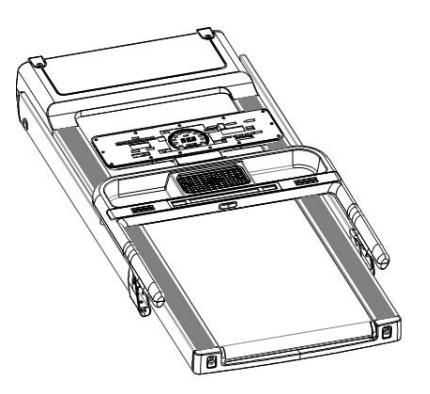

#### About moving

Must make sure when moving the unit:

- A:The machine's power switch is turned off;
- B:The power plug has been unplugged from the power connector;

C:The treadmill has been folded: After clarifying the above points, hold the end of the treadmill with one hand and the handrail on the same side with the other hand, and move the machine slowly when it is tilted 30°~40° to the chest.

#### About operation

- 1. Turn on the power, unfold the treadmill to the lowest position, and check whether the treadmill is normal.
- 2. Clip the safety key cord with your clothes.
- 3. Grasp the handrail with one hand and press the "START" button with the other hand, the treadmill will start after a delay of 5 seconds and run at a speed of 1.0Km/h. Press the "speed "+" button, the motor speed will increase to reach a speed of 2.5~3.5Km/h (this is the most comfortable running speed), grab the handrail with both hands at the same time, and step on the running belt with both feet one by one. Than you can run at the same speed as the running belt.
- 4. After a few minutes, you can run at a higher speed. If you want to increase the speed, hold the handrail with one hand and press the "speed "+" button to increase the speed slowly. You can also press the "speed "-" key to decrease the speed.
- 5. When running, press the speed quick key to quickly enter the running speed you need.
- 6. During the movement, you can press the "stop" key at any time to stop the motor from running.

- 7. Preset Mode Use. Turn on the power supply, turn on the power switch, after the display is normal, press the "Program" button to select one of the automatic running modes as the current mode to run, press the "Start" button to start the treadmill, and the treadmill starts to run automatically according to the selected mode. During running, you can press "speed "+" key or "speed "-" key to change the running speed of the current time period. Press the "Stop" key to abort the movement.
- 8. Adjustable in two gears if the slope of the treadmill needs to be changed, after the motor stops, incline the treadmill to a certain height and adjust the rear feet pad.
- 9. Heart rate test: After the treadmill is powered on, hold both hands on the metal heartbeat sensor, and the user's heart rate value will be displayed in the heart rate display window after a few seconds. (Note: This value is not used as medical data and can only be used as a sports reference.)

Note: When safety key pull out ,the treadmill will stop immediately .And thecomputer can not work ,the window shows" E07 ".

### Grounding guide

This product must have grounding. If error and damage occurred to the treadmill, grounding wire can form one circuit with lowest resistance; the current can be guided into the ground to reduce the danger of electric shock. This product is equipped with one cable, which has one grounding conductor and grounding plug. The treadmill must be grounded with correct socket that is compatible with local rules .

### Alert !

If you do not know whether the equipment is properly grounded, please consult a qualified electrician or maintenance personnel. Please do not change the plug attached to this product without authorization. If the plug is inconsistent with the socket, let a qualified electrician install a suitable socket. It should be under 110-120V and matches with this kind of socket as shown.

## Treadmill maintenance

Proper maintenance is very important to ensure a faultless and operational condition of the treadmill. Improper maintenance can cause damage to the treadmill or shorten the life of the product. All parts of the treadmill must be checked and tightened regularly. Worn out parts must be replaced immediately.

### BELT ADJUSTMENT

You may need to adjust the running belt during the first few weeks of use. All running belts are properly set at the factory. It may stretch of be off center after use. Stretching is normal during the break-in period.

### ADJUSTING THE BELT TENSION:

If the running belt feels as though it is slipping or hesitating when you plant your foot during a run, the tension on the running belt may have to be increased.

### TO INCREASE THE RUNNING BELT TENSION:

1. Place 8mm wrench on the left belt tension bolt. Turn the wrench clockwise 1/4 turn to draw the rear roller and increase the belt tension.

2. Repeat STEP 1 for the right belt tension bolt. You must be sure to turn both bolts the same number of turns, so the rear roller will stay square relative to the frame.

3. Repeat STEP 1 and STEP 2 until the slipping is eliminated.

4. Be careful not to tighten the running belt tension too much as you can create

An excessively tightened running belt may damage the roller bearings that would result in bearing noise from the front and rear rollers.

### TO DECREASE THE TENSION ON THE RUNNING BELT, TURN BOTH BOLTS COUNTER-CLOCKWISE THE SAME NUMBER OF TRUNS.

### CENTRING THE RUNNING BELT

When you run, you may push off harder with one foot than with another. The severity of the deflection depends on the amount of force that one foot exerts in the relation to the other. This deflection can cause the belt to move off- center. This deflection is normal and the running belt will center when nobody is on the running belt. If the running belt remains consistently off-center, you will need to center the running belt manually.

Start the treadmill without anyone on the running belt, increase speed to 6km/kh.

1. Observe whether the running belt is toward the right or left side of the deck.

●If toward the left side of the deck, using wrench, turn the left adjustment bolt clockwise 1/4 turn and the left adjustment bolt counter clockwise 1/4.

● If toward the right side of the deck, turn the right adjustment bolt clockwise 1/4 turn and the left adjustment bolt counter clockwise 1/4.

● If the belt is still not center, repeat the above step until the running belt is on center.

2. After the belt is center, increase the speed to 13kph and verify that it is running smoothly. Repeat the

above steps if it is necessary.

If the above procedure is unsuccessful in resolving the off-centre, you may need to increase the belt tension.

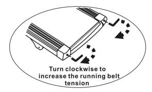

### Lubrication

The treadmill is factory-lubricated. However, it is recommended to check the lubrication of the treadmill regularly, to ensure an optimal operation of the treadmill. It is usually not necessary to lubricate the treadmill in the first year or the first 500 hours of operation.

After every 3 months of operation, lift the sides of the treadmill and feel the surface of the belt, as far as

possible. If traces of silicon spray are found, lubrication is not necessary.

In case of a dry surface refer to the following instructions.

Only use oil free silicon spray.

Application of lubricant on the belt:

● Position the belt so that the seam is located in the middle of the plate.

● Insert the spray valve in the spray head of the lubricant container.

● Lift the belt at one side and hold the spray valve in a distance to the

front end of striding belt and plate. Start at the front end of the belt. Lead the spray valve in direction of the back end. Repeat this process on the other side of the belt. Spray each side for about 4 seconds.

● Wait 1 minute to let the silicon spray spread, before starting the machine. CLEANING:

Regular cleaning of the striding belt ensures a long product life.

● Warning: The treadmill must be turned off to avoid electrical shocks. The power cord must be pulled out of the socket, before starting the cleaning or maintenance.

●After each training: Wipe the console and other surfaces with a clean soft and damp cloth to remove sweat residues.

Caution: Do not use any abrasives or solvents. To avoid damage to the computer, keep any liquids away. Do not expose the computer to direct sunlight.

●Weekly: To make the cleaning easier it is recommended to use a mat for the treadmill. Shoes can leave dirt on the striding belt that can fall beneath the treadmill. Clean the mat under the treadmill once a week. STORAGE:

Store you treadmill in a clean and dry environment. Ensure the master power switch is off and is un-plugged from the electrical wall outlet.

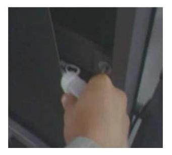

# Trouble shooting

| Item                                   | Reason                                                                                                  | Maintenance                                                                                                                                                               |
|----------------------------------------|---------------------------------------------------------------------------------------------------------|---------------------------------------------------------------------------------------------------------------------------------------------------------------------------|
| System not working               | A、Not plugged in or not turned on                                                     | Connect the power, or turn the power switch to the "NO" position                                                                         |
|                                        | B、Security key not in place                                                                 | Put the safety key in the correct position                                                                                                           |
|                                        | 、 C No power to the controller or monitor                                       | Replace the controller or monitor                                                                                                                             |
|                                        | D、Poor cable connection                                                                           | Check system input and output cable terminals                                                                                                           |
|                                        |                                                                                                         | and communication cables inside stand post                                                                                                                 |
| Sudden stop in normal         | A、Safety key off                                                                                  | Replace the safety key                                                                                                                                           |
| state                                  | B、System abnormal                                                                                    | Please call after-sales service                                                                                                                                  |
| Button failure                      | Button invalid                                                                                       | 1. Replace the key board and the keyboard cable; 2. Replace the PCB board 3. Replace the monitor.                      |
| E-01                                   | A、Poor communication line                                                                         | Reconnect the communication cable and check if the terminal is connected well or replace the communication cable          |
|                                        | B、defective console                                                                                  | Replace the console                                                                                                                                                 |
|                                        | C、defective controller                                                                               | Replace the controller                                                                                                                                              |
| E-02                                   | A、Defective motor cable and motor                                                           | Replace the motor                                                                                                                                                   |
|                                        | B、Poor connection between motor cable and controller or defective controller | Check and connect cables well or replace the controller                                                                                           |
| E-03                                   | A、The speed sensor is not installed correctly                                         | Check and reconnect                                                                                                                                                 |
|                                        | B、Defective speed sensor                                                                          | Replace the speed sensor                                                                                                                                         |
|                                        | 、 C Dirty speed sensor or poor contact                                             | Check and reconnect/clean the dust, grease on speed sensor                                                                                        |
|                                        | D、defective controller                                                                               | Replace the controller                                                                                                                                              |
| E-05                                   | A、Controller is damaged                                                                           | Replace the controller                                                                                                                                              |
|                                        | B、damaged motor                                                                                      | Replace the motor                                                                                                                                                   |
|                                        | C、mechanical failure                                                                                 | Check whether the silicon oil backside of running belt is dry or rollers was blocked                                            |
| E-07                                   | Console does not detect safety lock signal                                            | 1. Check whether the safety key is in correct position; 2. Reinstall the safety key sock; 3. Replace the console |
| No heart rate display         | A、The handle pulse cables are not inserted properly or defective             | Check and connect or replace the handle pulse cables                                                                                              |
|                                        | B、monitor cables are defective                                                                 | Replace the console                                                                                                                                                 |
| The console shows                | A、LED digital tube is defective                                                             | Replace the PCB board or monitor                                                                                                                           |
| incomplete or missing strokes | B、system error                                                                                       | Replace the monitor                                                                                                                                                 |
| lift failure                        | A、Defective incline motor                                                                         | Replace the incline motor                                                                                                                                        |
|                                        | B、defective controller                                                                               | Replace the controller                                                                                                                                              |
|                                        | C、Controller signal is abnormal                                                                | Press the calibrate key on the controller to calibrate the incline value.                                                                |

# !"#\$%&&%' ())\* +&,,\$+%-&,

Supports Bluetooth connection of three APPs, "Anyrun", "Kinomap" and "Zwift".

#### **ANYRUN**

Turn on the device's Settings -- Bluetooth. Log in the Anyrun APP -- click Settings -- Device Management -- Find the device.Click the Bluetooth name that you nd and the system will connect automatically.After successful connection, the screen of the console will display the Bluetooth connection symbol.

When using APP, you need to register a personal account for Anyrun APP -- click on the Settings in the right corner -- log in. Users exercise data will save on cloud server.

#### **KINOMAP**

Register and log in the Kinomap APP, click on the tness equipment management pages,click "+" in the upper right corner to add new tness equipment. Select My Treadmill and FTMS brand. Click Treadmill on My Treadmill page.Select SW-XXXXXX-XXXX(the number on the console) from the tness equipment and click.

#### **ZWIFT**

1 Login Zwift APP on mobile, select the running speed in running on the matching device page, click Matching, select SW-XXXXXX-XXXX(the number on the console) on the search page, and then press OK.

2 Select YOUR SPEED on the "What's YOUR SPEED" page and press OK.

3 Select the route from the list of locations, select training from the cycling mode, or choose to other Zwifters, and click "Run" after setting.

4 The console can synchronize data with Zwift when it enters the movement. Note: Bluetooth cannot be connected to the console under the page of engineering mode.

### **Bluetooth music play steps.**

1. Turn on bluetooth in your smart phone

2. Clik 'RUN MUSIC'

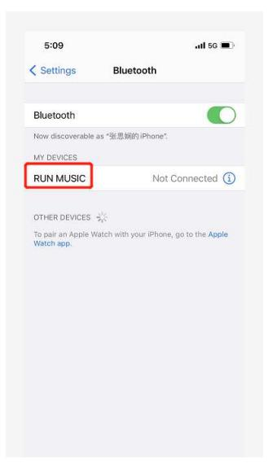

### 3. Connect successfully

| 5:09              |                                   | .all 5G                                                  |
|-------------------|-----------------------------------|----------------------------------------------------------|
| Settings          | <b>Bluetooth</b>                  |                                                          |
| Bluetooth         |                                   |                                                          |
|                   | Now discoverable as "张思娴的iPhone". |                                                          |
| <b>MY DEVICES</b> |                                   |                                                          |
| <b>RUN MUSIC</b>  |                                   | Connected (i)                                            |
| OTHER DEVICES     |                                   |                                                          |
| OPPO R15          |                                   |                                                          |
| Watch app.        |                                   | To pair an Apple Watch with your iPhone, go to the Apple |
|                   |                                   |                                                          |
|                   |                                   |                                                          |
|                   |                                   |                                                          |