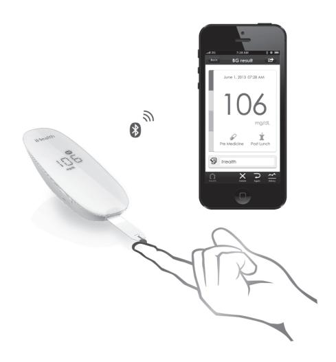
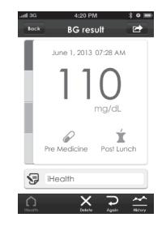

# *i*Health Wireless Smart Gluco-Monitoring System (BG5)

# **OWNER'S MANUAL**

# iHealth® **Wireless Smart Gluco-Monitoring System (BG5) OWNER'S MANUAL**

#### **Table of Contents**

| INTRODUCTIN INTRODUCTIN                                     | $\overline{1}$ |
|-------------------------------------------------------------|----------------|
| <table>        PACKAGE CONTENTS</table>                     | $\overline{1}$ |
| <table>        SETUP REQUIREMENTS</table>                   | $\overline{2}$ |
| . INTFNDFD USF                                           | 3              |
| <table>        HOW THE TEST WORKS?</table>                  | $\overline{3}$ |
| <table>        IMPORTANT SAFETY INSTRUCTIONS</table>        | $\overline{4}$ |
| <table>        IMPORTANT TESTING INFORMATION</table>        | 5              |
| INFORMATION ABOUT ALTERNATIVE SITE                          |                |
| TESTING (AST) ………………… <b>. </b>                          | 6              |
| <table>  What is Alternate Site Testing? 6</table>          |                |
| What is the Advantage of Alternative Site Testing?          | 6              |
| <table>  When to Use Alternative Site Testing? 7</table>    |                |
| <table>        PARTS AND DISPLAY INDICATORS       8</table> |                |
| <table>        Glucose Meter       8</table>                |                |
| <table>        Blood Glucose Test Strip       9</table>     |                |
| . SFTUP PROCFDURFS                                       | 9              |
| <table>        TESTING WITH A BLOOD SAMPLE       10</table> |                |
| Offline measurement mode: (not using iOS device) ---- 10    |                |
| Apply the Test Strip                                     |                |
| <table>  Obtaining a Blood Sample 11</table>                |                |
| <table>  Apply Your Blood Sample 11</table>                 |                |
| <table>        Read the Test Results       11</table>       |                |
| <table>  Discard the Used Test Strips 11</table>            |                |
| <table>        Discard the Used Lancet       12</table>     |                |
| Online measurement mode: (with iOS device) ~~~~~~~ 12       |                |
| <table>        Apply the Test Strip       12</table>        |                |
| <table>  Obtaining a Blood Sample 12</table>                |                |

| Apply Your Blood Sample                          | 13 |
|--------------------------------------------------|----|
| Read the Test Results                            | 13 |
| Discard the Used Test Strips                     | 13 |
| Discard the Used Lancet                          | 13 |
| Control Solution                                 | 14 |
| Performing an Offline Control Solution Test with |    |
| Meter Alone (not using iOS device)               | 14 |
| I Performing an Online Control Solution Test     |    |
| (with iOS device)                                | 15 |
| IMPORTANT INFORMATION ABOUT CONTROL              |    |
| SOLUTION TESTS                                   | 16 |
| METER MEMORY                                     | 17 |
| Offline measurement mode:(not using iOS device)  |    |
| Reviewing Test Results                           | 17 |
| Online measurement mode:(with iOS device)        | 18 |
| REFERENCE VALUE OF THE IHEALTH WIRELESS          |    |
| SMART GLUCOSE METER                              | 18 |
| COMPARING GLUCOSE METER TEST RESULTS WITH        |    |
| LABORATORY RESULTS                               | 18 |
| Before Going to the Lab                          | 19 |
| While at the Lab                                 | 19 |
| CLEANING AND DISINFECTION                        | 19 |
| IHEALTH WIRELESS SMART GLUCO-MONITORING          |    |
| SYSTEM SPECIFICATIONS                            | 22 |
| Maintenance and Storage of your Wireless Smart   |    |
| Glucose Meter                                    | 22 |
| LIMITATIONS OF USE                               | 23 |
|                                                  | 24 |
| SYSTEM TROUBLE SHOOTING                          | 24 |
| Result Readings                                  |    |
| Error Message                                    | 25 |
| Trouble Shooting                                 | 26 |
| IMPORTANT INFORMATION REQUIRED BY THE FCC        | 28 |

# **INTRODUCTIN**

Thank you for purchasing the iHealth Wireless Smart Gluco-Monitoring System (BG5). Before using this product, please read the following contents thoroughly and carefully. This manual provides important information to help you use the system properly so you get accurate readings every time. Regular monitoring of your blood glucose levels can help you and your doctor gain better control of your diabetes. Due to its compact size and easy operation, you can use the iHealth Wireless Smart Gluco-Monitoring System (BG5) to easily monitor your blood glucose levels on your own, anywhere, any time.

If you have questions regarding this product, please visit www.ihealthlabs.com, contact your place of purchase, or call iHealth Labs Customer Service at +1-855-816-7705.

# **PACKAGE CONTENTS**

- Cable
- Travel Case USB Charging Control Solution\*

• Owner's Manual

• Quick Start Guide

*Note: \* These contents may vary according to geographic markets. You must check your package.*

*If any items printed on the package are missing from your package or the package is opened prior to use, please contact the place of purchase for assistance.*

*The lancing device can be used several times, however, the lancet should be changed after each use.*

# **SETUP REQUIREMENTS**

The iHealth Wireless Smart Gluco-Monitoring System (BG5) is designed to be used with the following iPod Touch ,iPad, iPhone models:

iPod Touch 5 iPod Touch 4

- iPhone 5
- iPhone 4S
- iPhone 4
- iPad Mini
- iPad 4
- iPad 3

**Control Solution** iPad 2 The iOS version of these devices should be V5.0 or higher.

# **INTENDED USE**

The iHealth Wireless Smart Gluco-Monitoring System (BG5) should be used for:

- Quantitative measurement of glucose in fresh capillary whole blood samples drawn from the fingertip, palm, forearm, upper arm, calf or thigh
- Single person measurement only and should not be shared
- Self-testing outside the body (in vitro diagnostic use) by people with diabetes at home as an aid to monitor the effectiveness of diabetes control

The iHealth Wireless Smart Gluco-Monitoring System (BG5) should not be used for the diagnosis of or screening for diabetes, or for neonatal use.

Alternate Site Testing (AST) should be done only during steady – state times when glucose levels are not changing rapidly.

Control Solutions are intended for use with the Wireless Smart Gluco-Monitoring System (BG5). Control Solutions can be used to check that the glucose meter and test strips are working properly and that the measurement is accurate. These Control Solutions contain a known amount of glucose, as indicated on the bottles. If you need to purchase additional Control Solution, you can call Customer Service at +1-855-816-7705.

# **HOW THE TEST WORKS?**

The iHealth Wireless Smart Gluco-Monitoring System (BG5)

monitors glucose levels by measuring the amount of electrical currents that are generated when the glucose in your system reacts with the reagent of a test strip. The strength of the current produced by the reaction depends on the amount of glucose in the blood sample. The glucose meter measures the current and converts to the corresponding blood glucose level.

# **IMPORTANT SAFETY INSTRUCTIONS**

• Do not use in a manner not specified by the manufacturer. Please carefully read the following information before using the iHealth Wireless Smart Gluco-Monitoring System (BG5). Always keep these instructions in a safe place for reference.

- Misuse of the Wireless Smart Gluco-Monitoring System can cause electrocution, burns, fire and other hazards.
- The Wireless Smart Glucose Meter and lancing device are for single patient use. Do not use on multiple patients. Do not share the Wireless Smart Glucose Meter or lancing device with anyone, including other family members.
- Do not place the Wireless Smart Glucose Meter in or near liquid.
- Use the Wireless Smart Glucose Meter only for the purpose described in the Owner's Manual.
- Do not use accessories that are not supplied by the manufacturer.
- Do not use the Wireless Smart Glucose Meter if it has suffered any damage or is not working properly.
- Keep the Wireless Smart Glucose Meter away from heat at all times. Do not let the Wireless Smart Glucose Meter come into contact with surfaces that are hot to the touch.
- Do not block test ports or place the Wireless Smart Glucose Meter on soft surfaces that may block them. Keep test ports free from lint, hair, debris, etc.
- Do not place anything on top of the Wireless Smart Glucose Meter.

- Do not place foreign objects into any opening in the Wireless Smart Glucose Meter.
- Please make sure it is not used by children or people who cannot express their own volition to use it, and do not put the glucose meter in a place where it can easily be reached by children.
- Do not use the Wireless Smart Glucose Meter where aerosol sprays are being used or where oxygen is being administered.

### **IMPORTANT TESTING INFORMATION**

- Severe dehydration and excessive water loss may cause results that are lower than actual values. If you believe you are suffering from severe dehydration, consult a healthcare professional immediately.
- If your blood glucose results are lower or higher than usual, and you do not have symptoms of illness, first repeat the test. If you have symptoms or continue to get results that are higher or lower than usual, follow the treatment advice of your healthcare professional.
- Use only fresh whole blood samples to test your blood glucose. Using other substances will result in inaccurate results.
- If you are experiencing symptoms that are inconsistent with your blood glucose test results, and you have followed all the instructions provided in this Owner's Manual, contact your healthcare professional.
- Inaccurate results may occur in severely hypotensive individuals or patients who are in shock. Test results that are lower than actual values may occur in individuals who are in a hyperglycemic-hyperosmolar state, with or without ketosis. Please consult your healthcare professional before use.

# **INFORMATION ABOUT ALTERNATIVE SITE TESTING (AST)**

There are limitations for doing AST. Please consult your healthcare professional before you conduct AST. The Wireless Smart Gluco-Monitoring System limits usage to steady-state blood glucose conditions only.

#### **What is Alternate Site Testing?**

Alternate Site Testing (AST) is blood glucose self-monitoring using a blood sample collected from somewhere other than the fingertips. The Wireless Smart Gluco-Monitoring System (BG5) allows you to test on the palm, forearm, upper arm, calf, or thigh with equivalent results to fingertip testing.

#### **What is the Advantage of Alternative Site Testing?**

Pain is felt more readily on the fingertips because they are full of nerve endings (receptors). At other body sites where nerve endings are not so condensed, pain is not felt as acutely.

#### **When to Use Alternative Site Testing?**

Food, medication, illness, stress and exercise can affect blood glucose levels. Capillary blood from the fingertips reflects these changes faster than capillary blood from other sites. Therefore, when testing blood glucose levels during or immediately after one of these , such as meals or exercise, take a blood sample from your fingertips only. AST should be done only during steady–state times when glucose levels are not changing rapidly.

AST is suitable in the following instances:

- In a pre-meal or fasting state (two hours or more after the last meal)
- Two hours or more after taking insulin
- Two hours or more after exercising

*Caution: AST should not be used to calibrate continuous glucose monitoring systems (CGMs). Results from AST should not be used in insulin dose calculations. Do not use AST if:*

- You think your blood glucose is low
- You believe you may be hypoglycemic
- You are testing for hyperglycemia
- Your routine glucose results fluctuate often
- You are pregnant

# **PARTS AND DISPLAY INDICATORS**

#### **Glucose Meter**

#### **Blood Glucose Test Strip**

Each test strip is intended for single use only and should be discarded immediately after use Test strips consist of the following parts:

*NOTE: Only use iHealth Blood Glucose Test Strip with the iHealth Wireless Smart Gluco-Monitoring System (BG5). Other test strips may produce inaccurate results.* 

## **SETUP PROCEDURES**

Prior to the first use, set the meter time by connecting the meter with your iOS device via *Bluetooth*. Complete the steps below to have your desired time settings saved in the meter.

After connecting to your iOS device via *Bluetooth* and launching the App, you can view your measurement status and your test results on the screen.

#### **1. Download the Free iHealth App**

Prior to first use, download and install the free iHealth App from the App Store. Use keyword search terms "iHealth," "BG5" or" iHealth Gluco-Smart."

#### **2. Account Setup and Registration**

Follow the on-screen instructions to register and set up your personal account.

#### **3. Connect the Glucose Meter to your iOS Device via** *Bluetooth*

Press and hold the Memory Button for 3 seconds to turn the meter on. Enable the *Bluetooth* function on your iOS device. When the model name "BG5xxxxxx" and "Not Paired" appears in the *Bluetooth* menu, select the model name to pair and

connect. When the " " symbol appears, the meter is in *Bluetooth* communication mode.

#### **4. Two-dimensional code scanning**

Please scan two-dimensional code on the test strip vial after establishing a *Bluetooth* c onnection, we will help you manage your test strip.

# **TESTING WITH A BLOOD SAMPLE**

#### **Offline measurement mode**:**(not using iOS device)**

#### **Apply the Test Strip**

Take a test strip from its vial. You may touch the test strip anywhere on its surface with clean dry hands. Do not bend, cut or

modify the test strips in any way. Use each test strip immediately after removing it from the vial. Insert the test strip into the test port of the glucose meter.

#### **Obtaining a Blood Sample**

The detailed procedure reference iHealth Lancing Device.

#### **Apply Your Blood Sample**

Apply your blood to the blood sample area of the test strip, making sure the sample area is fully covered with your blood sample. Please leave the test strip blood samples when the countdown begins.

#### **Read the Test Results**

After counting down to "1" the test result will appear on the meter display.

*Note: The results obtained from the glucose meter are plasma-calibrated. This helps you and your physician or other qualified healthcare providers to compare your meter results with laboratory tests.* 

*Refer to the instructions given by your physician or other qualified healthcare providers, do not deviate from these instructions on the basis of the result without first consulting your physician.*

### **Discard the Used Test Strips**

Hold down the eject button to promote to the direction of the test strips, the test strips will leave a blood glucose meter. Discard the used test strips directly into the waste container.

#### **Discard the Used Lancet**

Discard the used lancet directly into a container designed for sharp objects. Always wash hands thoroughly with soap and water after handling the meter, lancing device, test strips.

*Note: Please consult a healthcare professional for interpretation of blood glucose measurements.*

#### **Online measurement mode**:**(with iOS device)**

#### **Apply the Test Strip**

Take a test strip from its vial. You may touch the test strip anywhere on its surface with clean dry hands. Do not bend, cut or modify the test strips in any way. Use each test strip immediately after removing it from the vial.

Insert the test strip into the test port of the glucose meter.

If this is your IOS device's *Bluetooth* function in the open mode, then the blood glucose meter will automatically connect the IOS device, and enter the online measurement mode.

Blood glucose meter line measurement mode only display the *Bluetooth* symbol.

#### **Obtaining a Blood Sample**

The detailed procedure reference iHealth Lancing Device.

#### **Apply Your Blood Sample**

Apply your blood to the blood sample area of the test strip, making sure the sample area is fully covered with your blood sample. Your iOS device will beep when you should remove the test strip from the blood sample.

#### **Read the Test Results**

Your blood glucose results will be displayed on the iOS device.

*Note: The results obtained from the glucose meter are plasma-calibrated. This helps you and your physician or other qualified healthcare providers to compare your meter results with laboratory tests. Refer to the instructions given by your physician or other qualified healthcare providers, do not deviate from these instructions on the basis of the result without first consulting your physician.*

#### **Discard the Used Test Strips**

Hold down the eject button to promote to the direction of the test strips, the test strips will leave a blood glucose meter. Discard the used test strips directly into the waste container.

#### **Discard the Used Lancet**

Discard the used lancet directly into a container designed for sharp objects. Always wash hands thoroughly with soap and water after handling the meter, lancing device, test strips.

*Note: Please consult a healthcare professional for interpretation of blood glucose measurements.*

*For additional information, please visit: www.ihealthlabs.com*

#### **Control Solution**

Control solution contains a known amount of glucose that reacts with test strips and is used to ensure that your meter and test strips are working together properly. Material needed:

- iHealth Wireless Smart Gluco-Monitoring System (BG5)
- iHealth AGS-1000I Blood Glucose Test Strip
- Control Solution

#### **Perform Control Solution test when:**

- First receiving the meter
- Checking the meter and test strips at least once a week
- Using a new vial of test strips
- You suspect the meter or test strips are not working properly
- Your blood glucose test results are not consistent with how you feel, or if you think the results are not accurate
- Practicing the testing process
- The meter has been dropped or damaged

#### **Performing an Offline Control Solution Test with Meter Alone (not using iOS device)**

When taking a Control Solution Test with meter alone, it is important to set the test mode to "CTL," so that the result will not be mixed up with your regular test results. Control Solution Test results will not be saved in the meter's memory. Please follow the instructions below.

#### **Step 1: Insert the test strip to turn on the meter**

Insert the test strip in the meter's Strip Port, and wait for the Blood Sample Symbol to appear in the meter display.

#### **Step 2: Press the Memory Button to turn on the control ("CTL") mode.**

When the "CTL" symbol appears, the meter is in control ode and will not save this test results in memory.

#### **Step 3: Press the "Memory Button" again to turn off the "CTL" mode and switch back to the regular testing mode.**

When the "CTL" symbol disappears from the meter display, the meter is in regular testing mode and subsequent tests will not be treated as a control solution test.

#### **Step 4: Apply Control Solution**

- Shake the Control Solution vial before each use.
- Squeeze a drop of Control Solution and place it in the vial cap. For better results, it is recommended that you use the second drop of the Control Solution (discard the first drop).
- Hold the meter and move the absorbent hole of the test strip to catch the drop. Once the confirmation window fills completely, the meter will start counting down. Please leave the test strip blood samples when the countdown begins.

*Note: To avoid contaminating the entire vial of Control Solution, do not directly apply Control Solution onto a strip.*

#### **Step 5: Read and Compare the Results**

After counting down to "1" the Control Solution test result will appear on the meter display.

The result of the Control Solution test should be within the range printed on the test strip vial label. If the test result falls outside the specified range, repeat the test, carefully

following the steps above.

#### **I Performing an Online Control Solution Test (with iOS device)**

**Step 1: Launch the App**

**Step 2: Tap the "CTL" button to switch to Control ("CTL") mode**

- **Step 3: Follow Steps 1-4 of "Performing an Offline Control Solution Test"**
- **Step 4: the Control Solution test result will appear on the iOS device.**

#### **Out-of-Range Results**

Results falling outside the specified range may be caused by:

- Error in performing the test
- Expired or contaminated Control Solution
- Expired or contaminated test strip
- iHealth Wireless Smart Gluco-Monitoring System (BG5) malfunction.

| lack                                                                          | 4:20 PM <b>BG</b> result |  |  |  |
|-------------------------------------------------------------------------------|-----------------------------|--|--|--|
|                                                                               | June 1, 2013 07:28 AM       |  |  |  |
| Glucose test result is beyond than the measurement range of the system. |                             |  |  |  |
|                                                                               | OK                          |  |  |  |
|                                                                               | Pre Medicine Post Lunch     |  |  |  |
|                                                                               | iHealth                     |  |  |  |
|                                                                               |                             |  |  |  |

If you continue to get Control Solution test results that fall outside of the range printed on the vial, the meter may not be working properly. Discontinue use and call iHealth Labs Customer Service at +1-855-816-7705 for assistance. To purchase additional Control Solution, call iHealth Labs Customer Service at +1-855-816-7705.

#### *Note: Do not use expired Control Solution.*

*The control solution range printed on the test strip vial is for Control Solution use only. It is not a recommended range for your blood glucose level.*

#### **IMPORTANT INFORMATION ABOUT CONTROL SOLUTION TESTS**

When performing a Control Solution test to check your glucose level, be sure to select the Control Solution test on the app. Control Solution tests conducted in regular testing mode will save results with regular test results, which may yield inaccurate blood glucose levels.

# **METER MEMORY**

#### **Offline measurement mode**:**(not using iOS device)**

The Wireless Smart Glucose Meter stores up to 500 of your most recent blood glucose test results along with their respective dates and times. Reviewing Test Results

**1. Press and release "Memory Button" on the meter.**  Press the **Memory Button** to view the test results stored in the meter. The first reading you'll see is your most recent blood glucose result.

*Note: When the meter memory is full, the oldest test result will be deleted automatically, and the newest test result will be saved.* 

### **2. Exit the Memory Mode**

When you reach the last test result, the word "End" will appear, and the meter will turn off automatically.

If you do not operate the meter in 30 seconds, it will turn off automatically.

#### **Online measurement mode**:**(with iOS device)**

Press and hold the Memory Button for 3 seconds to turn the meter on. Enable the *Bluetooth* function on your iOS device. When the " " symbol appears, the meter is in *Bluetooth* communication mode. You may perform a test even when the meter is not connected to your iOS device

via *Bluetooth*, and the meter will save up to

500 test results. launch the App and follow the on-screen instructions. Test results will be transmitted to the App with date and time. If the *Bluetooth* function disconnected, the meter will automatically shut off.

#### **REFERENCE VALUE OF THE IHEALTH WIRELESS SMART GLUCOSE METER**

| Time of day              | People without diabetes |
|--------------------------|-------------------------|
| Fasting and before meals | <110 mg/dL              |
| 2 hours after meals      | <140 mg/dL              |

**Source:** (1) American Diabetes Association: Diagnosis and Classification of Diabetes Mellitus (Position Statement). Diabetes Care 34 (Supp. 1) S66, 2011.

(2) Tietz Fundamentals of Clinical Chemistry, 6th Edition, Edited by Burtis CA and Ashwood ED, W. B. Saunders Co., Philadelphia, PA, 2008, p. 849.

Please consult your healthcare provider to determine a target range that is best for you.

#### **COMPARING GLUCOSE METER TEST RESULTS WITH LABORATORY RESULTS**

The Wireless Smart Glucose Meter provides you with whole blood equivalent results. The result you obtain from your

glucose meter may differ somewhat from your laboratory results due to normal variation. The Wireless Smart Glucose Meter results can be affected by factors and conditions that do not affect laboratory results in the same way. To make an accurate comparison between the Wireless Smart Glucose Meter and laboratory results, follow the guidelines below.

#### **Before Going to the Lab**

- Perform a Control Solution test to make sure that the meter is working properly.
- If possible, fast for at least eight hours before conducting a comparison test.
- Take your Wireless Smart Glucose Meter with you to the lab.

#### **While at the Lab**

Make sure that samples for both tests are taken and tested within 15 minutes of each other.

- Wash your hands before obtaining a blood sample.
- Never use your glucose meter with blood samples collected in a test tube.
- Use fresh capillary blood only.

# **CLEANING AND DISINFECTION**

The cleaning and disinfection is absolutely necessary for the test procedure, because cleaning can insure the meter works well (for example, display will be clear to see after cleaning); and disinfection can avoid the infection to you or to the other people, and the cross-infection.

We strongly warn that the protective cover is needed when use the iOS device to test the blood glucose , the meter and lancing device should be cleaned and disinfected following use. And we suggest you use the following product: CaviWipes (EPA registration number :46781-8). The CaviWipes, with Isopropanol and Diisobutyl-phenoxyethoxyethyl dimethyl benzyl ammonium chloride as the active ingredient, have been shown to be safe for use with the BG5 Blood Glucose meter and lancing device. You can purchase this product according to the following information: visit the web site www.metrex.com or contact Metrex at 800-841-1428 for product or technical information. The meter and the lancing device are for single-patient use, if user test 5-6 times every day, the devices may be cleaned and desinfected 5-6 times per day, as a result, there will be 11000 cycles cleanings plus disinfections (1 cycle = 1 cleaning + 1 disinfection) for the meter and the device during its 5 years life cycle.

- 1. After the test, the user should clean and wash hands, and then put on the disposable glove.
- 2. Use the Cavi WipesTM (Metrex® RESERCH CORPORATION, EPA Reg. NO. 46781-8, EPA Est. No. 56952-WI-001) to clean and disinfect the meter's housing and lens,.Take one wipe to clean the meter, including its front and back for 10 seconds for cleaning until there is no soil on the surface. Then disinfect the meter with another wipe and keep the surface wet for 2 min

With the same method use the Cavi WipesTM (Metrex® RESERCH CORPORATION,EPA Reg. NO. 46781-8, EPA Est. No. 56952-WI-001) to clean and disinfect the lancing device.

4. Take off the glove and the protective cover.

#### *Note:*

- 1. Each disinfection step requires a pre-cleaning step.
- 2. The users should wash hands thoroughly with soap and water after handling the meter, lancing device, or test strips.
- 3. The meter can only be cleaned and disinfected with the disinfecting towelette on the surface of the device, users can not insert the disinfecting towelette into the test strip port and the metal contector, and else the performance of the meter may be influenced.
- 4. Please refer to the following linkage for detail information: "FDA Public Health Notification: Use of Fingerstick Devices on More than One Person Poses Risk for Transmitting Bloodborne Pathogens: Initial Communication" (2010) http://www.fda.gov/MedicalDevices/Safety/AlertsandNoti ces/ucm224025.htm "CDC Clinical Reminder: Use of Fingerstick Devices on More than One Person Poses Risk for Transmitting Bloodborne Pathogens" (2010)

http://www.cdc.gov/injectionsafety/Fingerstick-DevicesB GM.html

- 5. If you have any questions you can call the number +1-855-816-7705
- 6. Table: A list of the signs of potential deterioration

#### **Physical and in performance**

| What do you see?                                                                                                                                                            | What to do?                                                                                                                             |
|-----------------------------------------------------------------------------------------------------------------------------------------------------------------------------|-----------------------------------------------------------------------------------------------------------------------------------------|
| The device does not work,for example the iOS device can't begin testing when meter is connect with iOS device or when test strip is inserted into the meter. | Stop using and contact local customer services or place of purchase for assistance, or toll free service hotline: +1-855-816-7705 |

| Discoloration of the meter casing or lancing device,for example it is difficult to read the labeling information. | Stop using and contact local customer services or place of purchase for assistance, or toll free service hotline: +1-855-816-7705 |
|----------------------------------------------------------------------------------------------------------------------------|-----------------------------------------------------------------------------------------------------------------------------------------|
| Corrosion, crazing,                                                                                                        | Stop using and contact local customer services or                                                                                       |
| embrittlement, Cracking of the                                                                                             | place of purchase for assistance, or toll free service                                                                                  |
| meter casing or lancing device                                                                                             | hotline: +1-855-816-7705                                                                                                                |

# **IHEALTH WIRELESS SMART GLUCO-MONITORING SYSTEM SPECIFICATIONS**

- 1. Model: BG5
- 2. Machine size: 3,8"×1,35"×0,75"(96mm×34,5mm×19mm)
- 3. Measuring method: Amperometric technology using glucose oxidase
- 4. Result range: 20 mg/dL~600 mg/dL (1,1 mmol/L ~33,3 mmol/L)
- 5. Power source: DC 3,7V , Li-ion 250mAh
- 6. Wireless communication:

*Bluetooth* V3,0+EDR Class 2 SPP Frequency Band: 2,402-2,480GHz

- 7. Storage condition: Test Strips 39,2° F~86° F (4° C~30° C), Humidity < 80% RH
- 8. Storage condition: WIRELESS Smart Glucose Meter -4° F - 131° F (-20° C~55° C); Humidity<80%RH
- 9. Operating conditions: 50°F~104°F (10° C~40° C)
- 10. Blood source: Fresh capillary whole blood
- 11. Blood volume: Min. 0,7 micro liter
- 12. Life span: Five years

#### **Maintenance and Storage of your Wireless SMART GLUCOSE METER**

• Always use care when handling the Wireless Smart Glucose Meter. Dropping or throwing the meter may cause damage.

- Don't expose the Wireless Smart Glucose Meter, test strips, or Control Solution to extreme conditions such as high humidity, heat, freezing cold or dust.
- Always wash your hands with soap and water, and rinse and dry them completely before handling the Wireless Smart Glucose Meter and test strips.

# **LIMITATIONS OF USE**

- The iHealth Wireless Smart Glucose Meter is not intended for use on newborns.
- The iHealth Wireless Smart Glucose Meter is not intended for use on artery blood, serum and plasma.
- The iHealth Wireless Smart Glucose Meter should only be used with iHealth test strips (AGS-1000I).
- The iHealth Wireless Smart Glucose Meter can be used up to an altitude of 3276 meters(10744feet).
- The following substances at levels greater than normal or therapeutic levels may cause significant interference (affect the result by greater than 10%) resulting in an inaccurate result: ascorbic acid, uric acid, acetaminophen, Dopamine, L-dopa, etc. These substances do not affect test results in normal concentration but may affect test results in high concentrations. Do not use haemolysis samples, icterus samples or high lipemia samples.
- Patients undergoing oxygen therapy may yield falsely lower results.
- Not for use for patients in a hyperglycemic-hyperosmolar state, with or without ketosis.
- Not for use on critically ill patients.
- Not to be used for patients who are dehydrated, hypertensive, hypotensive or in shock.
- Very low or very high red blood cell count (hematocrit) can lead to incorrect test results. If you do not know your hematocrit level, please consult your healthcare provider.

We recommend periodic comparison of the iHealth Wireless Smart Gluco-Monitoring System to another monitoring system known to be well maintained and monitored by a healthcare provider.

# **SYSTEM TROUBLE SHOOTING**

If you follow the recommended action but the problem persists, or error messages other than the ones below appear, please call iHealth Labs Customer Service at +1-855-816-7705. Do not attempt to repair the meter by yourself and never try to disassemble the meter under any circumstances.

#### **Result Readings**

| MESSAGE | WHAT IT MEANS                                                   | ACTION                                                                                                          |
|---------|-----------------------------------------------------------------|-----------------------------------------------------------------------------------------------------------------|
|         | Blood glucose level is lower than 20mg/dl (1.1mmol/L)     | The message indicates very low blood glucose. Consult with your healthcare professional.               |
|         | Blood glucose level is higher than 600 mg/dl (33.3mmol/L) | The message indicates severe hyperglycemia (high blood glucose). Seek immediate medical assistance. |

#### **Error Message**

| MESSAGE | WHAT IT MEANS                                                       | ACTION                                                                                                                                           |
|---------|---------------------------------------------------------------------|--------------------------------------------------------------------------------------------------------------------------------------------------|
|         | The meter's battery has insufficient power                    | Please charge the battery.                                                                                                                       |
|         | Problem with the meter.                                          | Re-test with a new test strip. If the problem persists, please call iHealth Labs Customer Service at +1-855-816-7705 for assistance. |
|         | Problems have occurred that are related to test strip use. | Please use a new test strip and re-test.                                                                                                      |
|         | The environmental temperature is lower than 50℉               | Please test at a higher environmental temperature.                                                                                            |
|         | The environmental temperature is higher than 104℉             | Please test at a lower environmental temperature.                                                                                             |
|         | Problem with the meter.                                          | Re-test with a new test strip. If the problem persists, please call iHealth Labs Customer Service at +1-855-816-7705 for assistance. |
|         | Time has not been set                                            | Please connect IOS devices, synchronize time.                                                                                                 |
|         | The test strip is 0                                                 | Please use the new test strip.                                                                                                                   |

|  | The test strip has expired | Please use the new test strip. |
|--|-------------------------------|--------------------------------|
|--|-------------------------------|--------------------------------|

#### **Trouble shooting**

| Problem                                                                                                        | Cause                                                                                                                                                                                                                                                                                                                                                     | Solution                                                                                                                                                                                                                                                                                                                                                                                                                                                      |
|----------------------------------------------------------------------------------------------------------------|-----------------------------------------------------------------------------------------------------------------------------------------------------------------------------------------------------------------------------------------------------------------------------------------------------------------------------------------------------------|---------------------------------------------------------------------------------------------------------------------------------------------------------------------------------------------------------------------------------------------------------------------------------------------------------------------------------------------------------------------------------------------------------------------------------------------------------------|
| Display remains blank after the test strip has been inserted into the meter.                          | 1. Battery power is too low for use. 2. Too much time has passed between inserting the test strip and performing the test. 3. Test strip has not been fully inserted into the Meter.                                                                                                                                           | 1. Charge the battery 2. Reinsert the test strip into the meter. 3. Reinsert the test strip into the meter, pressing firmly.                                                                                                                                                                                                                                                                                                                   |
| Test results are inconsistent or Control Solution test results are not within the specified range. | 1.Not enough sample in the Test Strip. 2.Test strip or Control Solution has expired. 3.Test strip has been damaged due to heat or humidity so that the sample cannot be applied, or the speed of application is too slow. 4.System is not performing due to the environment being above or below room temperature. | 1. Re-test with a new Test Strip and make sure that enough sample has been applied. 2. Re-test with a new Test Strip or new Control Solution 3. Perform a Control Solution test using a new Test Strip. If the results are still out of range, replace with new vial of Test Strips. 4. Bring the system to a room-temperature environment and wait approximately 30 minutes before performing a new test. |
| The meter countdown did not start.                                                                          | Test strip has not been inserted correctly.                                                                                                                                                                                                                                                                                                            | Use a new Test Strip and redo the test.                                                                                                                                                                                                                                                                                                                                                                                                                    |

- In vitro diagnostic medical device
- Serial number
- Consult instructions for use
- Consult instructions for use

Manufacturer

Environmental Protection– Waste electrical products should not be disposed of with household waste. Please recycle where facilities exist. Check with your local authority or retailer for recycling advice.

Authorised representative in the European Community

#### **FCC ID** ZRYBG5

iHealth is a trademark of iHealth Lab Inc.

"Made for iPod" "Made for iPad"and "Made for iPhone" mean that an electronic accessory has been designed to connect specifically to iPod, iPad,iPhone, respectively, and has been certified by the developer to meet Apple performance standards. Apple is not responsible for the

operation of this device or its compliance with safety and regulatory standards. Please note that the use of this accessory with iPod.iPad. iPhone may affect wireless performance, iPod Touch .iPad.iPhone are trademarks of Apple Inc., registered in the U.S. and other countries.

Manufactured for iHealth I ab Inc.

 $LISA$ 

iHealth I ab Inc. www.ihealthlabs.com Mountain View, CA 94043, USA  $+1$ -855-816-7705 (8:30 AM-5:00 PM PST, Monday to Friday)

#### Europe:

iHealthLabs Europe SARL www.ihealthlabs.eu 3 Rue Tronchet, 75008, Paris, France

+33(0)1 44 94 04 81 (9:00 AM-5:30 PM, Monday to Friday)

Andon Health Co., Ltd. No.3 JinPing Street, YaAn Road, Nankai District. Tianiin.China

Made in China

# IMPORTANT INFORMATION REQUIRED BY THE FCC

This device complies with Part 15 of the FCC Rules. Its operation is subject to the following two conditions:

- (1) This device may not cause harmful interference, and
- (2) this device must accept any interference received. including interference that may cause undesired operation.

Changes or modifications not expressly approved by iHealth Lab Inc. would void the user's authority to operate the product.

**Note:** This product has been tested and found to comply with the limits for a Class B digital device, pursuant to Part 15 of the FCC Rules. These limits are designed to provide reasonable protection against harmful interference in a

residential installation. This product generates, uses, and can radiate radio frequency energy and, if not installed and used in accordance with the instructions, may cause harmful interference to radio communications. However, there is no quarantee that interference will not occur in a particular installation. If this product does cause harmful interference to radio or television reception, which can be determined by turning the equipment off and on, the user is encouraged to try to correct the interference by one or more of the following measures.

- Reorient or relocate the receiving antenna.
- $-$  Increase the separation between the equipment and receiver
- $-$ Connect the equipment into an outlet on a circuit different from that to which the receiver is connected.
- $-$ Consult the dealer or an experienced radio/TV technician for help.

This product complies with Industry Canada, IC: RSS-210 This product is approved in accordance to R&TTE directive transmitter

#### IC NOTICE

This device complies with Industry Canada licence-exempt RSS standard(s). Operation is subject to the following two conditions:

- (1) this device may not cause interference, and
- (2) this device must accept any interference. including interference that may cause undesired operation of the device